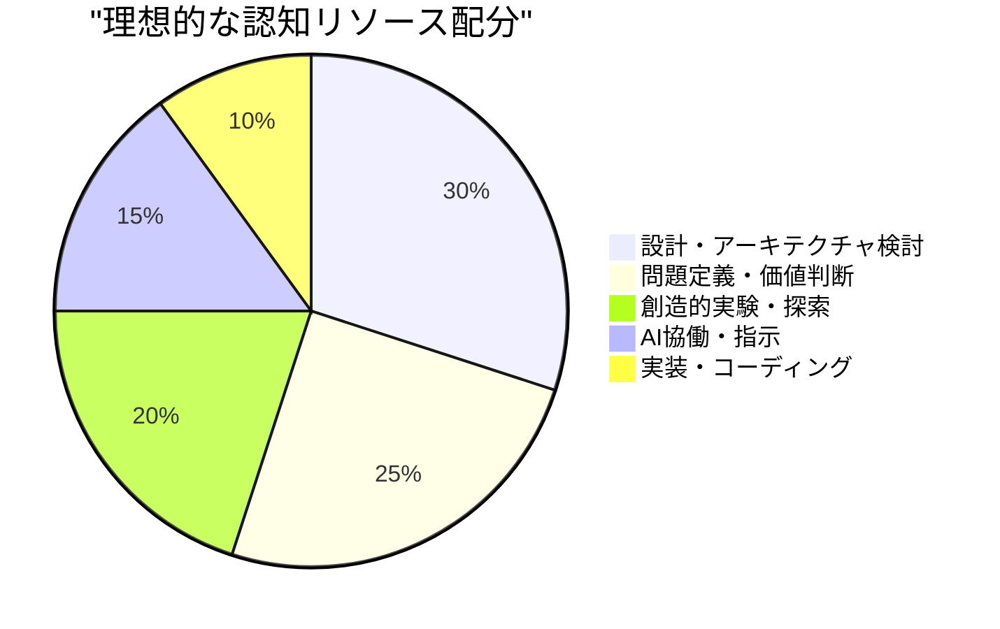
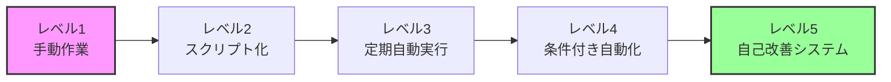

# AI時代のエンジニア能力マップ3.0：哲学と実践の統合で生き抜く6つの必須スキル


## 🎭 詩人の心で、職人の手を動かす

<div class="grid cards" markdown>

-   :material-music-note: **指揮者能力**
    
    AIという超一流の演奏者を束ね、美しいシステムという「音楽」を奏でる

-   :material-eye-check: **技術的審美眼**
    
    AIには判断できない「美しさ」と「違和感」を感じ取る直感力

-   :material-delete-sweep: **学習棄却力**
    
    認知的ポートフォリオを最適化し、真に価値ある領域に集中する戦略

-   :material-puzzle: **知的遊び心**
    
    予期しない価値創造を生む好奇心とセレンディピティの活用

-   :material-diamond-stone: **価値創造の実践力**
    
    美しい哲学を確実なビジネス成果に昇華させる実行力

-   :material-robot-industrial: **究極の自動化哲学**
    
    自分がいなくても価値を生み続けるシステムという芸術作品の創造

</div>

## 📖 Overview

2025年、AIの急速な進化により、エンジニアの役割は劇的に変化しています。コードを書く技術者から、**AIオーケストラの指揮者**へ。暗記と定型作業から、**創造と価値判断**へ。

本記事では、AI時代を生き抜くために必要な6つの能力を、**哲学（WHY・HOW）**と**実践スキル（WHAT）**の二層構造で解説します。崇高な理想と地に足のついた行動、その両方を実現するための具体的なロードマップです。

!!! tip "基本思想"
    - **哲学（WHY・HOW）** = 行動の方向性と意味を示すOS
    - **実践スキル（WHAT）** = 日々の学習と行動を導くアプリケーション
    
    この二層構造により、詩人のような大きな志と、職人のような確実な実践の両立を目指します。

## 🎼 1. 指揮者能力（Conductor Skills）

### 🤔 なぜ指揮者なのか

AIという超一流の「演奏者」が登場する時代、エンジニアの役割は楽器を弾くことから、全体の調和を創造することへシフトしています。個々の技術を極めることより、技術を組み合わせて美しいシステムという「音楽」を奏でることが価値の源泉となります。

### 💻 明日から何をするか

#### 全体構想力を鍛える

| スキル | 具体的アクション | 期待効果 |
|---|---|---|
| **問題定義スキル** | ビジネス課題を技術的問題に翻訳する練習を日常的に行う | 本質的な課題解決力の向上 |
| **システム設計力** | 小さなプロジェクトでもアーキテクチャ図を必ず描く習慣 | 全体像の可視化能力向上 |
| **制約条件管理** | 予算・時間・技術的制約を明文化し、設計に反映させる | 実現可能な解決策の提案力 |
| **全体俯瞰能力** | プロジェクトの工程表と依存関係を可視化する | ボトルネック早期発見 |

#### AI協働の指揮技法を磨く

```python
# プロンプトエンジニアリング実験ログの例
prompt_experiments = {
    "2025-01-15": {
        "technique": "Chain-of-Thought",
        "context": "複雑なアルゴリズム実装",
        "quality_score": 8.5,
        "notes": "段階的な思考プロセスを明示することで精度向上"
    },
    "2025-01-16": {
        "technique": "Few-shot Learning",
        "context": "APIドキュメント生成",
        "quality_score": 9.0,
        "notes": "3つの例示で出力品質が大幅改善"
    }
}
```

!!! example "実践例：複数案評価のテンプレート"
    ```markdown
    ## 機能実装案の評価
    
    ### 案1: マイクロサービス化
    - 利点: スケーラビリティ、独立デプロイ
    - 欠点: 複雑性増大、レイテンシ
    - 評価: ★★★☆☆
    
    ### 案2: モノリシック拡張
    - 利点: シンプル、低レイテンシ
    - 欠点: スケーラビリティ制限
    - 評価: ★★★★☆
    
    ### 案3: サーバーレス実装
    - 利点: コスト効率、自動スケール
    - 欠点: コールドスタート、ベンダーロック
    - 評価: ★★★☆☆
    ```

## 🎨 2. 技術的審美眼（Technical Aesthetics）

### 🤔 なぜ感覚が重要なのか

AIは論理的判断は得意ですが、「美しさ」「気持ち悪さ」という感覚的判断は苦手です。人間特有の直感・美的センス・健全な疑いこそが、AIの出力を真に価値あるものに昇華させる最後の砦となります。

### 💻 明日から何をするか

#### 技術的味覚を育てる

<div class="grid cards" markdown>

-   **毎日のコードレビュー**
    
    他人のコードを読み、「なぜ美しいか/醜いか」を言語化する習慣

-   **週次リファクタリング**
    
    動くコードを「より美しく」する改善を週1回以上実施

-   **設計原則の体得**
    
    SOLID原則、デザインパターンを実際のコードで繰り返し適用

-   **可読性の追求**
    
    6ヶ月後の自分が理解できるコードかを常に自問自答

</div>

#### システム的嗅覚を鍛える

```python
# 問題予測訓練の例
def analyze_potential_issues(feature_name):
    """新機能実装時の問題予測フレームワーク"""
    return {
        "6ヶ月後の予測問題": [
            "データ量増加によるパフォーマンス劣化",
            "エッジケースでの予期しない動作",
            "依存ライブラリの非互換性更新"
        ],
        "対策": [
            "インデックス設計とクエリ最適化",
            "包括的なテストケース作成",
            "依存関係の固定とアップデート計画"
        ]
    }
```

## 🧹 3. 学習棄却力（Strategic Unlearning）

### 🤔 なぜ「捨てる」ことが重要なのか

脳のリソースは有限です。AIが「記憶・検索・定型実装」を担う時代、人間は認知的ポートフォリオを最適化し、より創造的で高次の課題に集中すべきです。古いスキルへの執着は「スキル的負債」となり、変化への適応を阻害します。

### 💻 明日から何をするか

#### 積極的に手放すもの

| 手放すもの | 代替アプローチ | 再配分先 |
|---|---|---|
| **APIリファレンスの暗記** | AI検索・公式ドキュメント活用 | 設計思考・アーキテクチャ学習 |
| **手動定型作業** | 自動化スクリプト・AIツール | 創造的問題解決 |
| **完璧主義的実装** | 80点プロトタイプ＋反復改善 | ユーザーフィードバック収集 |
| **単一技術への固執** | 年1回の新分野学習 | クロスドメイン知識 |

#### 認知リソースの再配分戦略



## 🎮 4. 知的遊び心（Intellectual Playfulness）

### 🤔 なぜ「遊び」が必要なのか

イノベーションは既存の枠組みを超えたところで生まれます。目的から少し離れて実験・探求する「遊び心」こそが、予期しない価値創造の源泉。AIにはない人間特有の「好奇心」と「セレンディピティ」を意図的に活用します。

### 💻 明日から何をするか

#### 創造的実験カレンダー

| 頻度 | 活動 | 具体例 |
|---|---|---|
| **月1回** | 技術的セレンディピティ | 機械学習×IoT、ブロックチェーン×AR など異分野融合実験 |
| **週末2時間** | プロトタイピング | 「面白そう」を形にする自由実装時間 |
| **日々** | 失敗コレクション | 実験の失敗から学んだことを記録・振り返り |
| **四半期1回** | クロスドメイン学習 | デザイン思考、心理学、経済学などの越境学習 |

!!! tip "セレンディピティを生む環境設計"
    1. **技術ニュースの斜め読み** - 自分の専門外の記事を意図的に読む
    2. **ランダムAPI探索** - 知らないAPIを月1つ試してみる
    3. **アイデアメモ** - 日常で思いついた「これ技術で解決できそう」を記録
    4. **失敗歓迎文化** - チーム内で「今週の面白い失敗」を共有

## 💎 5. 価値創造の実践力（Value Creation Execution）

### 🤔 なぜ実行力が重要なのか

どれほど美しい哲学も、現実世界で価値を生まなければ意味がありません。「システムの詩人」として美を追求しながら、確実にビジネス成果を出す実行力こそが、エンジニアの真の価値を証明します。

### 💻 明日から何をするか

#### 上流工程の強化マトリクス

```python
# 要求分析フレームワーク
requirements_analysis = {
    "functional": {
        "must_have": ["ユーザー認証", "データ永続化"],
        "should_have": ["リアルタイム同期", "多言語対応"],
        "could_have": ["AI推奨機能", "高度な分析"],
        "wont_have": ["ブロックチェーン統合"]  # 今回は対象外
    },
    "non_functional": {
        "performance": "レスポンス時間 < 200ms",
        "scalability": "10,000同時接続対応",
        "security": "OWASP Top 10準拠"
    }
}
```

#### ビジネス価値の定量化

<div class="grid cards" markdown>

-   **ROI測定テンプレート**
    ```
    開発コスト: 200万円
    削減効果: 月50時間 × 時給5000円 = 月25万円
    投資回収期間: 8ヶ月
    3年間ROI: 300%
    ```

-   **ユーザー価値指標**
    ```
    タスク完了時間: 60% 短縮
    エラー率: 80% 削減
    ユーザー満足度: 4.2 → 4.7
    月間アクティブ率: 25% 向上
    ```

</div>

## 🤖 6. 究極の自動化哲学（Ultimate Automation Philosophy）

### 🤔 なぜ「サボり」を追求するのか

「サボる」とは怠惰ではなく、人間にしかできない創造的価値に集中するための戦略的選択です。自分がいなくても稼働し、学習し、価値を生み続けるシステムを作ることは、技術者としての究極の芸術作品です。

### 💻 明日から何をするか

#### 自動化の成熟度モデル



#### 自律システム設計チェックリスト

- [ ] **監視の自動化** - 異常検知から自動復旧まで
- [ ] **学習機構** - ユーザー行動から自動最適化
- [ ] **知識の形式化** - 暗黙知の文書化・コード化
- [ ] **引き継ぎ設計** - 自分不在でも運用可能な状態

## 🚀 実践ガイド：明日から始める3ステップ

### ステップ1：現在地の把握（1週間）

```python
# 自己評価フレームワーク
skill_assessment = {
    "指揮者能力": 3,         # 1-5で評価
    "技術的審美眼": 4,
    "学習棄却力": 2,
    "知的遊び心": 3,
    "価値創造実践力": 3,
    "自動化哲学": 4
}

# 優先順位決定
priorities = ["学習棄却力", "価値創造実践力", "指揮者能力"]
```

### ステップ2：日次習慣の設計（2週間目）

| 時間帯 | 活動 | 所要時間 |
|---|---|---|
| **朝（通勤中）** | 他者のコードレビュー＆美醜の言語化 | 10分 |
| **午前** | AI協働実験（新しいプロンプト手法） | 15分 |
| **午後** | 問題予測訓練（実装前の3つの懸念点） | 10分 |
| **夕方** | 自動化候補の発見と記録 | 5分 |

### ステップ3：定期振り返りの実装（継続）

!!! note "振り返りテンプレート"
    **月次振り返り（毎月最終金曜日）**
    - 今月最も成長した能力は？
    - 実践して効果があった習慣は？
    - 来月チャレンジしたい新しい取り組みは？
    
    **半期振り返り（6月・12月）**
    - 能力マップ全体の再評価
    - 重点領域の見直し
    - 新たな哲学的洞察の記録

## 💭 まとめ：詩人と職人の統合

AI時代のエンジニアに求められるのは、**大きな志を持つ詩人の心**と、**確実に価値を生む職人の手**の両立です。

- 🎭 **哲学なき実践は盲目** - なぜやるのかを見失う
- 🛠️ **実践なき哲学は空虚** - 現実の価値を生まない

この6つの能力は、相互に関連し、強化し合います。指揮者として全体を見渡し、審美眼で質を判断し、不要なものは棄却し、遊び心で創造し、確実に価値を生み、そして自動化で自由を得る。

**今日から一歩、明日また一歩。**
詩人の心で夢を描き、職人の手で現実を変える。
それがAI時代を生き抜くエンジニアの姿です。

## 🔗 Related Articles

- [AI開発ツール比較](./ai-development-tools.md)
- [Claude Code完全ガイド](./claude-code-complete-guide.md)
- [エージェント型AI開発](./agentic-ai-development.md)
- [LLMプログラミング](./llm-programming-guide.md)

---

!!! quote "記事の価値"
    この記事が、あなたのエンジニアとしての成長の羅針盤となり、
    AI時代における新たな価値創造への第一歩となることを願っています。