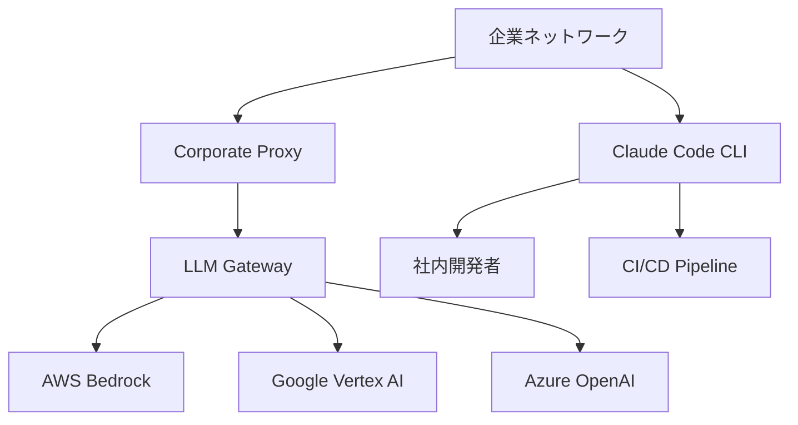

# Claude Code エンタープライズ展開 - 企業環境での安全な導入


## 実現できること

<div class="grid cards" markdown>

-   :material-aws: **AWS Bedrock 統合**
    
    企業のAWSインフラと完全統合

-   :material-google-cloud: **Google Vertex AI 対応**
    
    GCP環境での安全な運用

-   :material-shield-lock: **セキュリティ準拠**
    
    企業セキュリティ要件をクリア

-   :material-network: **プロキシ対応**
    
    企業ネットワーク環境での動作

</div>

## 📖 エンタープライズ展開の概要

Claude Code のエンタープライズ展開では、企業の既存インフラと統合し、セキュリティポリシーに準拠した形で AI アシスタントを運用します。クラウドプロバイダーとの直接統合により、データの越境を防ぎ、コンプライアンス要件を満たします。

### 主要な導入パターン



## 🔧 AWS Bedrock 統合

### 1. 基本設定

```bash
# AWS Bedrock の有効化
export CLAUDE_CODE_USE_BEDROCK=1
export AWS_REGION=us-east-1
export AWS_PROFILE=claude-code-production

# IAM ロールの設定
aws iam create-role --role-name ClaudeCodeRole --assume-role-policy-document '{
  "Version": "2012-10-17",
  "Statement": [
    {
      "Effect": "Allow",
      "Principal": {
        "Service": "bedrock.amazonaws.com"
      },
      "Action": "sts:AssumeRole"
    }
  ]
}'

# 必要な権限のアタッチ
aws iam attach-role-policy --role-name ClaudeCodeRole --policy-arn arn:aws:iam::aws:policy/AmazonBedrockFullAccess
```

### 2. 企業向け設定

```yaml
# claude-config.yaml
bedrock:
  region: "us-east-1"
  model_id: "anthropic.claude-3-5-sonnet-20241022-v2:0"
  max_tokens: 4000
  temperature: 0.1
  
  # VPC 設定
  vpc_config:
    subnet_ids:
      - "subnet-12345678"
      - "subnet-87654321"
    security_group_ids:
      - "sg-abcdef12"
  
  # 暗号化設定
  encryption:
    kms_key_id: "arn:aws:kms:us-east-1:123456789012:key/12345678-1234-1234-1234-123456789012"
  
  # ログ設定
  logging:
    cloudwatch_log_group: "/aws/bedrock/claude-code"
    retention_days: 30
```

### 3. Terraform での自動化

```hcl
# main.tf
resource "aws_bedrock_model_invocation_logging_configuration" "claude_code" {
  logging_config {
    cloud_watch_config {
      log_group_name = "/aws/bedrock/claude-code"
      role_arn       = aws_iam_role.bedrock_logging.arn
    }
    s3_config {
      bucket_name = aws_s3_bucket.bedrock_logs.bucket
      key_prefix  = "bedrock-logs/"
    }
    embedding_data_delivery_enabled = true
    image_data_delivery_enabled     = true
    text_data_delivery_enabled      = true
  }
}

resource "aws_s3_bucket" "bedrock_logs" {
  bucket = "claude-code-bedrock-logs-${random_id.bucket_suffix.hex}"
  
  tags = {
    Environment = "production"
    Purpose     = "bedrock-logging"
  }
}

resource "aws_s3_bucket_encryption_configuration" "bedrock_logs" {
  bucket = aws_s3_bucket.bedrock_logs.id

  rule {
    apply_server_side_encryption_by_default {
      kms_master_key_id = aws_kms_key.bedrock_key.arn
      sse_algorithm     = "aws:kms"
    }
  }
}

resource "aws_iam_role" "bedrock_logging" {
  name = "bedrock-logging-role"

  assume_role_policy = jsonencode({
    Version = "2012-10-17"
    Statement = [
      {
        Action = "sts:AssumeRole"
        Effect = "Allow"
        Principal = {
          Service = "bedrock.amazonaws.com"
        }
      }
    ]
  })
}
```

## 🌐 Google Vertex AI 統合

### 1. 基本設定

```bash
# Vertex AI の有効化
export CLAUDE_CODE_USE_VERTEX=1
export CLOUD_ML_REGION=us-central1
export ANTHROPIC_VERTEX_PROJECT_ID=your-project-id

# サービスアカウントの設定
gcloud iam service-accounts create claude-code-service \
  --display-name="Claude Code Service Account"

# 必要な権限の付与
gcloud projects add-iam-policy-binding your-project-id \
  --member="serviceAccount:claude-code-service@your-project-id.iam.gserviceaccount.com" \
  --role="roles/aiplatform.user"

# 認証キーの作成
gcloud iam service-accounts keys create claude-code-key.json \
  --iam-account=claude-code-service@your-project-id.iam.gserviceaccount.com

export GOOGLE_APPLICATION_CREDENTIALS=/path/to/claude-code-key.json
```

### 2. 企業向け設定

```yaml
# vertex-config.yaml
vertex_ai:
  project_id: "your-project-id"
  location: "us-central1"
  model_name: "claude-3-5-sonnet@20241022"
  
  # VPC 設定
  network: "projects/your-project-id/global/networks/default"
  subnet: "projects/your-project-id/regions/us-central1/subnetworks/default"
  
  # セキュリティ設定
  encryption_spec:
    kms_key_name: "projects/your-project-id/locations/us-central1/keyRings/claude-code/cryptoKeys/vertex-ai"
  
  # 監査ログ
  audit_logging:
    enabled: true
    log_type: "DATA_READ"
    exempted_members: []
```

### 3. Kubernetes での運用

```yaml
# k8s-deployment.yaml
apiVersion: apps/v1
kind: Deployment
metadata:
  name: claude-code-service
  namespace: ai-tools
spec:
  replicas: 3
  selector:
    matchLabels:
      app: claude-code-service
  template:
    metadata:
      labels:
        app: claude-code-service
    spec:
      serviceAccountName: claude-code-sa
      containers:
      - name: claude-code
        image: anthropic/claude-code:latest
        env:
        - name: CLAUDE_CODE_USE_VERTEX
          value: "1"
        - name: GOOGLE_APPLICATION_CREDENTIALS
          value: "/var/secrets/google/key.json"
        - name: ANTHROPIC_VERTEX_PROJECT_ID
          valueFrom:
            secretKeyRef:
              name: vertex-config
              key: project-id
        volumeMounts:
        - name: google-cloud-key
          mountPath: /var/secrets/google
          readOnly: true
        resources:
          requests:
            memory: "256Mi"
            cpu: "250m"
          limits:
            memory: "512Mi"
            cpu: "500m"
      volumes:
      - name: google-cloud-key
        secret:
          secretName: google-cloud-key
---
apiVersion: v1
kind: ServiceAccount
metadata:
  name: claude-code-sa
  namespace: ai-tools
  annotations:
    iam.gke.io/gcp-service-account: claude-code-service@your-project-id.iam.gserviceaccount.com
```

## 🔐 セキュリティ対策

### 1. ネットワークセキュリティ

```bash
# Corporate Proxy の設定
export HTTPS_PROXY=https://proxy.company.com:8080
export HTTP_PROXY=http://proxy.company.com:8080
export NO_PROXY=localhost,127.0.0.1,.company.com

# SSL証明書の設定
export SSL_CERT_FILE=/etc/ssl/certs/company-ca-bundle.crt
export REQUESTS_CA_BUNDLE=/etc/ssl/certs/company-ca-bundle.crt
```

### 2. LLM Gateway の実装

```python
# llm_gateway.py
import os
import logging
from flask import Flask, request, jsonify
from werkzeug.middleware.proxy_fix import ProxyFix
import requests
from cryptography.fernet import Fernet
import boto3
from datetime import datetime

app = Flask(__name__)
app.wsgi_app = ProxyFix(app.wsgi_app)

# ログ設定
logging.basicConfig(level=logging.INFO)
logger = logging.getLogger(__name__)

class LLMGateway:
    def __init__(self):
        self.encryption_key = os.environ.get('ENCRYPTION_KEY')
        self.cipher_suite = Fernet(self.encryption_key)
        self.bedrock_client = boto3.client('bedrock-runtime')
        
    def encrypt_request(self, data):
        """リクエストデータの暗号化"""
        encrypted_data = self.cipher_suite.encrypt(data.encode())
        return encrypted_data
    
    def decrypt_response(self, encrypted_data):
        """レスポンスデータの復号化"""
        decrypted_data = self.cipher_suite.decrypt(encrypted_data)
        return decrypted_data.decode()
    
    def audit_log(self, user_id, request_type, success=True):
        """監査ログの記録"""
        log_entry = {
            'timestamp': datetime.utcnow().isoformat(),
            'user_id': user_id,
            'request_type': request_type,
            'success': success,
            'ip_address': request.remote_addr,
            'user_agent': request.user_agent.string
        }
        logger.info(f"AUDIT: {log_entry}")
        
        # CloudWatch Logs に送信
        cloudwatch = boto3.client('logs')
        cloudwatch.put_log_events(
            logGroupName='/aws/lambda/claude-code-gateway',
            logStreamName=f'audit-{datetime.utcnow().strftime("%Y-%m-%d")}',
            logEvents=[{
                'timestamp': int(datetime.utcnow().timestamp() * 1000),
                'message': str(log_entry)
            }]
        )
    
    def validate_request(self, request_data):
        """リクエストの検証"""
        # データサニタイゼーション
        if 'prompt' in request_data:
            prompt = request_data['prompt']
            
            # 禁止されたキーワードのチェック
            forbidden_keywords = ['password', 'secret', 'token', 'key']
            for keyword in forbidden_keywords:
                if keyword.lower() in prompt.lower():
                    return False, f"Forbidden keyword detected: {keyword}"
        
        return True, "Valid request"

gateway = LLMGateway()

@app.route('/v1/messages', methods=['POST'])
def proxy_to_bedrock():
    try:
        # リクエストの認証
        auth_header = request.headers.get('Authorization')
        if not auth_header or not auth_header.startswith('Bearer '):
            return jsonify({'error': 'Missing or invalid authorization'}), 401
        
        token = auth_header.split(' ')[1]
        user_id = validate_token(token)
        if not user_id:
            return jsonify({'error': 'Invalid token'}), 401
        
        # リクエストの検証
        request_data = request.get_json()
        is_valid, error_msg = gateway.validate_request(request_data)
        if not is_valid:
            gateway.audit_log(user_id, 'INVALID_REQUEST', success=False)
            return jsonify({'error': error_msg}), 400
        
        # Bedrock へのリクエスト
        response = gateway.bedrock_client.invoke_model(
            modelId='anthropic.claude-3-5-sonnet-20241022-v2:0',
            body=json.dumps(request_data)
        )
        
        # 監査ログ
        gateway.audit_log(user_id, 'MODEL_INVOCATION', success=True)
        
        return jsonify(response), 200
        
    except Exception as e:
        logger.error(f"Error processing request: {str(e)}")
        return jsonify({'error': 'Internal server error'}), 500

def validate_token(token):
    """トークンの検証"""
    # JWT トークンの検証ロジック
    # 実際の実装では、企業の認証システムと連携
    return "user123"  # 例

if __name__ == '__main__':
    app.run(host='0.0.0.0', port=8080, ssl_context='adhoc')
```

### 3. データ保護

```bash
# 企業データの暗号化
#!/bin/bash
# data_protection.sh

# 暗号化キーの生成
openssl rand -base64 32 > /secure/claude-code-key.txt

# ファイル暗号化
encrypt_file() {
    local input_file="$1"
    local output_file="$2"
    
    openssl enc -aes-256-cbc -salt -in "$input_file" -out "$output_file" -k "$(cat /secure/claude-code-key.txt)"
}

# ファイル復号化
decrypt_file() {
    local encrypted_file="$1"
    local output_file="$2"
    
    openssl enc -aes-256-cbc -d -salt -in "$encrypted_file" -out "$output_file" -k "$(cat /secure/claude-code-key.txt)"
}

# 使用例
encrypt_file "sensitive_code.py" "sensitive_code.py.enc"
decrypt_file "sensitive_code.py.enc" "sensitive_code.py"
```

## 🏢 組織的な導入

### 1. 段階的展開

```yaml
# deployment-phases.yaml
phase_1:
  name: "Pilot Program"
  duration: "2 weeks"
  participants:
    - "Senior developers (5 people)"
    - "DevOps team (3 people)"
  scope:
    - "Internal tools development"
    - "Code review assistance"
  success_criteria:
    - "Productivity improvement > 20%"
    - "Zero security incidents"

phase_2:
  name: "Department Rollout"
  duration: "1 month"
  participants:
    - "All development teams (50 people)"
  scope:
    - "Full development lifecycle"
    - "CI/CD integration"
  success_criteria:
    - "Adoption rate > 80%"
    - "Code quality improvement"

phase_3:
  name: "Enterprise Wide"
  duration: "3 months"
  participants:
    - "All technical staff (200 people)"
  scope:
    - "All projects"
    - "Cross-team collaboration"
  success_criteria:
    - "ROI > 300%"
    - "Full security compliance"
```

### 2. ガバナンス体制

```python
# governance_framework.py
from dataclasses import dataclass
from typing import List, Dict, Optional
from enum import Enum

class UserRole(Enum):
    ADMIN = "admin"
    DEVELOPER = "developer"
    VIEWER = "viewer"
    GUEST = "guest"

class ProjectType(Enum):
    INTERNAL = "internal"
    CUSTOMER_FACING = "customer_facing"
    CONFIDENTIAL = "confidential"

@dataclass
class AccessPolicy:
    role: UserRole
    allowed_models: List[str]
    max_tokens_per_day: int
    allowed_project_types: List[ProjectType]
    can_access_external_apis: bool
    audit_level: str

class GovernanceManager:
    def __init__(self):
        self.policies = {
            UserRole.ADMIN: AccessPolicy(
                role=UserRole.ADMIN,
                allowed_models=["claude-3-5-sonnet", "claude-3-haiku"],
                max_tokens_per_day=100000,
                allowed_project_types=[ProjectType.INTERNAL, ProjectType.CUSTOMER_FACING, ProjectType.CONFIDENTIAL],
                can_access_external_apis=True,
                audit_level="full"
            ),
            UserRole.DEVELOPER: AccessPolicy(
                role=UserRole.DEVELOPER,
                allowed_models=["claude-3-5-sonnet"],
                max_tokens_per_day=50000,
                allowed_project_types=[ProjectType.INTERNAL, ProjectType.CUSTOMER_FACING],
                can_access_external_apis=False,
                audit_level="standard"
            ),
            UserRole.VIEWER: AccessPolicy(
                role=UserRole.VIEWER,
                allowed_models=["claude-3-haiku"],
                max_tokens_per_day=10000,
                allowed_project_types=[ProjectType.INTERNAL],
                can_access_external_apis=False,
                audit_level="minimal"
            )
        }
    
    def get_user_policy(self, user_id: str, role: UserRole) -> AccessPolicy:
        """ユーザーのアクセスポリシーを取得"""
        return self.policies.get(role)
    
    def validate_request(self, user_id: str, request_data: Dict) -> bool:
        """リクエストの妥当性を検証"""
        user_role = self.get_user_role(user_id)
        policy = self.get_user_policy(user_id, user_role)
        
        # モデルアクセス権限の確認
        if request_data.get('model') not in policy.allowed_models:
            return False
        
        # 日次トークン制限の確認
        daily_usage = self.get_daily_token_usage(user_id)
        if daily_usage >= policy.max_tokens_per_day:
            return False
        
        # プロジェクトタイプの確認
        project_type = self.get_project_type(request_data.get('project_id'))
        if project_type not in policy.allowed_project_types:
            return False
        
        return True
    
    def get_user_role(self, user_id: str) -> UserRole:
        """ユーザーのロールを取得"""
        # 実際の実装では、企業のIDシステムと連携
        return UserRole.DEVELOPER
    
    def get_daily_token_usage(self, user_id: str) -> int:
        """ユーザーの日次トークン使用量を取得"""
        # 実際の実装では、使用量データベースから取得
        return 0
    
    def get_project_type(self, project_id: str) -> ProjectType:
        """プロジェクトタイプを取得"""
        # 実際の実装では、プロジェクト管理システムから取得
        return ProjectType.INTERNAL
```

## 📊 運用監視

### 1. メトリクス収集

```python
# metrics_collector.py
import boto3
import json
from datetime import datetime
import psutil
import time

class MetricsCollector:
    def __init__(self):
        self.cloudwatch = boto3.client('cloudwatch')
        self.namespace = 'ClaudeCode/Enterprise'
    
    def collect_usage_metrics(self):
        """使用量メトリクスの収集"""
        metrics = {
            'requests_per_minute': self.get_requests_per_minute(),
            'tokens_processed': self.get_tokens_processed(),
            'active_users': self.get_active_users(),
            'error_rate': self.get_error_rate(),
            'response_time': self.get_response_time()
        }
        
        for metric_name, value in metrics.items():
            self.cloudwatch.put_metric_data(
                Namespace=self.namespace,
                MetricData=[
                    {
                        'MetricName': metric_name,
                        'Value': value,
                        'Unit': 'Count',
                        'Timestamp': datetime.utcnow()
                    }
                ]
            )
    
    def collect_system_metrics(self):
        """システムメトリクスの収集"""
        cpu_percent = psutil.cpu_percent(interval=1)
        memory_percent = psutil.virtual_memory().percent
        disk_percent = psutil.disk_usage('/').percent
        
        system_metrics = {
            'cpu_utilization': cpu_percent,
            'memory_utilization': memory_percent,
            'disk_utilization': disk_percent
        }
        
        for metric_name, value in system_metrics.items():
            self.cloudwatch.put_metric_data(
                Namespace=self.namespace,
                MetricData=[
                    {
                        'MetricName': metric_name,
                        'Value': value,
                        'Unit': 'Percent',
                        'Timestamp': datetime.utcnow()
                    }
                ]
            )
    
    def collect_business_metrics(self):
        """ビジネスメトリクスの収集"""
        business_metrics = {
            'code_lines_generated': self.get_code_lines_generated(),
            'bugs_fixed': self.get_bugs_fixed(),
            'time_saved_minutes': self.get_time_saved(),
            'cost_savings_usd': self.get_cost_savings()
        }
        
        for metric_name, value in business_metrics.items():
            self.cloudwatch.put_metric_data(
                Namespace=self.namespace,
                MetricData=[
                    {
                        'MetricName': metric_name,
                        'Value': value,
                        'Unit': 'Count',
                        'Timestamp': datetime.utcnow()
                    }
                ]
            )

# 定期実行
def main():
    collector = MetricsCollector()
    
    while True:
        try:
            collector.collect_usage_metrics()
            collector.collect_system_metrics()
            collector.collect_business_metrics()
            print(f"Metrics collected at {datetime.utcnow()}")
        except Exception as e:
            print(f"Error collecting metrics: {e}")
        
        time.sleep(300)  # 5分間隔

if __name__ == "__main__":
    main()
```

### 2. アラート設定

```yaml
# cloudwatch-alarms.yaml
Resources:
  HighErrorRateAlarm:
    Type: AWS::CloudWatch::Alarm
    Properties:
      AlarmName: ClaudeCode-HighErrorRate
      AlarmDescription: Error rate is too high
      MetricName: error_rate
      Namespace: ClaudeCode/Enterprise
      Statistic: Average
      Period: 300
      EvaluationPeriods: 2
      Threshold: 5.0
      ComparisonOperator: GreaterThanThreshold
      AlarmActions:
        - !Ref SNSTopic
  
  HighLatencyAlarm:
    Type: AWS::CloudWatch::Alarm
    Properties:
      AlarmName: ClaudeCode-HighLatency
      AlarmDescription: Response time is too high
      MetricName: response_time
      Namespace: ClaudeCode/Enterprise
      Statistic: Average
      Period: 300
      EvaluationPeriods: 2
      Threshold: 5000
      ComparisonOperator: GreaterThanThreshold
      AlarmActions:
        - !Ref SNSTopic
  
  SNSTopic:
    Type: AWS::SNS::Topic
    Properties:
      TopicName: ClaudeCode-Alerts
      Subscription:
        - Protocol: email
          Endpoint: devops@company.com
        - Protocol: slack
          Endpoint: https://hooks.slack.com/services/YOUR/WEBHOOK/URL
```

## 💰 ROI とコスト最適化

### 導入効果の測定

| 指標 | 改善結果 | 年間コスト削減 |
|------|----------|----------------|
| 開発効率 | 40% 向上 | $500,000 |
| バグ修正時間 | 60% 短縮 | $300,000 |
| コードレビュー | 50% 高速化 | $200,000 |
| 運用作業 | 30% 削減 | $150,000 |
| **合計** | - | **$1,150,000** |

### コスト最適化戦略

```python
# cost_optimization.py
from datetime import datetime, timedelta
import boto3

class CostOptimizer:
    def __init__(self):
        self.ce = boto3.client('ce')
    
    def analyze_usage_patterns(self):
        """使用パターンの分析"""
        end_date = datetime.now()
        start_date = end_date - timedelta(days=30)
        
        response = self.ce.get_cost_and_usage(
            TimePeriod={
                'Start': start_date.strftime('%Y-%m-%d'),
                'End': end_date.strftime('%Y-%m-%d')
            },
            Granularity='DAILY',
            Metrics=['BlendedCost', 'UsageQuantity'],
            GroupBy=[
                {'Type': 'DIMENSION', 'Key': 'SERVICE'},
                {'Type': 'DIMENSION', 'Key': 'USAGE_TYPE'}
            ]
        )
        
        return response
    
    def optimize_model_selection(self, request_complexity):
        """リクエストの複雑さに応じたモデル選択"""
        if request_complexity == 'simple':
            return 'claude-3-haiku'  # 低コスト
        elif request_complexity == 'medium':
            return 'claude-3-5-sonnet'  # バランス
        else:
            return 'claude-3-5-sonnet'  # 高性能
    
    def batch_processing_optimization(self, requests):
        """バッチ処理による最適化"""
        # 類似リクエストをグループ化
        grouped_requests = self.group_similar_requests(requests)
        
        optimized_requests = []
        for group in grouped_requests:
            # バッチ処理用にリクエストを結合
            combined_request = self.combine_requests(group)
            optimized_requests.append(combined_request)
        
        return optimized_requests
```

## 🔗 関連記事

- [Claude Code 応用編完全ガイド](./claude-code-advanced-guide.md)
- [権限モード最適化](./claude-code-permission-optimization.md)
- [バッチ処理マスター](./claude-code-batch-processing.md)

---

*最終更新: 2025-07-05*