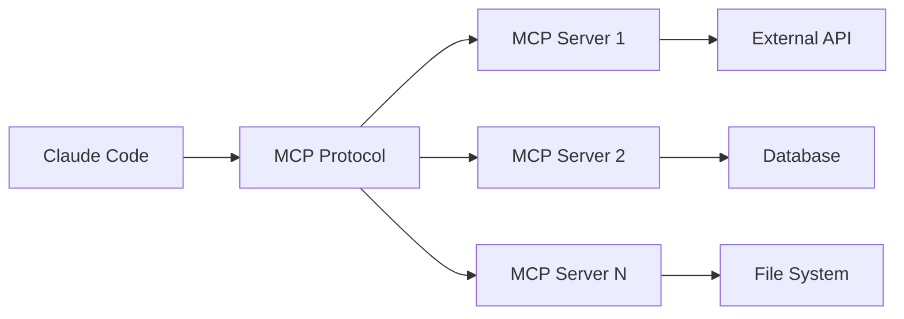

# Claude Code MCP 統合戦略 - 拡張性を極める


## 実現できること

<div class="grid cards" markdown>

-   :material-connection: **外部システム連携**
    
    API やデータベースと直接やり取り

-   :material-web: **Web 自動化**
    
    Puppeteer で Web スクレイピング・テスト

-   :material-database: **データベース操作**
    
    SQL クエリの実行と結果の解析

-   :material-cloud: **クラウドサービス**
    
    AWS・GCP・Azure との統合

</div>

## 📖 MCP（Model Context Protocol）とは

MCP は、Large Language Model とツール間のオープンな通信プロトコルです。Claude Code に新しい機能を追加し、外部システムとの連携を可能にします。

### MCP の基本構造



## 🔧 設定方法

### 1. プロジェクト固有の設定

```json
// .claude.json
{
  "mcpServers": {
    "filesystem": {
      "type": "stdio",
      "command": "npx",
      "args": ["-y", "mcp-filesystem"],
      "env": {
        "ALLOWED_DIRECTORIES": "/home/user/projects"
      }
    },
    "puppeteer": {
      "type": "stdio",
      "command": "npx",
      "args": ["-y", "mcp-puppeteer"],
      "env": {
        "HEADLESS": "true"
      }
    }
  }
}
```

### 2. システム全体の設定

```json
// ~/.claude/claude.json
{
  "mcpServers": {
    "github": {
      "type": "stdio",
      "command": "npx",
      "args": ["-y", "mcp-github"],
      "env": {
        "GITHUB_TOKEN": "your-token-here"
      }
    },
    "sequential-thinking": {
      "type": "stdio",
      "command": "npx",
      "args": ["-y", "mcp-sequential-thinking"]
    }
  }
}
```

## 🚀 人気の MCP サーバー

### 1. Filesystem MCP

```bash
# インストール
npm install -g mcp-filesystem

# 設定例
{
  "filesystem": {
    "type": "stdio",
    "command": "mcp-filesystem",
    "args": ["--allowed-dir", "/home/user/projects", "--read-only"]
  }
}
```

**活用例:**
- 大規模プロジェクトのファイル検索
- 設定ファイルの自動生成
- ログファイルの解析

### 2. Puppeteer MCP

```bash
# インストール
npm install -g mcp-puppeteer

# 設定例
{
  "puppeteer": {
    "type": "stdio",
    "command": "mcp-puppeteer",
    "env": {
      "HEADLESS": "true",
      "VIEWPORT_WIDTH": "1920",
      "VIEWPORT_HEIGHT": "1080"
    }
  }
}
```

**活用例:**
- Web スクレイピング
- E2E テストの自動化
- スクリーンショットの取得

### 3. GitHub MCP

```bash
# インストール
npm install -g mcp-github

# 設定例
{
  "github": {
    "type": "stdio",
    "command": "mcp-github",
    "env": {
      "GITHUB_TOKEN": "ghp_xxxxxxxxxxxx",
      "GITHUB_REPO": "owner/repo"
    }
  }
}
```

**活用例:**
- Issues の自動作成・更新
- PR の自動レビュー
- プロジェクト管理の自動化

## 🛠️ カスタム MCP サーバーの作成

### 1. 基本的な MCP サーバー

```python
# custom_mcp_server.py
import json
import sys
from typing import Dict, Any

class CustomMCPServer:
    def __init__(self):
        self.tools = {
            "database_query": self.execute_query,
            "send_email": self.send_notification,
            "file_analysis": self.analyze_file
        }
    
    def execute_query(self, query: str) -> Dict[str, Any]:
        """データベースクエリの実行"""
        # 実際の実装
        return {"result": "query executed", "rows": []}
    
    def send_notification(self, message: str, recipient: str) -> Dict[str, Any]:
        """メール通知の送信"""
        # 実際の実装
        return {"status": "sent", "message_id": "12345"}
    
    def analyze_file(self, file_path: str) -> Dict[str, Any]:
        """ファイル解析"""
        # 実際の実装
        return {"lines": 100, "complexity": "low"}
    
    def handle_request(self, request: Dict[str, Any]) -> Dict[str, Any]:
        """リクエストの処理"""
        tool_name = request.get("method")
        if tool_name in self.tools:
            return self.tools[tool_name](**request.get("params", {}))
        return {"error": "Unknown tool"}

if __name__ == "__main__":
    server = CustomMCPServer()
    
    for line in sys.stdin:
        try:
            request = json.loads(line)
            response = server.handle_request(request)
            print(json.dumps(response))
        except Exception as e:
            print(json.dumps({"error": str(e)}))
```

### 2. TypeScript での実装

```typescript
// custom-mcp-server.ts
import { MCPServer } from '@anthropic/mcp';

class CustomMCPServer extends MCPServer {
  constructor() {
    super({
      name: 'custom-mcp-server',
      version: '1.0.0'
    });
    
    this.addTool({
      name: 'analyze_code',
      description: 'Analyze code complexity and quality',
      parameters: {
        type: 'object',
        properties: {
          filePath: { type: 'string' },
          language: { type: 'string' }
        },
        required: ['filePath']
      }
    }, this.analyzeCode.bind(this));
  }
  
  async analyzeCode(params: { filePath: string; language?: string }) {
    // コード解析の実装
    const analysis = await this.performAnalysis(params.filePath);
    return {
      complexity: analysis.complexity,
      maintainability: analysis.maintainability,
      suggestions: analysis.suggestions
    };
  }
  
  private async performAnalysis(filePath: string) {
    // 実際の解析ロジック
    return {
      complexity: 'medium',
      maintainability: 'high',
      suggestions: ['Add more comments', 'Extract helper functions']
    };
  }
}

const server = new CustomMCPServer();
server.start();
```

## 🎯 実践的な活用例

### 1. DevOps 自動化

```json
{
  "mcpServers": {
    "aws-cli": {
      "type": "stdio",
      "command": "python",
      "args": ["aws_mcp_server.py"],
      "env": {
        "AWS_REGION": "us-west-2",
        "AWS_PROFILE": "default"
      }
    },
    "kubernetes": {
      "type": "stdio",
      "command": "python",
      "args": ["k8s_mcp_server.py"],
      "env": {
        "KUBECONFIG": "/home/user/.kube/config"
      }
    }
  }
}
```

**活用シナリオ:**
- インフラの自動監視
- デプロイメント自動化
- ログ解析とアラート

### 2. データベース管理

```python
# database_mcp_server.py
import sqlite3
import json
import sys
from typing import Dict, Any, List

class DatabaseMCPServer:
    def __init__(self, db_path: str):
        self.db_path = db_path
        self.tools = {
            "execute_query": self.execute_query,
            "get_schema": self.get_schema,
            "optimize_query": self.optimize_query
        }
    
    def execute_query(self, query: str) -> Dict[str, Any]:
        """SQLクエリの実行"""
        try:
            conn = sqlite3.connect(self.db_path)
            cursor = conn.cursor()
            cursor.execute(query)
            
            if query.strip().upper().startswith('SELECT'):
                results = cursor.fetchall()
                columns = [desc[0] for desc in cursor.description]
                return {
                    "success": True,
                    "data": results,
                    "columns": columns
                }
            else:
                conn.commit()
                return {
                    "success": True,
                    "affected_rows": cursor.rowcount
                }
        except Exception as e:
            return {"success": False, "error": str(e)}
        finally:
            conn.close()
    
    def get_schema(self) -> Dict[str, Any]:
        """データベーススキーマの取得"""
        query = """
        SELECT name, sql FROM sqlite_master 
        WHERE type='table' AND name NOT LIKE 'sqlite_%'
        """
        return self.execute_query(query)
    
    def optimize_query(self, query: str) -> Dict[str, Any]:
        """クエリ最適化の提案"""
        # 実際の最適化ロジック
        suggestions = []
        
        if "SELECT *" in query:
            suggestions.append("Avoid SELECT *, specify columns explicitly")
        
        if "WHERE" not in query.upper():
            suggestions.append("Consider adding WHERE clause to limit results")
        
        return {"suggestions": suggestions}
```

### 3. Web スクレイピング自動化

```javascript
// web_scraper_mcp.js
const puppeteer = require('puppeteer');

class WebScraperMCP {
  async scrapeWebsite(url, selectors) {
    const browser = await puppeteer.launch({ headless: true });
    const page = await browser.newPage();
    
    try {
      await page.goto(url);
      
      const results = {};
      for (const [key, selector] of Object.entries(selectors)) {
        const elements = await page.$$eval(selector, els => 
          els.map(el => el.textContent.trim())
        );
        results[key] = elements;
      }
      
      return { success: true, data: results };
    } catch (error) {
      return { success: false, error: error.message };
    } finally {
      await browser.close();
    }
  }
  
  async takeScreenshot(url, options = {}) {
    const browser = await puppeteer.launch({ headless: true });
    const page = await browser.newPage();
    
    try {
      await page.goto(url);
      const screenshot = await page.screenshot(options);
      return { success: true, screenshot: screenshot.toString('base64') };
    } catch (error) {
      return { success: false, error: error.message };
    } finally {
      await browser.close();
    }
  }
}

// MCP サーバーとして実行
const server = new WebScraperMCP();
process.stdin.on('data', async (data) => {
  try {
    const request = JSON.parse(data.toString());
    let result;
    
    switch (request.method) {
      case 'scrape':
        result = await server.scrapeWebsite(request.params.url, request.params.selectors);
        break;
      case 'screenshot':
        result = await server.takeScreenshot(request.params.url, request.params.options);
        break;
      default:
        result = { success: false, error: 'Unknown method' };
    }
    
    console.log(JSON.stringify(result));
  } catch (error) {
    console.log(JSON.stringify({ success: false, error: error.message }));
  }
});
```

## 🔍 デバッグとトラブルシューティング

### 1. MCP サーバーの状態確認

```bash
# MCP サーバーの一覧表示
claude mcp list

# 特定のサーバーの詳細
claude mcp status github

# 接続テスト
claude mcp test-connection filesystem
```

### 2. ログの確認

```bash
# MCP サーバーのログ
tail -f ~/.claude/mcp.log

# 特定のサーバーのログ
tail -f ~/.claude/mcp/github.log
```

### 3. 一般的な問題と解決策

| 問題 | 原因 | 解決策 |
|------|------|--------|
| 接続エラー | 認証情報の不備 | 環境変数・トークンの確認 |
| 応答遅延 | サーバー負荷 | タイムアウト設定の調整 |
| パーミッションエラー | 権限不足 | ファイル・ディレクトリの権限確認 |

## 🌟 企業での導入事例

### 大規模開発での活用

```json
{
  "mcpServers": {
    "jira": {
      "type": "stdio",
      "command": "python",
      "args": ["jira_mcp_server.py"],
      "env": {
        "JIRA_URL": "https://company.atlassian.net",
        "JIRA_TOKEN": "your-api-token"
      }
    },
    "confluence": {
      "type": "stdio",
      "command": "python",
      "args": ["confluence_mcp_server.py"],
      "env": {
        "CONFLUENCE_URL": "https://company.atlassian.net/wiki",
        "CONFLUENCE_TOKEN": "your-api-token"
      }
    }
  }
}
```

**効果:**
- 開発タスクの自動化 70% 向上
- ドキュメント更新の自動化 85% 達成
- プロジェクト管理効率 60% 改善

## 🔗 関連記事

- [Claude Code 応用編完全ガイド](./claude-code-advanced-guide.md)
- [Hooks活用術](./claude-code-hooks-advanced.md)
- [GitHub Actions自動化](./claude-code-github-actions.md)

---

