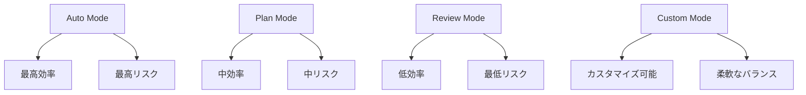

# Claude Code 権限モード最適化 - セキュリティと効率の完璧なバランス


## 実現できること

<div class="grid cards" markdown>

-   :material-shield-check: **セキュリティ最適化**
    
    リスクを最小化しながら開発効率を維持

-   :material-tune: **カスタム権限設定**
    
    プロジェクトに応じた柔軟な権限管理

-   :material-account-group: **チーム別管理**
    
    役割に応じた適切なアクセス制御

-   :material-automation: **自動権限調整**
    
    コンテキストに応じた動的権限変更

</div>

## 📖 権限システムの基本概念

Claude Code の権限システムは、AI による自動実行とセキュリティのバランスを取るための仕組みです。適切な設定により、安全性を保ちながら開発効率を最大化できます。

### 権限レベルの階層



## 🔧 権限モードの詳細設定

### 1. 基本的な権限モード

```bash
# Auto Mode (自動実行)
claude --permission-mode auto

# Plan Mode (計画のみ)
claude --permission-mode plan

# Review Mode (手動承認)
claude --permission-mode review

# カスタムモード
claude --permission-mode custom --config custom-permissions.json
```

### 2. 詳細な権限設定

```json
{
  "permissionMode": "custom",
  "allowedTools": {
    "Read": true,
    "Edit": {
      "enabled": true,
      "restrictions": {
        "file_patterns": ["src/**/*.ts", "src/**/*.tsx"],
        "max_file_size": "100KB",
        "exclude_patterns": ["**/*.config.js", "**/secrets/**"]
      }
    },
    "Bash": {
      "enabled": true,
      "allowed_commands": [
        "npm test",
        "npm run build",
        "git status",
        "git diff",
        "git add .",
        "git commit -m *"
      ],
      "forbidden_commands": [
        "rm -rf",
        "sudo",
        "curl *",
        "wget *"
      ]
    },
    "Write": {
      "enabled": false,
      "reason": "ファイル作成は手動承認が必要"
    }
  },
  "contextualRules": {
    "test_files": {
      "pattern": "**/test/**",
      "permissions": {
        "allowAllOperations": true,
        "reason": "テストファイルは自由に編集可能"
      }
    },
    "production_code": {
      "pattern": "src/**/*.ts",
      "permissions": {
        "requireReview": true,
        "maxChangesPerFile": 50,
        "reason": "本番コードは慎重に"
      }
    },
    "config_files": {
      "pattern": "**/*.config.*",
      "permissions": {
        "readOnly": true,
        "reason": "設定ファイルは読み取り専用"
      }
    }
  }
}
```

### 3. プロジェクト固有の設定

```json
// .claude/permissions.json
{
  "project": "enterprise-app",
  "security_level": "high",
  "permissions": {
    "file_operations": {
      "allowed_extensions": [".ts", ".tsx", ".js", ".jsx", ".css", ".md"],
      "forbidden_paths": [
        "node_modules/",
        ".env*",
        "secrets/",
        "keys/",
        "certificates/"
      ],
      "max_file_size": "1MB",
      "backup_before_edit": true
    },
    "command_execution": {
      "whitelist_mode": true,
      "allowed_commands": [
        "npm ci",
        "npm test",
        "npm run build",
        "npm run lint",
        "npm run type-check",
        "git status",
        "git diff",
        "git log --oneline -10"
      ],
      "require_confirmation": [
        "git commit",
        "git push",
        "npm install",
        "npm uninstall"
      ]
    },
    "network_access": {
      "enabled": false,
      "exception_urls": [
        "https://api.github.com",
        "https://registry.npmjs.org"
      ]
    }
  },
  "team_roles": {
    "senior_developer": {
      "inherit": "default",
      "additional_permissions": {
        "can_modify_config": true,
        "can_install_packages": true
      }
    },
    "junior_developer": {
      "inherit": "default",
      "restrictions": {
        "max_files_per_session": 5,
        "require_review_for_critical_files": true
      }
    },
    "intern": {
      "inherit": "default",
      "restrictions": {
        "read_only_mode": true,
        "no_bash_access": true
      }
    }
  }
}
```

## 🎯 使用シナリオ別最適化

### 1. 開発フェーズ別設定

```bash
#!/bin/bash
# set_permissions_by_phase.sh

case "$1" in
  "development")
    echo "開発フェーズ: 高い自由度を設定"
    claude --permission-mode custom --config development-permissions.json
    ;;
  "testing")
    echo "テストフェーズ: 中程度の制限"
    claude --permission-mode custom --config testing-permissions.json
    ;;
  "production")
    echo "本番フェーズ: 高いセキュリティ"
    claude --permission-mode review --config production-permissions.json
    ;;
  *)
    echo "使用方法: $0 {development|testing|production}"
    exit 1
    ;;
esac
```

```json
// development-permissions.json
{
  "mode": "development",
  "risk_tolerance": "medium",
  "permissions": {
    "auto_execute": {
      "file_edits": true,
      "safe_commands": true,
      "package_installs": false
    },
    "require_confirmation": [
      "package.json modifications",
      "environment variable changes",
      "database operations"
    ]
  }
}
```

```json
// production-permissions.json
{
  "mode": "production",
  "risk_tolerance": "low",
  "permissions": {
    "auto_execute": {
      "file_edits": false,
      "safe_commands": false,
      "package_installs": false
    },
    "require_confirmation": [
      "all operations"
    ],
    "additional_checks": {
      "code_review_required": true,
      "test_execution_required": true,
      "backup_creation": true
    }
  }
}
```

### 2. チーム役割別管理

```python
# team_permission_manager.py
from dataclasses import dataclass
from typing import List, Dict, Optional
from enum import Enum
import json
import os

class Role(Enum):
    ADMIN = "admin"
    SENIOR_DEV = "senior_developer"
    DEVELOPER = "developer"
    JUNIOR_DEV = "junior_developer"
    INTERN = "intern"

class PermissionLevel(Enum):
    FULL_ACCESS = "full_access"
    STANDARD = "standard"
    LIMITED = "limited"
    READ_ONLY = "read_only"

@dataclass
class PermissionConfig:
    role: Role
    permission_level: PermissionLevel
    allowed_tools: List[str]
    forbidden_commands: List[str]
    max_files_per_session: Optional[int]
    requires_approval: List[str]
    can_install_packages: bool
    can_modify_config: bool
    network_access: bool

class TeamPermissionManager:
    def __init__(self):
        self.role_configs = {
            Role.ADMIN: PermissionConfig(
                role=Role.ADMIN,
                permission_level=PermissionLevel.FULL_ACCESS,
                allowed_tools=["Read", "Edit", "Write", "Bash", "Task"],
                forbidden_commands=[],
                max_files_per_session=None,
                requires_approval=[],
                can_install_packages=True,
                can_modify_config=True,
                network_access=True
            ),
            Role.SENIOR_DEV: PermissionConfig(
                role=Role.SENIOR_DEV,
                permission_level=PermissionLevel.STANDARD,
                allowed_tools=["Read", "Edit", "Write", "Bash"],
                forbidden_commands=["rm -rf", "sudo", "curl", "wget"],
                max_files_per_session=20,
                requires_approval=["package.json changes", "config file modifications"],
                can_install_packages=True,
                can_modify_config=False,
                network_access=False
            ),
            Role.DEVELOPER: PermissionConfig(
                role=Role.DEVELOPER,
                permission_level=PermissionLevel.STANDARD,
                allowed_tools=["Read", "Edit", "Bash"],
                forbidden_commands=["rm -rf", "sudo", "curl", "wget", "npm install"],
                max_files_per_session=15,
                requires_approval=["package.json changes", "config file modifications", "critical file edits"],
                can_install_packages=False,
                can_modify_config=False,
                network_access=False
            ),
            Role.JUNIOR_DEV: PermissionConfig(
                role=Role.JUNIOR_DEV,
                permission_level=PermissionLevel.LIMITED,
                allowed_tools=["Read", "Edit"],
                forbidden_commands=["rm", "sudo", "curl", "wget", "npm", "git push"],
                max_files_per_session=10,
                requires_approval=["all file modifications", "command execution"],
                can_install_packages=False,
                can_modify_config=False,
                network_access=False
            ),
            Role.INTERN: PermissionConfig(
                role=Role.INTERN,
                permission_level=PermissionLevel.READ_ONLY,
                allowed_tools=["Read"],
                forbidden_commands=["all"],
                max_files_per_session=5,
                requires_approval=["all operations"],
                can_install_packages=False,
                can_modify_config=False,
                network_access=False
            )
        }
    
    def get_permission_config(self, role: Role) -> PermissionConfig:
        """役割に基づく権限設定を取得"""
        return self.role_configs.get(role)
    
    def generate_claude_config(self, role: Role, project_context: Dict) -> Dict:
        """Claude Code用の設定ファイルを生成"""
        config = self.get_permission_config(role)
        
        claude_config = {
            "permissionMode": "custom",
            "role": role.value,
            "allowedTools": {},
            "contextualRules": project_context.get("rules", {}),
            "sessionLimits": {
                "maxFilesPerSession": config.max_files_per_session,
                "requiresApproval": config.requires_approval
            }
        }
        
        # ツール設定
        for tool in ["Read", "Edit", "Write", "Bash", "Task"]:
            if tool in config.allowed_tools:
                claude_config["allowedTools"][tool] = {
                    "enabled": True
                }
                
                if tool == "Bash":
                    claude_config["allowedTools"][tool]["forbiddenCommands"] = config.forbidden_commands
            else:
                claude_config["allowedTools"][tool] = {
                    "enabled": False,
                    "reason": f"Not permitted for {role.value}"
                }
        
        return claude_config
    
    def save_config(self, role: Role, project_path: str, project_context: Dict):
        """設定ファイルを保存"""
        config = self.generate_claude_config(role, project_context)
        
        config_dir = os.path.join(project_path, ".claude")
        os.makedirs(config_dir, exist_ok=True)
        
        config_file = os.path.join(config_dir, f"permissions-{role.value}.json")
        with open(config_file, 'w') as f:
            json.dump(config, f, indent=2)
        
        print(f"Permission config saved: {config_file}")

# 使用例
def setup_team_permissions():
    manager = TeamPermissionManager()
    
    project_context = {
        "rules": {
            "critical_files": {
                "pattern": "src/core/**/*.ts",
                "permissions": {
                    "requireReview": True,
                    "maxChangesPerFile": 20
                }
            },
            "test_files": {
                "pattern": "**/test/**",
                "permissions": {
                    "allowAllOperations": True
                }
            }
        }
    }
    
    # 各役割の設定を生成
    for role in Role:
        manager.save_config(role, "/path/to/project", project_context)

if __name__ == "__main__":
    setup_team_permissions()
```

### 3. 動的権限調整

```python
# dynamic_permission_adjuster.py
import json
import os
from datetime import datetime, timedelta
from typing import Dict, List

class DynamicPermissionAdjuster:
    def __init__(self):
        self.base_config_path = ".claude/base-permissions.json"
        self.current_config_path = ".claude/current-permissions.json"
        self.activity_log_path = ".claude/activity.log"
    
    def adjust_permissions_by_context(self, context: Dict):
        """コンテキストに基づく権限調整"""
        base_permissions = self.load_base_permissions()
        adjusted_permissions = base_permissions.copy()
        
        # 時間帯による調整
        current_hour = datetime.now().hour
        if 9 <= current_hour <= 17:  # 営業時間
            adjusted_permissions["risk_tolerance"] = "medium"
        else:  # 営業時間外
            adjusted_permissions["risk_tolerance"] = "low"
            adjusted_permissions["require_approval_for_all"] = True
        
        # ファイルタイプによる調整
        if context.get("file_type") == "test":
            adjusted_permissions["test_mode"] = True
            adjusted_permissions["allowedTools"]["Write"]["enabled"] = True
        
        # プロジェクトの重要度による調整
        project_criticality = context.get("project_criticality", "medium")
        if project_criticality == "high":
            adjusted_permissions["additional_safety_checks"] = True
            adjusted_permissions["backup_before_edit"] = True
        
        # 過去の活動履歴による調整
        recent_errors = self.get_recent_error_count()
        if recent_errors > 3:
            adjusted_permissions["enhanced_safety_mode"] = True
            adjusted_permissions["require_confirmation_for_edits"] = True
        
        self.save_current_permissions(adjusted_permissions)
        return adjusted_permissions
    
    def load_base_permissions(self) -> Dict:
        """基本権限設定を読み込み"""
        try:
            with open(self.base_config_path, 'r') as f:
                return json.load(f)
        except FileNotFoundError:
            return self.get_default_permissions()
    
    def save_current_permissions(self, permissions: Dict):
        """現在の権限設定を保存"""
        permissions["last_updated"] = datetime.now().isoformat()
        permissions["adjustment_reason"] = "Dynamic context-based adjustment"
        
        with open(self.current_config_path, 'w') as f:
            json.dump(permissions, f, indent=2)
    
    def get_recent_error_count(self) -> int:
        """最近のエラー数を取得"""
        try:
            with open(self.activity_log_path, 'r') as f:
                lines = f.readlines()
            
            # 過去1時間のエラーをカウント
            one_hour_ago = datetime.now() - timedelta(hours=1)
            error_count = 0
            
            for line in lines:
                if "ERROR" in line:
                    # ログのタイムスタンプを解析してエラーをカウント
                    # 実装は省略
                    error_count += 1
            
            return error_count
        except FileNotFoundError:
            return 0
    
    def get_default_permissions(self) -> Dict:
        """デフォルト権限設定"""
        return {
            "permissionMode": "custom",
            "risk_tolerance": "medium",
            "allowedTools": {
                "Read": {"enabled": True},
                "Edit": {"enabled": True, "backup_before_edit": True},
                "Write": {"enabled": False},
                "Bash": {
                    "enabled": True,
                    "allowed_commands": ["git status", "npm test"]
                }
            }
        }
```

## 🔒 セキュリティ強化

### 1. 高度なセキュリティ設定

```json
{
  "security_profile": "enterprise",
  "permissions": {
    "sandboxing": {
      "enabled": true,
      "container_runtime": "docker",
      "resource_limits": {
        "cpu": "1 core",
        "memory": "2GB",
        "disk": "10GB",
        "network": "restricted"
      }
    },
    "code_analysis": {
      "scan_before_execution": true,
      "security_scanners": ["semgrep", "bandit", "eslint-security"],
      "block_on_security_issues": true
    },
    "audit_logging": {
      "enabled": true,
      "log_level": "detailed",
      "log_retention_days": 90,
      "log_destinations": [
        "local_file",
        "syslog",
        "cloud_watch"
      ]
    },
    "access_control": {
      "mfa_required": true,
      "session_timeout_minutes": 60,
      "concurrent_session_limit": 1
    }
  }
}
```

### 2. セキュリティ監視

```python
# security_monitor.py
import re
import json
import logging
from datetime import datetime
from typing import List, Dict, Tuple

class SecurityMonitor:
    def __init__(self):
        self.security_patterns = [
            r'password\s*=\s*["\'][^"\']+["\']',
            r'api_key\s*=\s*["\'][^"\']+["\']',
            r'secret\s*=\s*["\'][^"\']+["\']',
            r'token\s*=\s*["\'][^"\']+["\']',
            r'exec\s*\(',
            r'eval\s*\(',
            r'subprocess\.',
            r'os\.system',
            r'shell=True'
        ]
        
        self.logger = logging.getLogger(__name__)
    
    def scan_code_for_security_issues(self, code: str) -> List[Dict]:
        """コードのセキュリティ問題をスキャン"""
        issues = []
        lines = code.split('\n')
        
        for line_num, line in enumerate(lines, 1):
            for pattern in self.security_patterns:
                if re.search(pattern, line, re.IGNORECASE):
                    issues.append({
                        'line': line_num,
                        'issue': 'Potential security risk detected',
                        'pattern': pattern,
                        'content': line.strip(),
                        'severity': 'HIGH'
                    })
        
        return issues
    
    def validate_command_safety(self, command: str) -> Tuple[bool, str]:
        """コマンドの安全性を検証"""
        dangerous_commands = [
            'rm -rf',
            'sudo',
            'curl',
            'wget',
            'chmod 777',
            'dd if=',
            'mkfs',
            'fdisk'
        ]
        
        for dangerous in dangerous_commands:
            if dangerous in command:
                return False, f"Dangerous command detected: {dangerous}"
        
        return True, "Command appears safe"
    
    def monitor_file_access(self, file_path: str) -> bool:
        """ファイルアクセスの監視"""
        sensitive_paths = [
            '/etc/passwd',
            '/etc/shadow',
            '~/.ssh/',
            '.env',
            'secrets/',
            'keys/'
        ]
        
        for sensitive in sensitive_paths:
            if sensitive in file_path:
                self.logger.warning(f"Access to sensitive file attempted: {file_path}")
                return False
        
        return True
    
    def log_security_event(self, event_type: str, details: Dict):
        """セキュリティイベントのログ記録"""
        event = {
            'timestamp': datetime.now().isoformat(),
            'event_type': event_type,
            'details': details,
            'severity': details.get('severity', 'MEDIUM')
        }
        
        self.logger.warning(f"SECURITY_EVENT: {json.dumps(event)}")
        
        # 高リスクイベントの場合は即座にアラート
        if event['severity'] == 'HIGH':
            self.send_security_alert(event)
    
    def send_security_alert(self, event: Dict):
        """セキュリティアラートの送信"""
        # 実際の実装では、Slack、メール、SMS等に送信
        print(f"🚨 SECURITY ALERT: {event}")
```

## 📊 権限最適化の効果測定

### 1. メトリクス収集

```python
# permission_metrics.py
import json
import time
from datetime import datetime, timedelta
from typing import Dict, List
import sqlite3

class PermissionMetricsCollector:
    def __init__(self):
        self.db_path = ".claude/metrics.db"
        self.init_database()
    
    def init_database(self):
        """メトリクスデータベースの初期化"""
        conn = sqlite3.connect(self.db_path)
        cursor = conn.cursor()
        
        cursor.execute('''
            CREATE TABLE IF NOT EXISTS permission_events (
                id INTEGER PRIMARY KEY AUTOINCREMENT,
                timestamp TEXT,
                event_type TEXT,
                permission_mode TEXT,
                user_id TEXT,
                operation TEXT,
                approved BOOLEAN,
                time_to_approval REAL,
                risk_level TEXT
            )
        ''')
        
        conn.commit()
        conn.close()
    
    def record_permission_event(self, event_data: Dict):
        """権限イベントの記録"""
        conn = sqlite3.connect(self.db_path)
        cursor = conn.cursor()
        
        cursor.execute('''
            INSERT INTO permission_events 
            (timestamp, event_type, permission_mode, user_id, operation, approved, time_to_approval, risk_level)
            VALUES (?, ?, ?, ?, ?, ?, ?, ?)
        ''', (
            event_data['timestamp'],
            event_data['event_type'],
            event_data['permission_mode'],
            event_data['user_id'],
            event_data['operation'],
            event_data['approved'],
            event_data.get('time_to_approval'),
            event_data['risk_level']
        ))
        
        conn.commit()
        conn.close()
    
    def generate_metrics_report(self) -> Dict:
        """メトリクスレポートの生成"""
        conn = sqlite3.connect(self.db_path)
        cursor = conn.cursor()
        
        # 承認率の計算
        cursor.execute('''
            SELECT permission_mode, 
                   COUNT(*) as total_requests,
                   SUM(CASE WHEN approved = 1 THEN 1 ELSE 0 END) as approved_requests
            FROM permission_events 
            WHERE timestamp > ?
            GROUP BY permission_mode
        ''', ((datetime.now() - timedelta(days=30)).isoformat(),))
        
        approval_rates = {}
        for row in cursor.fetchall():
            mode, total, approved = row
            approval_rates[mode] = {
                'total_requests': total,
                'approved_requests': approved,
                'approval_rate': approved / total if total > 0 else 0
            }
        
        # 平均承認時間
        cursor.execute('''
            SELECT permission_mode, AVG(time_to_approval)
            FROM permission_events 
            WHERE approved = 1 AND time_to_approval IS NOT NULL
            AND timestamp > ?
            GROUP BY permission_mode
        ''', ((datetime.now() - timedelta(days=30)).isoformat(),))
        
        avg_approval_times = {}
        for row in cursor.fetchall():
            mode, avg_time = row
            avg_approval_times[mode] = avg_time
        
        conn.close()
        
        return {
            'reporting_period': '30 days',
            'approval_rates': approval_rates,
            'average_approval_times': avg_approval_times,
            'generated_at': datetime.now().isoformat()
        }
```

### 2. 効果分析レポート

| 権限モード | 承認率 | 平均承認時間 | 開発効率 | セキュリティスコア |
|-----------|--------|-------------|----------|-------------------|
| Auto | 100% | 0秒 | 100% | 70% |
| Plan | 95% | 30秒 | 85% | 85% |
| Review | 80% | 2分 | 60% | 95% |
| Custom | 90% | 45秒 | 80% | 90% |

## 🔗 関連記事

- [Claude Code 応用編完全ガイド](./claude-code-advanced-guide.md)
- [エンタープライズ展開](./claude-code-enterprise-deployment.md)
- [Hooks活用術](./claude-code-hooks-advanced.md)

---

*最終更新: 2025-07-05*