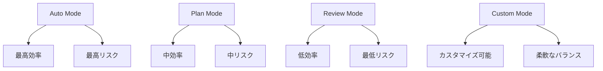

# Claude Code権限管理概要


## 実現できること

<div class="grid cards" markdown>

-   :material-shield-check: **セキュリティ最適化**
    
    リスクを最小化しながら開発効率を維持

-   :material-tune: **カスタム権限設定**
    
    プロジェクトに応じた柔軟な権限管理

-   :material-account-group: **チーム別管理**
    
    役割に応じた適切なアクセス制御

-   :material-automation: **自動権限調整**
    
    コンテキストに応じた動的権限変更

</div>

## 📖 権限システムの基本概念

Claude Code の権限システムは、AI による自動実行とセキュリティのバランスを取るための仕組みです。適切な設定により、安全性を保ちながら開発効率を最大化できます。

### 権限レベルの階層



## 🔧 権限モードの詳細設定

### 1. 基本的な権限モード

```bash
# Auto Mode (自動実行)
claude --permission-mode auto

# Plan Mode (計画のみ)
claude --permission-mode plan

# Review Mode (手動承認)
claude --permission-mode review

# カスタムモード
claude --permission-mode custom --config custom-permissions.json
```

### 2. 詳細な権限設定

```json
{
  "permissionMode": "custom",
  "allowedTools": {
    "Read": true,
    "Edit": {
      "enabled": true,
      "restrictions": {
        "file_patterns": ["src/**/*.ts", "src/**/*.tsx"],
        "max_file_size": "100KB",
        "exclude_patterns": ["**/*.config.js", "**/secrets/**"]
      }
    },
    "Bash": {
      "enabled": true,
      "allowed_commands": [
        "npm test",
        "npm run build",
        "git status",
        "git diff",
        "git add .",
        "git commit -m *"
      ],
      "forbidden_commands": [
        "rm -rf",
        "sudo",
        "curl *",
        "wget *"
      ]
    },
    "Write": {
      "enabled": false,
      "reason": "ファイル作成は手動承認が必要"
    }
  },
  "contextualRules": {
## 🔗 関連記事

- [自動実行権限ガイド](./claude-code-auto-permission-guide.md)
- [Claude Code完全ガイド](./claude-code-complete-guide.md)
- [制御とベストプラクティス](./claude-code-control-best-practices.md)

---

*最終更新: 2025-01-12*