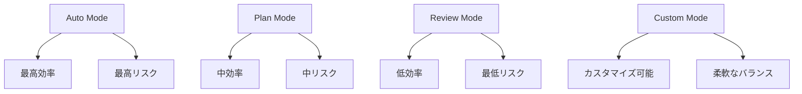
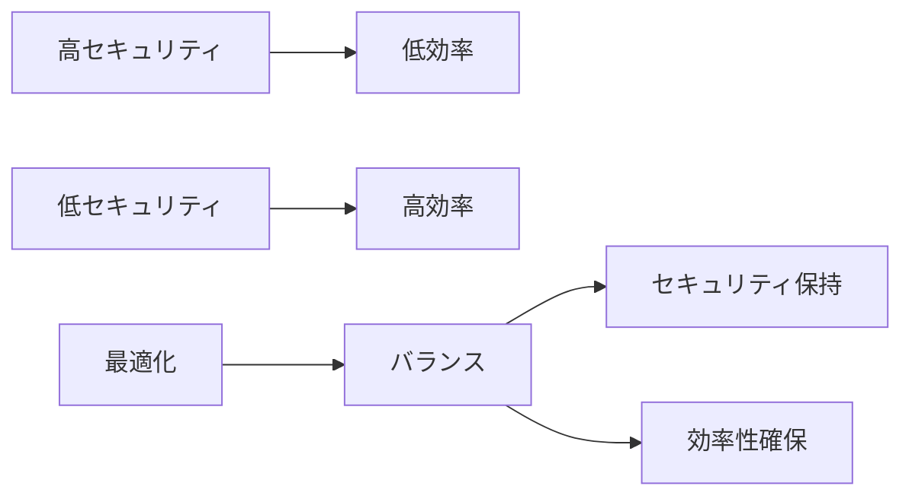

# Claude Code権限管理概要


## 実現できること

<div class="grid cards" markdown>

-   :material-shield-check: **セキュリティ最適化**
    
    リスクを最小化しながら開発効率を維持

-   :material-tune: **カスタム権限設定**
    
    プロジェクトに応じた柔軟な権限管理

-   :material-account-group: **チーム別管理**
    
    役割に応じた適切なアクセス制御

-   :material-automation: **自動権限調整**
    
    コンテキストに応じた動的権限変更

</div>

## 📖 権限システムの基本概念

Claude Code の権限システムは、AI による自動実行とセキュリティのバランスを取るための仕組みです。適切な設定により、安全性を保ちながら開発効率を最大化できます。

### 権限レベルの階層



## 🔧 権限モードの詳細設定

### 1. 基本的な権限モード

```bash
# Auto Mode (自動実行)
claude --permission-mode auto

# Plan Mode (計画のみ)
claude --permission-mode plan

# Review Mode (手動承認)
claude --permission-mode review

# カスタムモード
claude --permission-mode custom --config custom-permissions.json
```

### 2. 詳細な権限設定

```json
{
  "permissionMode": "custom",
  "allowedTools": {
    "Read": true,
    "Edit": {
      "enabled": true,
      "restrictions": {
        "file_patterns": ["src/**/*.ts", "src/**/*.tsx"],
        "max_file_size": "100KB",
        "exclude_patterns": ["**/*.config.js", "**/secrets/**"]
      }
    },
    "Bash": {
      "enabled": true,
      "allowed_commands": [
        "npm test",
        "npm run build",
        "git status",
        "git diff",
        "git add .",
        "git commit -m *"
      ],
      "forbidden_commands": [
        "rm -rf",
        "sudo",
        "curl *",
        "wget *"
      ]
    },
    "Write": {
      "enabled": false,
      "reason": "ファイル作成は手動承認が必要"
    }
  },
  "contextualRules": {
    "when_testing": {
      "permission_mode": "auto",
      "description": "テスト実行時は自動承認"
    },
    "when_production": {
      "permission_mode": "review",
      "description": "本番環境では全て手動承認"
    },
    "file_size_threshold": {
      "large_files": {
        "threshold": "1MB",
        "action": "require_approval"
      }
    }
  },
  "teamSettings": {
    "roles": {
      "senior_developer": {
        "permission_mode": "auto",
        "tools": ["all"]
      },
      "junior_developer": {
        "permission_mode": "plan",
        "tools": ["Read", "Edit", "restricted_Bash"]
      },
      "reviewer": {
        "permission_mode": "review",
        "tools": ["Read", "Comment"]
      }
    }
  }
}
```

## 🏢 エンタープライズ向け権限管理

### 組織レベルの権限ポリシー

```yaml
# organization-policy.yml
organization:
  default_permission_mode: "review"
  
teams:
  backend:
    permission_mode: "auto"
    allowed_tools: ["Read", "Edit", "Bash", "Write"]
    restricted_paths: ["config/", "secrets/"]
    
  frontend:
    permission_mode: "plan"
    allowed_tools: ["Read", "Edit", "Write"]
    restricted_commands: ["npm publish", "git push origin main"]
    
  devops:
    permission_mode: "auto"
    allowed_tools: ["all"]
    audit_level: "high"

compliance:
  audit_logging: true
  approval_workflow: true
  two_factor_commands: ["rm", "deploy", "delete"]
```

### コンプライアンス対応

```bash
# 監査ログの有効化
claude config set audit.enabled true
claude config set audit.level detailed

# 承認ワークフローの設定
claude config set approval.required_for "write,bash,deploy"
claude config set approval.reviewers "team-lead,security-team"
```

## 🛡️ セキュリティベストプラクティス

### 1. 最小権限の原則

```json
{
  "principle": "least_privilege",
  "default_deny": true,
  "explicit_allow": {
    "tools": ["Read"],
    "escalation": "approval_required"
  }
}
```

### 2. 時間ベース権限

```json
{
  "temporal_permissions": {
    "working_hours": {
      "monday_friday": {
        "start": "09:00",
        "end": "18:00",
        "permission_mode": "auto"
      }
    },
    "after_hours": {
      "permission_mode": "review",
      "requires_justification": true
    }
  }
}
```

### 3. リスクベース評価

```javascript
// リスク評価ルール
const riskAssessment = {
  lowRisk: {
    actions: ["read", "view", "search"],
    permission: "auto"
  },
  mediumRisk: {
    actions: ["edit", "create", "test"],
    permission: "plan"
  },
  highRisk: {
    actions: ["delete", "deploy", "config_change"],
    permission: "review"
  }
};
```

## 🔧 実践的な権限設定例

### 開発環境

```bash
# 開発時は効率重視
claude config set permission.mode auto
claude config set permission.restrictions minimal
claude config set audit.level basic
```

### ステージング環境

```bash
# バランス型設定
claude config set permission.mode plan
claude config set permission.review_threshold medium
claude config set audit.level standard
```

### 本番環境

```bash
# セキュリティ重視
claude config set permission.mode review
claude config set permission.require_approval all
claude config set audit.level comprehensive
```

## 📊 権限管理のモニタリング

### ダッシュボード例

```yaml
metrics:
  - permission_violations
  - approval_response_time
  - security_incidents
  - efficiency_impact

alerts:
  - unusual_permission_escalation
  - repeated_denials
  - after_hours_activity
```

### レポート生成

```bash
# 週次セキュリティレポート
claude report permission-usage --period weekly

# 権限違反の分析
claude analyze security-violations --last-month

# 効率性メトリクス
claude metrics efficiency --compare last-quarter
```

## 🚀 権限最適化のガイドライン

### 段階的な権限緩和

1. **初期設定**: 最も制限的な設定から開始
2. **観察期間**: 2週間のモニタリング
3. **段階的緩和**: データに基づく権限拡張
4. **継続的評価**: 月次レビューと調整

### パフォーマンス vs セキュリティ



## 🎯 まとめ

Claude Codeの権限管理は、**セキュリティと効率性のバランス**が鍵となります。

### 重要なポイント

1. **段階的アプローチ**: 制限的設定から始めて徐々に緩和
2. **コンテキスト対応**: 環境や状況に応じた動的権限変更
3. **継続的監視**: 定期的な見直しと最適化
4. **チーム連携**: 役割に応じた適切な権限分散

### 推奨実装順序

1. 基本的な権限モードの理解と設定
2. プロジェクト固有の制限ルール作成
3. チーム向けロールベース権限の導入
4. 監査とモニタリング体制の構築
5. 継続的最適化プロセスの確立

## 🔗 関連記事

### 基本・設定編
- [Claude Code完全ガイド](./claude-code-complete-guide.md) - 全体像とナビゲーション
- [自動実行権限ガイド](./claude-code-auto-permission-guide.md) - 具体的な設定操作方法
- [制御とベストプラクティス](./claude-code-control-best-practices.md) - CLAUDE.mdによる制御手法

### 実践・応用編
- [Claude Code Tips集](../Tips/claude-code-tips.md) - 実用的なテクニック集
- [エンタープライズ導入ガイド](./claude-code-enterprise-deployment.md) - 大規模組織での運用

---

