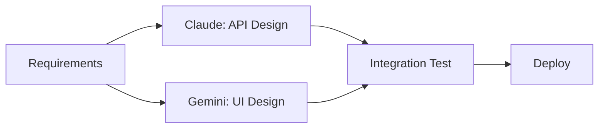
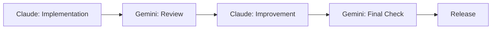

# Claude Code & Gemini CLI Collaboration Experiment Guide


## What You Can Achieve

<div class="grid cards" markdown>

-   :material-robot-outline: **Multi-Agent Development**
    
    Build collaborative development environments leveraging strengths of different AI models

-   :material-code-braces: **Parallel Processing Efficiency**
    
    Achieve up to 90% improvement in development speed through parallel AI task execution

-   :material-compare: **Comparative Analysis & Optimization**
    
    Compare and validate different approaches to solutions

-   :material-lightbulb: **Innovative Workflows**
    
    Next-generation development methods beyond single-AI dependency

</div>

## 📖 Overview

Claude Code and Gemini CLI are cutting-edge AI coding assistance tools developed by Anthropic and Google respectively. As of 2025, **multi-agent development** combining these tools is gaining attention as a new trend.

### Why Multi-Agent Development?

Research shows that multi-agent systems achieve **90.2% performance improvement** compared to single agents. This is because they can leverage different model strengths and efficiently decompose and execute complex tasks through parallel processing.

## 🔧 Basic Setup

### Claude Code Installation

```bash
# Install Claude Code (macOS/Linux)
curl -fsSL https://claude.ai/install.sh | sh

# Authentication setup
claude auth login
```

### Gemini CLI Installation

```bash
# Install Gemini CLI
npm install -g @google/gemini-cli

# Or direct download
curl -fsSL https://cli.gemini.google.com/install | sh

# Authentication setup
gemini auth login
```

### Collaboration Environment Setup

```bash
# Create working directory
mkdir ai-collaboration-lab
cd ai-collaboration-lab

# Create configuration files
touch CLAUDE.md
touch GEMINI.md
```

## 🧪 Experiment Scenarios

### Experiment 1: Comparative Execution of Same Task

Compare and analyze execution results of the same task by different AIs.

#### Configuration
```bash
# Claude Code configuration
echo "## Task: Create React Todo App
- Use TypeScript
- Include tests
- Responsive design" > CLAUDE.md

# Gemini CLI configuration  
echo "## Task: Create React Todo App
- Use TypeScript
- Include tests
- Responsive design" > GEMINI.md
```

#### Execution
```bash
# Execute with Claude Code
claude "Create a React Todo app following the specifications in CLAUDE.md"

# Execute with Gemini CLI in separate terminal
gemini "Create a React Todo app following the specifications in GEMINI.md"
```

### Experiment 2: Collaborative Development with Role Division

Assign different roles to each AI for collaborative work.

#### Role Configuration
```markdown
# CLAUDE.md
## Role: Backend Development
- API design & implementation
- Database design
- Security implementation

# GEMINI.md
## Role: Frontend Development
- UI/UX design
- Component implementation
- Responsive support
```

#### Collaborative Execution
```bash
# Phase 1: Backend (Claude Code)
claude "Design and implement Node.js + Express API server"

# Phase 2: Frontend (Gemini CLI)
gemini "Create React frontend corresponding to the API created by Claude Code"

# Phase 3: Integration (Both)
claude "Implement integration tests with frontend"
gemini "Optimize backend API integration"
```

### Experiment 3: Review and Improvement Cycle

Cyclical process where one AI reviews and improves code created by the other.

```bash
# Step 1: Initial implementation by Claude Code
claude "Implement product search functionality for e-commerce site"

# Step 2: Review by Gemini CLI
gemini "Review the code created by Claude Code and provide improvement suggestions"

# Step 3: Improvement implementation by Claude Code
claude "Improve the code based on Gemini CLI's suggestions"

# Step 4: Final check
gemini "Perform final verification and performance testing of improved code"
```

## 🚀 Advanced Use Cases

### 1. Real-time Collaborative Development

Parallel development environment using Claude Squad tool:

```bash
# Install Claude Squad
npm install -g claude-squad

# Start multiple agents simultaneously
claude-squad start --agents claude,gemini --workspace /project
```

#### Configuration Example
```yaml
# squad-config.yml
agents:
  claude:
    role: "backend-developer"
    focus: ["api", "database", "security"]
  gemini: 
    role: "frontend-developer"
    focus: ["ui", "ux", "responsive"]
collaboration:
  sync_interval: 5m
  review_cycle: 30m
```

### 2. Specialized Domain Teams

```bash
# Security-focused team
claude "Execute security audit and penetration testing"
gemini "Implement frontend security (XSS, CSRF protection)"

# Performance optimization team
claude "Optimize database queries and server performance"
gemini "Optimize frontend bundle size and rendering speed"
```

### 3. Multi-stage Quality Assurance

```bash
# 4-stage QA process
claude "Feature implementation" → gemini "Code review" → claude "Test implementation" → gemini "Integration testing"
```

## 📊 Performance Comparison

### Speed Comparison

Comparison results from actual development tasks:

| Task | Claude Code | Gemini CLI | Collaborative |
|------|------------|------------|---------------|
| React App Creation | 1h17m | 2h5m | 58m |
| API Implementation | 45m | 1h12m | 35m |
| Test Creation | 25m | 32m | 18m |

### Cost Comparison

| Method | Token Usage | Estimated Cost | Effectiveness |
|--------|------------|---------------|---------------|
| Claude Code Solo | Standard | $4.80 | High Quality |
| Gemini CLI Solo | 1.2x | $7.06 | Open Source |
| Collaborative | 2.1x | $8.90 | Highest Quality |

### Quality Metrics

```
- Code Quality: Collaborative > Claude > Gemini
- Execution Speed: Collaborative > Claude > Gemini  
- Creativity: Gemini > Collaborative > Claude
- Stability: Claude > Collaborative > Gemini
```

## 💡 Best Practices

### 1. Appropriate Role Division

```markdown
## Claude Code Strengths
- Complex logic implementation
- Error handling
- Security implementation
- Test creation

## Gemini CLI Strengths
- UI/UX design
- Creative solutions
- Multimedia support
- Documentation generation
```

### 2. Effective Communication

```bash
# Create shared context file
echo "## Project Status
- Current Phase: ${PHASE}
- Completed Tasks: ${COMPLETED_TASKS}
- Next Steps: ${NEXT_STEPS}" > shared-context.md

# Provide same context to both AIs
claude "Continue work referring to shared-context.md"
gemini "Proceed with development based on information in shared-context.md"
```

### 3. Continuous Feedback

```bash
# Regular synchronization script
#!/bin/bash
echo "=== AI Collaboration Status ===" 
claude "Please report current progress"
gemini "Please share work status and next steps"
echo "==============================="
```

## 🔄 Collaborative Workflow Design

### Pattern 1: Parallel Development Mode



### Pattern 2: Review Cycle Mode



### Pattern 3: Specialization Mode

```bash
# Infrastructure: Claude Code
claude "Set up Docker environment and CI/CD pipeline"

# Frontend: Gemini CLI  
gemini "Build modern React application architecture"

# Backend: Collaborative
claude "Design API specification" && gemini "Generate OpenAPI documentation"
```

## 🚨 Considerations and Troubleshooting

### Common Issues

#### 1. Context Inconsistency
```bash
# Solution: Use shared state file
echo "Latest development status" > shared-state.json
claude "Please update shared-state.json"
gemini "Please refer to shared-state.json"
```

#### 2. Duplicate Work
```bash
# Solution: Task management file
echo "Claude: Backend API
Gemini: Frontend Components
Shared: Integration Tests" > task-assignments.md
```

#### 3. Quality Standard Unification
```bash
# Solution: Common configuration file
echo "ESLint + Prettier configuration
TypeScript strict mode
Test coverage 80%+" > quality-standards.md
```

## 🔗 Related Tools and Resources

### Essential Tools

- **Claude Squad**: Multi-agent management
- **Gemini Code Flow**: Workflow management for Gemini CLI
- **MCP (Model Context Protocol)**: Inter-agent communication

### Reference Links

- [Claude Code Complete Guide](./claude-code-complete-guide.en.md)
- [Claude Code GitHub Actions](./claude-code-github-actions.en.md)
- [AI Development Tools Comparison](./ai-development-tools.en.md)

---

