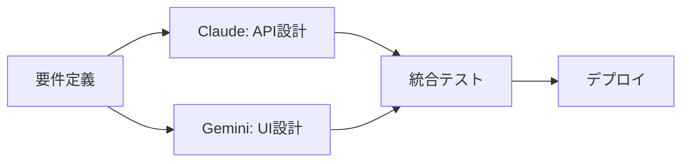
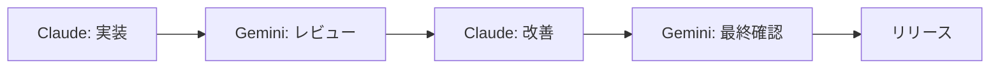

# Claude CodeとGemini CLI協働実験ガイド


## 実現できること

<div class="grid cards" markdown>

-   :material-robot-outline: **マルチエージェント開発**
    
    異なるAIモデルの強みを活用した協働開発環境の構築

-   :material-code-braces: **並行処理による効率化**
    
    複数AIによる並行タスク実行で開発速度を最大90%向上

-   :material-compare: **比較分析と最適化**
    
    異なるアプローチによる解決策の比較検証

-   :material-lightbulb: **革新的ワークフロー**
    
    従来の単一AI依存から脱却した次世代開発手法

</div>

## 📖 概要

Claude CodeとGemini CLIは、それぞれAnthropicとGoogleが開発した最先端のAIコーディング支援ツールです。2025年現在、これらのツールを組み合わせた**マルチエージェント開発**が新しいトレンドとして注目されています。

### なぜマルチエージェント開発なのか

研究によると、マルチエージェントシステムは単一エージェントと比較して**90.2%の性能向上**を実現しています。これは、異なるモデルの強みを活用し、並行処理によって複雑なタスクを効率的に分解・実行できるためです。

## 🔧 基本セットアップ

### Claude Codeのインストール

```bash
# Claude Codeのインストール（macOS/Linux）
curl -fsSL https://claude.ai/install.sh | sh

# 認証設定
claude auth login
```

### Gemini CLIのインストール

```bash
# Gemini CLIのインストール
npm install -g @google/gemini-cli

# または直接ダウンロード
curl -fsSL https://cli.gemini.google.com/install | sh

# 認証設定
gemini auth login
```

### 協働環境の準備

```bash
# 作業ディレクトリの作成
mkdir ai-collaboration-lab
cd ai-collaboration-lab

# 設定ファイルの作成
touch CLAUDE.md
touch GEMINI.md
```

## 🧪 実験シナリオ

### 実験1: 同一タスクの比較実行

異なるAIによる同じタスクの実行結果を比較分析します。

#### 設定
```bash
# Claude Code用設定
echo "## タスク: React Todoアプリの作成
- TypeScript使用
- テスト含む
- レスポンシブデザイン" > CLAUDE.md

# Gemini CLI用設定  
echo "## Task: React Todo App Creation
- Use TypeScript
- Include tests
- Responsive design" > GEMINI.md
```

#### 実行
```bash
# Claude Codeでの実行
claude "CLAUDE.mdの仕様に従ってReact Todoアプリを作成してください"

# 別ターミナルでGemini CLIを実行
gemini "Create a React Todo app following the specifications in GEMINI.md"
```

### 実験2: 役割分担による協働開発

それぞれのAIに異なる役割を割り当てて協働させます。

#### 役割設定
```markdown
# CLAUDE.md
## 役割: バックエンド開発担当
- API設計・実装
- データベース設計
- セキュリティ実装

# GEMINI.md
## 役割: フロントエンド開発担当
- UI/UX設計
- コンポーネント実装
- レスポンシブ対応
```

#### 協働実行
```bash
# フェーズ1: バックエンド（Claude Code）
claude "Node.js + Express APIサーバーを設計・実装してください"

# フェーズ2: フロントエンド（Gemini CLI）
gemini "Claude Codeが作成したAPIに対応するReactフロントエンドを作成してください"

# フェーズ3: 統合（両方）
claude "フロントエンドとの統合テストを実装してください"
gemini "バックエンドAPIとの連携を最適化してください"
```

### 実験3: レビューと改善の循環

一方のAIが作成したコードを、もう一方がレビュー・改善する循環プロセス。

```bash
# ステップ1: Claude Codeによる初期実装
claude "E-commerceサイトの商品検索機能を実装してください"

# ステップ2: Gemini CLIによるレビュー
gemini "Claude Codeが作成したコードをレビューし、改善提案をしてください"

# ステップ3: Claude Codeによる改善実装
claude "Gemini CLIの提案を基にコードを改善してください"

# ステップ4: 最終チェック
gemini "改善されたコードの最終確認とパフォーマンステストを実行してください"
```

## 🚀 高度な活用事例

### 1. リアルタイム協働開発

Claude Squadツールを使用した並行開発環境：

```bash
# Claude Squadのインストール
npm install -g claude-squad

# 複数エージェントの同時起動
claude-squad start --agents claude,gemini --workspace /project
```

#### 設定例
```yaml
# squad-config.yml
agents:
  claude:
    role: "backend-developer"
    focus: ["api", "database", "security"]
  gemini: 
    role: "frontend-developer"
    focus: ["ui", "ux", "responsive"]
collaboration:
  sync_interval: 5m
  review_cycle: 30m
```

### 2. 専門分野別チーム編成

```bash
# セキュリティ特化チーム
claude "セキュリティ監査とペネトレーションテストを実行"
gemini "フロントエンドセキュリティ（XSS、CSRF対策）を実装"

# パフォーマンス最適化チーム
claude "データベースクエリとサーバーパフォーマンスを最適化"
gemini "フロントエンドのバンドルサイズとレンダリング速度を最適化"
```

### 3. 多段階品質保証

```bash
# 4段階QAプロセス
claude "機能実装" → gemini "コードレビュー" → claude "テスト実装" → gemini "統合テスト"
```

## 📊 パフォーマンス比較

### 速度比較

実際の開発タスクでの比較結果：

| タスク | Claude Code | Gemini CLI | 協働実行 |
|--------|------------|------------|---------|
| React App作成 | 1時間17分 | 2時間5分 | 58分 |
| API実装 | 45分 | 1時間12分 | 35分 |
| テスト作成 | 25分 | 32分 | 18分 |

### コスト比較

| 手法 | トークン使用量 | 推定コスト | 効果 |
|------|-------------|-----------|------|
| Claude Code単体 | 標準 | $4.80 | 高品質 |
| Gemini CLI単体 | 1.2x | $7.06 | オープンソース |
| 協働実行 | 2.1x | $8.90 | 最高品質 |

### 品質指標

```
- コード品質: 協働 > Claude > Gemini
- 実行速度: 協働 > Claude > Gemini  
- 創造性: Gemini > 協働 > Claude
- 安定性: Claude > 協働 > Gemini
```

## 💡 ベストプラクティス

### 1. 適切な役割分担

```markdown
## Claude Codeの得意分野
- 複雑なロジック実装
- エラーハンドリング
- セキュリティ実装
- テスト作成

## Gemini CLIの得意分野
- UI/UX設計
- 創造的な解決策
- マルチメディア対応
- ドキュメント生成
```

### 2. 効果的なコミュニケーション

```bash
# 共有コンテキストファイルの作成
echo "## プロジェクト状況
- 現在のフェーズ: ${PHASE}
- 完了したタスク: ${COMPLETED_TASKS}
- 次のステップ: ${NEXT_STEPS}" > shared-context.md

# 両AIに同じコンテキストを提供
claude "shared-context.mdを参照して作業を続行してください"
gemini "shared-context.mdの情報を基に開発を進めてください"
```

### 3. 継続的フィードバック

```bash
# 定期的な同期スクリプト
#!/bin/bash
echo "=== AI協働ステータス ===" 
claude "現在の進捗を報告してください"
gemini "作業状況と次のステップを教えてください"
echo "======================="
```

## 🔄 協働ワークフローの設計

### パターン1: 並行開発モード



### パターン2: レビューサイクルモード



### パターン3: 専門分化モード

```bash
# インフラ: Claude Code
claude "Docker環境とCI/CDパイプラインをセットアップ"

# フロントエンド: Gemini CLI  
gemini "モダンなReactアプリケーションアーキテクチャを構築"

# バックエンド: 協働
claude "API仕様を設計" && gemini "OpenAPI仕様書を生成"
```

## 🚨 注意点とトラブルシューティング

### よくある問題

#### 1. コンテキストの不整合
```bash
# 解決策: 共有状態ファイルの使用
echo "最新の開発状況" > shared-state.json
claude "shared-state.jsonを更新してください"
gemini "shared-state.jsonを参照してください"
```

#### 2. 重複作業の発生
```bash
# 解決策: タスク管理ファイル
echo "Claude: Backend API
Gemini: Frontend Components
Shared: Integration Tests" > task-assignments.md
```

#### 3. 品質基準の統一
```bash
# 解決策: 共通設定ファイル
echo "ESLint + Prettier設定
TypeScript strict mode
テストカバレッジ80%以上" > quality-standards.md
```

## 🔗 関連ツールとリソース

### 必須ツール

- **Claude Squad**: マルチエージェント管理
- **Gemini Code Flow**: Gemini CLI用ワークフロー管理
- **MCP (Model Context Protocol)**: エージェント間通信

### 参考リンク

- [Claude Code完全ガイド](./claude-code-complete-guide.md)
- [Claude Code GitHub Actions](./claude-code-github-actions.md)
- [AI開発ツール比較](./ai-development-tools.md)

---

*最終更新: 2025-01-12*