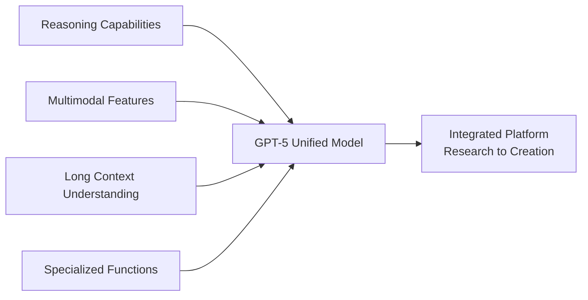
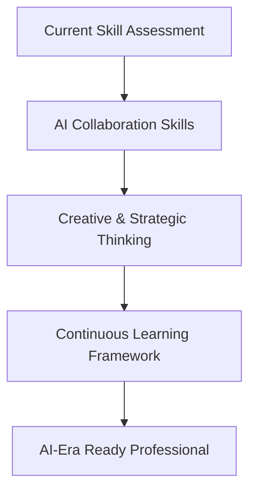

# Generative AI Trends July 2025: Japan Lags Behind in Adoption, GPT-5 Unified Model Announced


## What You Can Achieve

<div class="grid cards" markdown>

-   :material-trending-up: **Global Trend Analysis**
    
    Understand worldwide generative AI market movements and investment trends

-   :material-chart-line: **Japan Market Insights**
    
    Grasp current state of domestic AI adoption rates and challenges

-   :material-robot-industrial: **Technology Innovation Tracking**
    
    Stay updated on latest developments like GPT-5 unified model

-   :material-briefcase: **Business Strategy Reference**
    
    Get insights for corporate AI adoption strategies and investment decisions

</div>

## 📖 Overview

A comprehensive summary of the latest generative AI industry developments as of July 17, 2025. This article covers Japan's significantly lagging AI adoption rates compared to other developed nations, OpenAI's announcement of the GPT-5 unified model, massive investments by tech giants like Meta and Amazon, and employment impacts - essential news for technology professionals.

## 🇯🇵 Japan Market Status and Challenges

### International Usage Rate Comparison

The Ministry of Internal Affairs and Communications' White Paper on Information and Communications, published July 8, 2025, reveals concerning statistics:

| Country | Individual Usage | Corporate Usage |
|---------|------------------|-----------------|
| **China** | 81.2% | 95.8% |
| **USA** | 68.8% | 90.6% |
| **Germany** | 59.2% | 90.3% |
| **Japan** | **26.7%** | **55.2%** |

### Reasons for Non-Usage (Japan)

1. **"Not necessary for life/work"** - Over 40%
2. **"Don't know how to use"** - Nearly 40%
3. **Generation gap** - 20s (44.7%) vs 60s (15.5%)

### Government Response

Digital Agency is developing "Government AI" (tentative name):

- **2025 fiscal year**: Partial system implementation
- **2026 fiscal year**: Full rollout to central and local governments
- **Purpose**: Promote cross-agency generative AI adoption

## 🌍 Global Technology Trends

### OpenAI GPT-5 Unified Model

OpenAI's significant announcement for GPT-5 release in late 2025:



**Key Features**:
- Multiple specialized models integrated into single system
- Unified reasoning, multimodal, and long-context understanding
- Comprehensive task support from research to creative work

### Major Corporate Developments

#### Meta: $14.8B Investment Concerns

```python
# Meta AI investment analysis
meta_investment = {
    "amount": 14.8,  # billion USD
    "concerns": [
        "Excessive investment in saturated market",
        "Unclear ROI prospects",
        "Demand plateau concerns"
    ],
    "expert_view": "panic scaling rather than sustainable growth"
}
```

#### Amazon vs Walmart: AI Competition Intensifies

<div class="grid cards" markdown>

-   **Amazon Strategy**
    
    - Generative AI deployment in supply chain automation
    - Logistics optimization and cost reduction
    - Voice shopping enhancement

-   **Walmart Response**
    
    - Predictive analytics and inventory optimization
    - Personalization enhancement
    - Store operation efficiency improvement

</div>

## 💼 Corporate Implementation Cases

### Sony Group's Achievements

Presentation at AWS Summit Japan 2025:

- **Impact**: 50,000 hours monthly business time reduction
- **Strategy**: "AI Democratization" - all employees use AI
- **Goal**: Transformation to AI-driven company

### Executive Usage Patterns

"100 CEOs Survey" results:

```yaml
daily_usage_rate: 40%  # CEOs using AI daily
primary_use_cases:
  - "Planning & ideation": 48%
  - "Document creation & editing": 35%
  - "Data analysis support": 28%
  - "Decision support": 22%
```

## 🔬 Industry-Specific Adoption

### Pharmaceutical Industry (India)

Global Capability Centers (GCC) implementation:

1. **Molecular Prediction Modeling** - Early drug candidate discovery
2. **Clinical Trial Simulation** - Cost and time reduction
3. **Regulatory Data Processing** - Approval process efficiency

Impact: India's transformation from support hub to innovation center

### Publishing Industry (Vietnam)

```python
# AI benefits in publishing
publishing_ai_benefits = {
    "editing_efficiency": "+300%",
    "translation_cost": "-70%",
    "content_generation": "Educational material creation time halved",
    "global_expansion": "Market expansion through multilingual output"
}
```

## ⚠️ Employment Impact

### Executive Warnings

Leaders from Ford, JPMorgan, and Amazon raise concerns:

- **Target roles**: Finance, HR, administrative functions
- **Scale of impact**: Millions of white-collar positions
- **Countermeasures**: Investment in reskilling and digital transformation required

### Recommended Preparation



## 📱 Consumer-Facing New Features

### Lenovo Chromebook Plus 14

New features launched July 2025:

- **Smart grouping**: Automatic tab and document organization
- **AI image editing**: Built-in Gallery app functionality
- **Text extraction**: Image to editable text conversion

### NotebookLM Expansion

Google's announced new capabilities:

- **Public sharing**: Single-link notebook sharing
- **Expanded use cases**: Non-profits, corporate manuals, study guides
- **Enhanced accessibility**: Public access support

## 🎓 Educational Sector Progress

### Gemini for Education

Education-focused AI announced at ISTE 2025:

<div class="grid cards" markdown>

-   **For Learners**
    
    Personalized learning and customized content delivery

-   **For Educators**
    
    Engaging material creation and curriculum design support

-   **For Administrators**
    
    Educational effectiveness analysis and operational efficiency

-   **For Parents**
    
    Learning progress visualization and home study support

</div>

## 📊 Market Statistics and Trends

### Global Usage Statistics (June 2025 Survey)

```python
global_ai_usage_stats = {
    "us_adult_usage_rate": 61,  # % (past 6 months)
    "global_users": 1.8,        # billion
    "daily_active_users": 0.55, # billion (estimated)
    "growth_trend": "Continued expansion, but growth rate slowing"
}
```

### Copyright and Legal Developments

Significant judicial decisions:

- **Meta & OpenAI Victory**: AI training on copyrighted content deemed "fair use"
- **Impact**: Legal stability for AI companies' training data usage
- **Future**: More aggressive large-scale dataset utilization possible

## 🚀 Implementation Insights

### Actions for Technical Professionals

1. **Skill Assessment and Reallocation**
   ```python
   # Recommended skill investment allocation
   skill_investment = {
       "AI collaboration & prompt engineering": 30,
       "System design & architecture": 25,
       "Problem definition & value judgment": 20,
       "Creative experimentation & exploration": 15,
       "Traditional coding": 10  # %
   }
   ```

2. **Corporate Adoption Strategy**
   - Start with small-scale prototypes for effect validation
   - Begin with measurable ROI areas
   - Parallel implementation of gradual expansion and skill development

3. **Opportunities in Japanese Market**
   - Low adoption rate = significant growth potential
   - Government "Government AI" collaboration opportunities
   - Differentiation factors in manufacturing and service industries

## 💭 Summary

The generative AI industry in July 2025 demonstrates both **technological maturity** and **expanding market disparities**. While Japan significantly lags in adoption rates, this conversely represents enormous growth opportunities.

For technical professionals, priorities include:
- Early acquisition of **AI collaboration skills**
- Shift focus to **value creation**
- Establish **continuous learning** systems

With the introduction of GPT-5 unified model, AI capabilities will leap forward dramatically. To avoid falling behind this wave, action must start immediately.

## 🔗 Related Articles

- [AI Era Engineer Capability Map 3.0](./ai-engineer-skills-philosophy-2025.en.md)
- [AI Development Tools Comparison](./ai-development-tools.en.md)
- [Agent-Based AI Development](./agentic-ai-development.en.md)

---