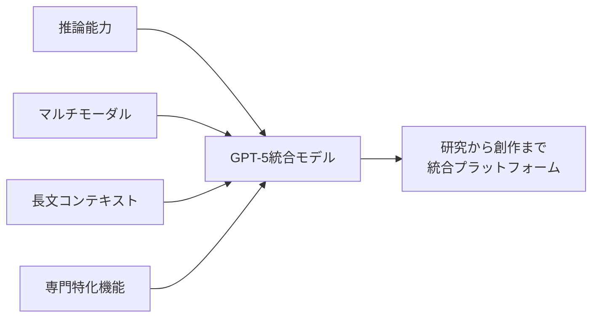
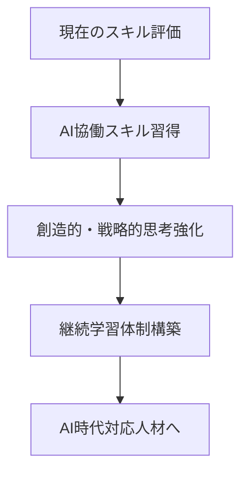

# 生成AI最新動向2025年7月：日本の利用率は世界に大きく遅れ、GPT-5統合モデル発表へ


## 実現できること

<div class="grid cards" markdown>

-   :material-trending-up: **グローバル動向把握**
    
    世界の生成AI市場動向と投資トレンドを理解

-   :material-chart-line: **日本市場分析**
    
    国内の生成AI利用率と課題の現状を把握

-   :material-robot-industrial: **技術革新追跡**
    
    GPT-5統合モデルなど最新技術動向をキャッチアップ

-   :material-briefcase: **ビジネス戦略**
    
    企業のAI活用戦略と投資判断の参考情報を取得

</div>

## 📖 Overview

2025年7月17日時点での生成AI業界の最新動向をまとめました。日本の生成AI利用率が先進国に大きく遅れている実態、OpenAIによるGPT-5統合モデルの発表、Meta・Amazon等の大手企業による大規模投資、そして雇用への影響など、技術者が知っておくべき重要なニュースを整理しています。

## 🇯🇵 日本市場の現状と課題

### 利用率の国際比較

総務省が2025年7月8日に公表した情報通信白書によると、深刻な実態が明らかになりました：

| 国名 | 個人利用率 | 企業利用率 |
|------|-----------|-----------|
| **中国** | 81.2% | 95.8% |
| **米国** | 68.8% | 90.6% |
| **ドイツ** | 59.2% | 90.3% |
| **日本** | **26.7%** | **55.2%** |

### 利用しない理由（日本）

1. **「生活や業務に必要ない」** - 40%超
2. **「使い方がわからない」** - 40%近く
3. **年代格差** - 20代（44.7%）vs 60代（15.5%）

### 政府の対策

デジタル庁は「ガバメントAI」（仮称）を開発中：

- **2025年度中**: 一部システム実用化
- **2026年度**: 中央官庁・地方自治体への本格提供開始
- **目的**: 行政機関横断での生成AI活用促進

## 🌍 グローバル技術動向

### OpenAI GPT-5統合モデル

OpenAIが2025年後半リリース予定のGPT-5について重要な発表：



**特徴**:
- 複数の専門モデルを単一システムに統合
- 推論・マルチモーダル・長文理解の統合
- 研究から創作まで幅広いタスク対応

### 大手企業の動向

#### Meta: $14.8B投資の背景

```python
# Meta AI投資分析
meta_investment = {
    "amount": 14.8,  # billion USD
    "concerns": [
        "過飽和市場での過度な投資",
        "ROI不透明性",
        "需要平坦化への懸念"
    ],
    "expert_view": "panic scaling rather than sustainable growth"
}
```

#### Amazon vs Walmart: AI競争激化

<div class="grid cards" markdown>

-   **Amazon戦略**
    
    - サプライチェーン自動化への生成AI投入
    - 物流最適化とコスト削減
    - 音声ショッピング強化

-   **Walmart対応**
    
    - 予測分析と在庫最適化
    - パーソナライゼーション強化
    - 店舗運営効率化

</div>

## 💼 企業活用事例

### ソニーグループの成果

AWS Summit Japan 2025での発表内容：

- **効果**: 月5万時間の業務時間削減
- **戦略**: "AIの民主化" - 全社員がAI活用
- **目標**: AIドリブンカンパニーへの変革

### 経営者の利用実態

「社長100人アンケート」結果：

```yaml
daily_usage_rate: 40%  # 毎日利用する経営者
primary_use_cases:
  - "企画・アイデア出し": 48%
  - "文書作成・校正": 35%
  - "データ分析支援": 28%
  - "意思決定サポート": 22%
```

## 🔬 産業別導入状況

### 製薬業界（インド）

グローバル・ケイパビリティ・センター(GCC)での活用：

1. **分子予測モデリング** - 新薬候補物質の早期発見
2. **臨床試験シミュレーション** - コスト・時間削減
3. **規制データ処理** - 承認プロセス効率化

効果：インドが支援拠点からイノベーション拠点へ変革

### 出版業界（ベトナム）

```python
# 出版業界でのAI活用効果
publishing_ai_benefits = {
    "editing_efficiency": "+300%",
    "translation_cost": "-70%",
    "content_generation": "教材制作時間半減",
    "global_expansion": "多言語出力による市場拡大"
}
```

## ⚠️ 雇用への影響

### 経営陣の警告

Ford、JPMorgan、Amazonの幹部が警鐘：

- **対象職種**: 金融、HR、管理業務
- **影響規模**: 数百万人のホワイトカラー職
- **対策**: リスキリング・デジタル変革への投資必要

### 推奨される準備



## 📱 コンシューマー向け新機能

### Lenovo Chromebook Plus 14

2025年7月新機能：

- **Smart grouping**: タブ・文書の自動整理
- **AI画像編集**: ギャラリーアプリ内蔵
- **テキスト抽出**: 画像から編集可能テキストへ変換

### NotebookLM拡張

Googleが発表した新機能：

- **公開共有**: 単一リンクでノートブック公開
- **用途拡大**: 非営利団体、企業マニュアル、学習ガイド
- **アクセス性向上**: パブリックアクセス対応

## 🎓 教育分野の進展

### Gemini for Education

ISTE 2025で発表された教育特化AI：

<div class="grid cards" markdown>

-   **学習者向け**
    
    個別最適化学習とパーソナライズド・コンテンツ

-   **教育者向け**
    
    魅力的な教材作成とカリキュラム設計支援

-   **管理者向け**
    
    教育効果分析と運営効率化

-   **保護者向け**
    
    学習進捗の可視化と家庭学習サポート

</div>

## 📊 市場統計とトレンド

### グローバル利用状況（2025年6月調査）

```python
global_ai_usage_stats = {
    "us_adult_usage_rate": 61,  # %（過去6ヶ月）
    "global_users": 1.8,        # billion
    "daily_active_users": 0.55, # billion (推定)
    "growth_trend": "継続的拡大、ただし成長率は鈍化傾向"
}
```

### 著作権・法的動向

重要な司法判断：

- **Meta・OpenAI勝訴**: 著作権コンテンツのAI学習利用が「公正使用」と認定
- **影響**: AI企業の学習データ利用に法的安定性
- **今後**: より積極的な大規模データセット活用が可能に

## 🚀 実装への示唆

### 技術者が取るべきアクション

1. **スキル評価と再配分**
   ```python
   # 推奨スキル投資配分
   skill_investment = {
       "AI協働・プロンプトエンジニアリング": 30,
       "システム設計・アーキテクチャ": 25,
       "問題定義・価値判断": 20,
       "創造的実験・探索": 15,
       "従来のコーディング": 10  # ％
   }
   ```

2. **企業での導入戦略**
   - まず小規模プロトタイプで効果検証
   - ROI測定可能な領域から開始
   - 段階的拡大とスキル育成の並行実施

3. **日本市場での機会**
   - 低利用率 = 大きな成長ポテンシャル
   - 政府の「ガバメントAI」連携機会
   - 製造業・サービス業での差別化要因

## 💭 まとめ

2025年7月の生成AI業界は、**技術的成熟**と**市場格差拡大**の両面を示しています。日本は利用率で大きく遅れているものの、これは逆に言えば巨大な成長機会を意味します。

技術者としては：
- **AI協働スキル**の早期習得
- **価値創造**への焦点シフト  
- **継続学習**体制の構築

が急務です。GPT-5統合モデルの登場で、AI能力はさらに飛躍的に向上します。この波に乗り遅れないよう、今すぐ行動を開始しましょう。

## 🔗 Related Articles

- [AI時代のエンジニア能力マップ3.0](./ai-engineer-skills-philosophy-2025.md)
- [AI開発ツール比較](./ai-development-tools.md)
- [エージェント型AI開発](./agentic-ai-development.md)

---