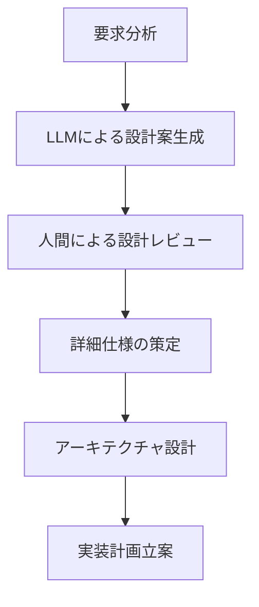

# LLMを活用したプログラミングの実践ガイド

## LLMプログラミングの基本原則

LLM（大規模言語モデル）を活用したプログラミングは、従来の開発手法を根本的に変革しています。2025年現在、LLMは単なるコード補完ツールから、包括的な開発パートナーへと進化しています。

### 基本的な考え方
1. **人間とAIの協調**: LLMは置き換えではなく、増強するツール
2. **反復的改善**: 一度で完璧を求めず、段階的に改善
3. **コンテキスト重視**: 豊富な情報提供がより良い結果を生む
4. **検証の習慣**: LLMの出力は必ず人間が検証・テスト

## 開発ワークフローの設計

### 1. プロジェクト開始時のワークフロー



#### 具体的な実践例
```python
# 1. 要求分析をLLMに相談
prompt = """
以下の要求を分析して、技術仕様を提案してください：

要求：
- Webベースのタスク管理システム
- ユーザー認証機能
- タスクの作成、編集、削除
- チーム共有機能
- リアルタイム更新

制約：
- 開発期間：3ヶ月
- チーム：フロントエンド2名、バックエンド2名
- 予算：システム運用費月額5万円以内

提案してほしい内容：
1. 技術スタック
2. アーキテクチャ概要
3. 主要機能の実装優先度
4. セキュリティ考慮事項
"""
```

### 2. 実装フェーズのワークフロー

```python
# 段階的な実装アプローチ
class DevelopmentPhase:
    def __init__(self):
        self.phases = [
            "PoC (Proof of Concept)",
            "MVP (Minimum Viable Product)", 
            "機能拡張",
            "パフォーマンス最適化",
            "プロダクション対応"
        ]
    
    def execute_phase(self, phase, llm_assistant):
        """各フェーズでLLMを活用"""
        requirements = self.get_phase_requirements(phase)
        implementation = llm_assistant.generate_code(requirements)
        tested_code = self.test_and_validate(implementation)
        return tested_code
```

## 効果的なプロンプト設計パターン

### 1. 階層的プロンプト

```python
# 悪い例：曖昧すぎるプロンプト
"Pythonでログイン機能を作って"

# 良い例：構造化されたプロンプト
prompt = """
【システム概要】
- FastAPI を使用したWebAPI
- JWT認証を実装
- PostgreSQLでユーザー情報管理

【要求仕様】
1. ユーザー登録エンドポイント（POST /register）
2. ログインエンドポイント（POST /login）
3. ユーザー情報取得（GET /me）
4. パスワードハッシュ化（bcrypt使用）

【技術的制約】
- Python 3.11
- FastAPI 0.104+
- SQLAlchemy 2.0
- Pydantic v2

【セキュリティ要件】
- パスワード最小8文字、英数字記号含む
- JWT有効期限1時間
- リフレッシュトークン機能

【期待する出力】
1. コード実装
2. テストケース
3. API仕様書（OpenAPI形式）
4. セキュリティチェックリスト
"""
```

### 2. コンテキスト注入パターン

```python
# プロジェクトコンテキストを含むプロンプト
context_prompt = f"""
【プロジェクトコンテキスト】
プロジェクト名: {project_name}
アーキテクチャ: {architecture_type}
使用技術: {tech_stack}
コーディング規約: {coding_standards}
テスト戦略: {testing_strategy}

【既存コード構造】
{code_structure}

【今回の作業】
{current_task}

上記のコンテキストを考慮して実装してください。
"""
```

### 3. エラー修正パターン

```python
debug_prompt = """
【エラー状況】
エラーメッセージ: {error_message}
発生箇所: {error_location}
スタックトレース: {stack_trace}

【環境情報】
OS: {os_info}
Python版: {python_version}
依存関係: {dependencies}

【関連コード】
{relevant_code}

【試したこと】
{attempted_solutions}

【求める解決策】
1. エラーの根本原因
2. 修正方法（コード含む）
3. 再発防止策
4. 関連する可能性のある問題
"""
```

## コード品質向上のテクニック

### 1. レビュー駆動開発

```python
# LLMを使ったコードレビューの例
review_prompt = """
以下のコードをレビューしてください：

【レビュー観点】
1. 可読性・保守性
2. パフォーマンス
3. セキュリティ
4. エラーハンドリング
5. テスタビリティ
6. 設計原則の遵守

【コード】
{code_to_review}

【プロジェクト固有の制約】
- 処理時間は1秒以内
- メモリ使用量は100MB以下
- 同時接続数1000まで対応

【出力形式】
- 問題点の特定と重要度（高/中/低）
- 具体的な改善案
- リファクタリング後のコード
"""
```

### 2. テスト駆動開発（TDD）の支援

```python
# テスト先行開発のプロンプト例
tdd_prompt = """
以下の仕様に基づいてテストケースを先に作成してください：

【機能仕様】
{function_specification}

【テスト戦略】
- 単体テスト（pytest使用）
- 境界値テスト
- 異常系テスト
- モック・スタブの活用

【期待するテストケース】
1. 正常系テスト
2. 異常系テスト
3. 境界値テスト
4. パフォーマンステスト

テスト作成後、実装コードも提供してください。
"""
```

### 3. リファクタリング支援

```python
refactoring_prompt = """
以下のレガシーコードを現代的なPythonコードにリファクタリングしてください：

【対象コード】
{legacy_code}

【リファクタリング目標】
1. 型ヒントの追加
2. 関数の単一責任原則
3. エラーハンドリングの改善
4. ドキュメント文字列の追加
5. テストしやすい構造

【制約】
- 既存のAPIは変更しない
- パフォーマンスは維持または改善
- Python 3.11の機能を活用

【出力】
1. リファクタリングされたコード
2. 変更点の説明
3. 移行ガイド
"""
```

## パフォーマンス最適化

### 1. プロファイリング支援

```python
# パフォーマンス分析のプロンプト
performance_prompt = """
以下のコードのパフォーマンスを分析・改善してください：

【現在の問題】
- 処理時間: {current_time}秒（目標: {target_time}秒）
- メモリ使用量: {current_memory}MB（目標: {target_memory}MB）
- データサイズ: {data_size}件

【対象コード】
{performance_critical_code}

【分析項目】
1. ボトルネックの特定
2. アルゴリズムの複雑度分析
3. メモリ効率の評価
4. I/O処理の最適化

【改善提案】
1. 最適化されたコード
2. ベンチマーク比較
3. 代替アルゴリズムの提案
"""
```

### 2. 並列処理の実装

```python
# 並列処理実装のガイダンス
concurrency_prompt = """
以下の処理を並列化して高速化してください：

【処理内容】
{sequential_processing_code}

【要件】
- データ量: {data_volume}
- 利用可能CPU: {cpu_cores}コア
- メモリ制限: {memory_limit}GB

【並列化戦略】
1. マルチプロセッシング
2. マルチスレッディング
3. 非同期処理
4. バッチ処理

【考慮事項】
- データの依存関係
- 共有リソースへのアクセス
- エラーハンドリング
- 進捗監視
"""
```

## デバッグとトラブルシューティング

### 1. 体系的なデバッグアプローチ

```python
class LLMDebuggingAssistant:
    def analyze_error(self, error_info):
        prompt = f"""
        【エラー解析依頼】
        
        1. エラーの分類
        2. 発生可能性の高い原因
        3. 調査手順
        4. 修正方法の提案
        
        【エラー情報】
        {error_info}
        
        【環境情報】
        {self.get_environment_info()}
        """
        return self.llm.generate(prompt)
    
    def suggest_debugging_strategy(self, problem_description):
        return """
        1. ログ出力の追加
        2. 単体テストの作成
        3. データフローの可視化
        4. パフォーマンス計測
        5. 外部依存関係の確認
        """
```

### 2. ログ分析支援

```python
log_analysis_prompt = """
以下のログを分析して問題を特定してください：

【ログデータ】
{log_data}

【システム情報】
- アプリケーション: {app_name}
- 環境: {environment}
- タイムゾーン: {timezone}

【分析項目】
1. エラーパターンの特定
2. 時系列での問題発生傾向
3. 関連するイベントの相関
4. 性能指標の異常値

【出力】
1. 問題の要約
2. 根本原因の推定
3. 対策案
4. 監視改善提案
"""
```

## セキュリティベストプラクティス

### 1. セキュリティレビュー

```python
security_review_prompt = """
以下のコードのセキュリティを評価してください：

【対象コード】
{code_for_security_review}

【チェック項目】
1. 入力値検証
2. SQLインジェクション対策
3. XSS対策
4. 認証・認可
5. データ暗号化
6. ログ出力のセキュリティ

【コンプライアンス要件】
- GDPR準拠
- SOC2 Type II
- PCI DSS（決済関連の場合）

【出力】
1. 脆弱性の特定
2. リスク評価（Critical/High/Medium/Low）
3. 修正方法
4. セキュリティテストケース
"""
```

### 2. 安全なAPI設計

```python
# セキュアなAPI設計支援
api_security_prompt = """
以下のAPI仕様のセキュリティを強化してください：

【現在のAPI仕様】
{current_api_spec}

【セキュリティ要件】
1. 認証メカニズム（JWT/OAuth2）
2. レート制限
3. データ検証
4. ログ監査
5. HTTPS強制

【出力】
1. セキュリティ強化されたAPI仕様
2. セキュリティ実装コード
3. セキュリティテスト手順
4. 運用時のセキュリティチェックリスト
"""
```

## チーム開発でのLLM活用

### 1. コードレビューの標準化

```python
# チーム向けレビューテンプレート
team_review_template = """
【レビュー項目】（チーム共通）
□ コーディング規約遵守
□ テストカバレッジ80%以上
□ ドキュメント更新
□ セキュリティチェック
□ パフォーマンス影響評価

【プロジェクト固有項目】
□ {project_specific_checks}

【LLMレビュー結果】
{llm_review_results}

【人間レビュアーの判断】
□ 承認
□ 修正要求
□ 議論が必要
"""
```

### 2. 知識共有の促進

```python
knowledge_sharing_prompt = """
以下の実装について、チーム向けの技術共有資料を作成してください：

【実装内容】
{implementation_details}

【対象者】
- 経験レベル: {team_experience_level}
- 技術背景: {technical_background}

【資料構成】
1. 概要・背景
2. 技術選択理由
3. 実装のポイント
4. 注意事項・落とし穴
5. 参考資料・リンク

【出力形式】
- Markdown形式
- コード例含む
- 図表も含める（PlantUML等）
"""
```

## 継続的学習と改善

### 1. 技術トレンドの把握

```python
trend_analysis_prompt = """
以下の技術分野の最新トレンドを調査し、
プロジェクトへの適用可能性を評価してください：

【技術分野】
{technology_domain}

【現在のプロジェクト状況】
{project_current_state}

【評価項目】
1. 技術的メリット
2. 導入コスト・リスク
3. 学習コスト
4. 競合優位性
5. 長期的な保守性

【出力】
1. トレンド分析レポート
2. 適用可能性評価
3. 導入計画案
4. リスク軽減策
"""
```

### 2. スキル向上計画

```python
skill_development_prompt = """
現在のスキルセットを分析し、学習計画を提案してください：

【現在のスキル】
{current_skills}

【プロジェクト要求スキル】
{required_skills}

【キャリア目標】
{career_goals}

【制約】
- 学習時間: 週{study_hours}時間
- 期間: {timeframe}
- 予算: {budget}

【学習計画】
1. 優先度付けされたスキル一覧
2. 学習リソース（書籍、コース、プロジェクト）
3. マイルストーン設定
4. 進捗測定方法
"""
```

## まとめ

LLMを活用したプログラミングは、開発者の生産性と創造性を大幅に向上させる可能性を秘めています。しかし、効果的な活用には以下が重要です：

1. **明確なコミュニケーション**: LLMに対する指示は具体的で構造化する
2. **段階的なアプローチ**: 複雑な問題は小さな部分に分割して解決
3. **検証の習慣**: LLMの出力は必ず人間が確認・テスト
4. **継続的な学習**: 新しい手法や機能を積極的に試す
5. **チーム全体での活用**: 個人だけでなく、チーム全体でベストプラクティスを共有

LLMは開発者を置き換えるのではなく、より高度で創造的な作業に集中できるよう支援するツールです。適切に活用することで、より良いソフトウェアをより効率的に開発することが可能になります。