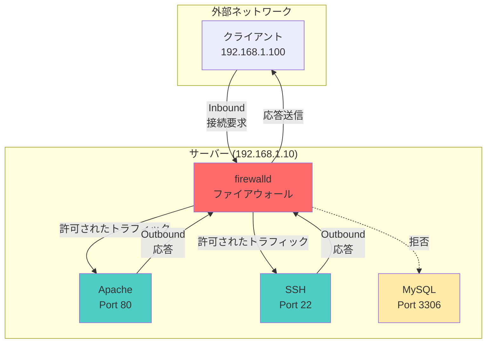
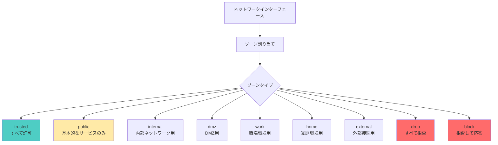
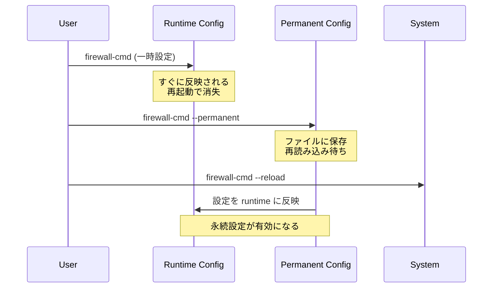

# firewalldコマンド完全ガイド

CentOS/RHEL 7以降で標準的なファイアウォール管理ツールであるfirewalldの設定方法を詳しく解説します。

## 実現できること

<div class="grid cards" markdown>

-   :fontawesome-solid-shield:{ .lg .middle } __ゾーンベース管理__

    ---

    ネットワークインターフェースをゾーンで分類し柔軟な制御

-   :fontawesome-solid-clock:{ .lg .middle } __動的設定変更__

    ---

    サービス停止なしでリアルタイム設定変更

-   :fontawesome-solid-layer-group:{ .lg .middle } __サービス定義__

    ---

    predefinedサービスで簡単なポート管理

-   :fontawesome-solid-code:{ .lg .middle } __Rich Rules__

    ---

    高度な条件指定によるきめ細かい制御

</div>

## firewalldの基本概念

### ネットワーク通信の仕組み



### Inbound vs Outbound

| 方向 | 説明 | 例 | 制御方法 |
|------|------|-----|----------|
| **Inbound** | 外部からサーバーへの接続 | SSH接続、Web アクセス | `--add-service`, `--add-port` |
| **Outbound** | サーバーから外部への接続 | パッケージ更新、外部API呼び出し | `--add-rich-rule` (送信元指定) |

## ゾーン（Zone）の概念

### ゾーン階層と役割



### デフォルトゾーンの特徴

| ゾーン | 信頼レベル | 用途 | デフォルトサービス |
|--------|------------|------|-------------------|
| **trusted** | 最高 | 完全に信頼できるネットワーク | すべて許可 |
| **public** | 低 | 公共ネットワーク（デフォルト） | ssh, dhcpv6-client |
| **internal** | 高 | 内部ネットワーク | ssh, mdns, samba-client, dhcpv6-client |
| **dmz** | 中 | DMZ（非武装地帯） | ssh |
| **drop** | なし | すべて破棄 | なし |

## 基本操作コマンド

### サービス状態確認

```bash
# firewalldサービス状態確認
systemctl status firewalld

# firewalldの起動
sudo systemctl start firewalld

# 自動起動設定
sudo systemctl enable firewalld

# 現在の設定概要表示
sudo firewall-cmd --list-all

# 全ゾーンの設定表示
sudo firewall-cmd --list-all-zones
```

### ゾーン管理

```bash
# デフォルトゾーン確認
sudo firewall-cmd --get-default-zone

# 利用可能ゾーン一覧
sudo firewall-cmd --get-zones

# アクティブゾーン確認
sudo firewall-cmd --get-active-zones

# デフォルトゾーン変更
sudo firewall-cmd --set-default-zone=internal

# インターフェースのゾーン確認
sudo firewall-cmd --get-zone-of-interface=eth0

# インターフェースをゾーンに割り当て
sudo firewall-cmd --zone=internal --change-interface=eth0 --permanent
```

## サービス設定

### 定義済みサービス管理

```bash
# 利用可能サービス一覧
sudo firewall-cmd --get-services

# サービス詳細確認
sudo firewall-cmd --info-service=ssh

# サービス追加（一時的）
sudo firewall-cmd --add-service=http

# サービス追加（永続化）
sudo firewall-cmd --add-service=http --permanent

# 複数サービス同時追加
sudo firewall-cmd --add-service={http,https,ssh} --permanent

# サービス削除
sudo firewall-cmd --remove-service=http --permanent

# 現在有効なサービス確認
sudo firewall-cmd --list-services
```

### よく使用するサービス例

| サービス名 | ポート | 用途 |
|------------|--------|------|
| `ssh` | 22/tcp | SSH接続 |
| `http` | 80/tcp | Web サーバー |
| `https` | 443/tcp | SSL Web サーバー |
| `ftp` | 21/tcp | FTP サーバー |
| `mysql` | 3306/tcp | MySQL データベース |
| `postgresql` | 5432/tcp | PostgreSQL データベース |
| `smtp` | 25/tcp | メール送信 |
| `dns` | 53/tcp,53/udp | DNS サーバー |
| `nfs` | 2049/tcp | NFS ファイル共有 |
| `samba` | 445/tcp, 139/tcp | Samba ファイル共有 |

## ポート設定

### 直接ポート指定

```bash
# ポート追加（一時的）
sudo firewall-cmd --add-port=8080/tcp

# ポート追加（永続化）
sudo firewall-cmd --add-port=8080/tcp --permanent

# ポート範囲指定
sudo firewall-cmd --add-port=8000-8100/tcp --permanent

# 複数ポート同時追加
sudo firewall-cmd --add-port={80/tcp,443/tcp,8080/tcp} --permanent

# UDPポート追加
sudo firewall-cmd --add-port=1194/udp --permanent

# ポート削除
sudo firewall-cmd --remove-port=8080/tcp --permanent

# 開放ポート確認
sudo firewall-cmd --list-ports
```

### ポート転送（Port Forwarding）

```bash
# ポート転送設定
sudo firewall-cmd --add-forward-port=port=80:proto=tcp:toport=8080 --permanent

# 異なるホストへの転送
sudo firewall-cmd --add-forward-port=port=80:proto=tcp:toaddr=192.168.1.100:toport=80 --permanent

# 転送ルール確認
sudo firewall-cmd --list-forward-ports
```

## Rich Rules（高度なルール）

### Rich Rulesの構文

```bash
# 基本構文
sudo firewall-cmd --add-rich-rule='rule family="ipv4" source address="IP/マスク" service name="サービス名" accept'
```

### 実践的なRich Rules例

```bash
# 特定IPからのSSH接続のみ許可
sudo firewall-cmd --add-rich-rule='rule family="ipv4" source address="192.168.1.100" service name="ssh" accept' --permanent

# 特定ネットワークからのHTTP接続許可
sudo firewall-cmd --add-rich-rule='rule family="ipv4" source address="192.168.1.0/24" service name="http" accept' --permanent

# 特定IPからの接続を拒否
sudo firewall-cmd --add-rich-rule='rule family="ipv4" source address="192.168.1.50" reject' --permanent

# 時間制限付きルール（1時間後に削除）
sudo firewall-cmd --add-rich-rule='rule family="ipv4" source address="192.168.1.0/24" service name="ftp" accept' --timeout=3600

# ログ付きルール
sudo firewall-cmd --add-rich-rule='rule family="ipv4" source address="0.0.0.0/0" service name="ssh" log prefix="SSH-LOG" level="info" limit value="3/m" accept' --permanent

# Rich Rules一覧表示
sudo firewall-cmd --list-rich-rules
```

### Outbound制御の例

```bash
# 特定ポートへの外部接続制御
sudo firewall-cmd --direct --add-rule ipv4 filter OUTPUT 0 -p tcp --dport 443 -j ACCEPT --permanent

# 特定IPへの接続のみ許可
sudo firewall-cmd --add-rich-rule='rule family="ipv4" destination address="8.8.8.8" accept' --permanent
```

## 設定の永続化と反映

### 設定変更の流れ



### 設定管理コマンド

```bash
# 設定再読み込み（permanent → runtime）
sudo firewall-cmd --reload

# 完全再起動（全接続切断）
sudo firewall-cmd --complete-reload

# 現在の設定をpermanentに保存
sudo firewall-cmd --runtime-to-permanent

# 設定ファイル確認
ls /etc/firewalld/zones/

# 設定内容確認
sudo cat /etc/firewalld/zones/public.xml
```

## トラブルシューティング

### 設定確認・診断

```bash
# 詳細な状態確認
sudo firewall-cmd --state
sudo firewall-cmd --get-default-zone
sudo firewall-cmd --get-active-zones
sudo firewall-cmd --list-all

# ログ確認
sudo journalctl -f -u firewalld
sudo journalctl -u firewalld --since "1 hour ago"

# 接続テスト
telnet サーバーIP ポート番号
nc -zv サーバーIP ポート番号

# iptablesルール確認（参考）
sudo iptables -L -n
sudo iptables -t nat -L -n
```

### よくある問題と対処法

#### 1. 設定したのに接続できない

```bash
# permanentに設定したか確認
sudo firewall-cmd --list-services --permanent

# reloadしたか確認
sudo firewall-cmd --reload

# 正しいゾーンに設定したか確認
sudo firewall-cmd --get-active-zones
sudo firewall-cmd --list-all --zone=適切なゾーン
```

#### 2. SSH接続が切れてしまった

```bash
# コンソールアクセスで緊急対処
sudo firewall-cmd --add-service=ssh
sudo firewall-cmd --add-service=ssh --permanent
sudo firewall-cmd --reload

# 一時的にfirewall停止（最終手段）
sudo systemctl stop firewalld
```

#### 3. 複雑な設定をリセットしたい

```bash
# デフォルト設定に戻す
sudo firewall-cmd --complete-reload
sudo rm /etc/firewalld/zones/*.xml
sudo systemctl reload firewalld
```

## セキュリティベストプラクティス

### 基本原則

1. **最小権限の原則**: 必要最小限のサービスのみ開放
2. **送信元制限**: 可能な限り接続元IPを制限
3. **定期監査**: 設定の定期的な見直し
4. **ログ監視**: 不審なアクセスの検知

### 推奨設定例

```bash
# デフォルトゾーンをpublicに設定
sudo firewall-cmd --set-default-zone=public

# SSH接続を特定IPに制限
sudo firewall-cmd --remove-service=ssh --permanent
sudo firewall-cmd --add-rich-rule='rule family="ipv4" source address="管理者IP" service name="ssh" accept' --permanent

# Web サーバー設定
sudo firewall-cmd --add-service=http --permanent
sudo firewall-cmd --add-service=https --permanent

# 不要なサービス削除
sudo firewall-cmd --remove-service=dhcpv6-client --permanent

# 設定反映
sudo firewall-cmd --reload
```

## パフォーマンス考慮事項

### 大量ルール時の最適化

```bash
# ルール数確認
sudo firewall-cmd --list-all | wc -l

# IPセット使用（大量IP制御時）
sudo firewall-cmd --new-ipset=allowed_ips --type=hash:ip --permanent
sudo firewall-cmd --ipset=allowed_ips --add-entry=192.168.1.100 --permanent
sudo firewall-cmd --add-rich-rule='rule source ipset="allowed_ips" accept' --permanent
```

## まとめ

firewalldは、ゾーンベースの柔軟な設定とサービス定義による使いやすさが特徴です。

**設定時のポイント:**
- ✅ ゾーンの概念を理解して適切に使い分ける
- ✅ permanentオプションで設定を永続化する
- ✅ Rich Rulesで高度な制御を実現する
- ✅ 定期的な設定見直しでセキュリティを維持する

## 関連記事

- [iptablesコマンドガイド](./iptables設定.md)
- [firewalldとiptablesの違いと使い分け](./ファイアウォール比較.md)
- [SELinux設定](./SELinux.md)
- [ネットワーク診断コマンド](./ネットワーク診断.md)