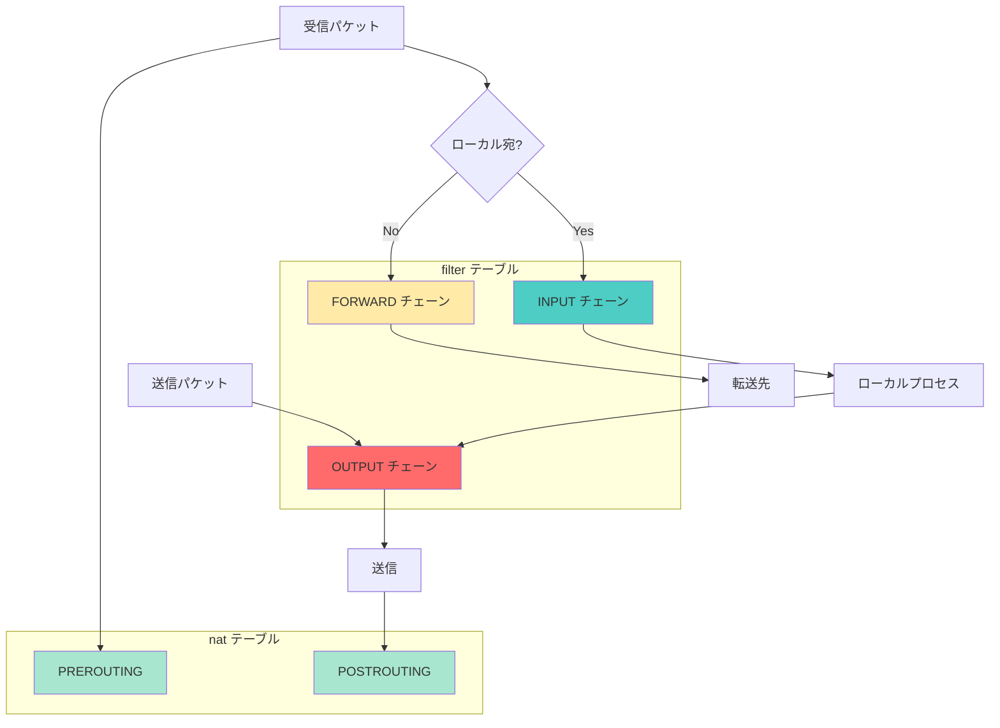
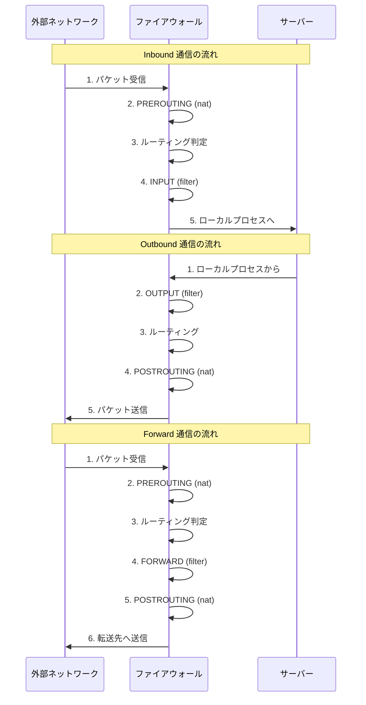

# iptablesコマンド完全ガイド

Linuxの標準的なファイアウォール機能であるiptablesの設定方法を詳しく解説します。

## 実現できること

<div class="grid cards" markdown>

-   :fontawesome-solid-table:{ .lg .middle } __テーブル・チェーン管理__

    ---

    filter, nat, mangle テーブルによる詳細制御

-   :fontawesome-solid-route:{ .lg .middle } __パケット処理制御__

    ---

    INPUT/OUTPUT/FORWARD での細かなルール定義

-   :fontawesome-solid-network-wired:{ .lg .middle } __NAT・転送設定__

    ---

    ポート転送やマスカレード設定

-   :fontawesome-solid-gauge-high:{ .lg .middle } __高パフォーマンス__

    ---

    カーネルレベルでの高速パケット処理

</div>

## iptablesの基本概念

### パケット処理フロー



### テーブルとチェーンの関係

| テーブル | 用途 | 主要チェーン |
|----------|------|--------------|
| **filter** | パケットフィルタリング | INPUT, OUTPUT, FORWARD |
| **nat** | アドレス変換 | PREROUTING, POSTROUTING, OUTPUT |
| **mangle** | パケット改変 | PREROUTING, INPUT, FORWARD, OUTPUT, POSTROUTING |
| **raw** | 接続追跡の除外 | PREROUTING, OUTPUT |

### パケットの流れとInbound/Outbound



## 基本操作コマンド

### ルール確認

```bash
# すべてのルール表示
sudo iptables -L

# 詳細情報付きで表示
sudo iptables -L -v

# 行番号付きで表示
sudo iptables -L --line-numbers

# 数値形式で表示（名前解決なし）
sudo iptables -L -n

# 特定テーブルの表示
sudo iptables -t nat -L
sudo iptables -t mangle -L

# 特定チェーンの表示
sudo iptables -L INPUT
sudo iptables -L OUTPUT
```

### チェーンのデフォルトポリシー

```bash
# 現在のポリシー確認
sudo iptables -L | head -n 10

# デフォルトポリシー設定
sudo iptables -P INPUT DROP      # すべて拒否
sudo iptables -P OUTPUT ACCEPT   # すべて許可
sudo iptables -P FORWARD DROP    # 転送拒否

# 安全な初期設定例
sudo iptables -P INPUT DROP
sudo iptables -P FORWARD DROP
sudo iptables -P OUTPUT ACCEPT
```

## フィルタリングルール

### INPUT チェーン（受信制御）

```bash
# ループバック接続許可（必須）
sudo iptables -A INPUT -i lo -j ACCEPT

# 確立済み接続の継続許可
sudo iptables -A INPUT -m state --state ESTABLISHED,RELATED -j ACCEPT

# SSH接続許可
sudo iptables -A INPUT -p tcp --dport 22 -j ACCEPT

# 特定IPからのSSH接続のみ許可
sudo iptables -A INPUT -p tcp -s 192.168.1.100 --dport 22 -j ACCEPT

# Web サーバー許可
sudo iptables -A INPUT -p tcp --dport 80 -j ACCEPT
sudo iptables -A INPUT -p tcp --dport 443 -j ACCEPT

# 特定ネットワークからの接続許可
sudo iptables -A INPUT -s 192.168.1.0/24 -j ACCEPT

# ICMP(ping)許可
sudo iptables -A INPUT -p icmp --icmp-type echo-request -j ACCEPT

# DNS許可
sudo iptables -A INPUT -p udp --dport 53 -j ACCEPT
sudo iptables -A INPUT -p tcp --dport 53 -j ACCEPT
```

### OUTPUT チェーン（送信制御）

```bash
# 基本的には全て許可が一般的
sudo iptables -P OUTPUT ACCEPT

# 厳密制御する場合の例
sudo iptables -P OUTPUT DROP

# ループバック許可
sudo iptables -A OUTPUT -o lo -j ACCEPT

# 確立済み接続許可
sudo iptables -A OUTPUT -m state --state ESTABLISHED,RELATED -j ACCEPT

# HTTP/HTTPS接続許可（パッケージ更新等）
sudo iptables -A OUTPUT -p tcp --dport 80 -j ACCEPT
sudo iptables -A OUTPUT -p tcp --dport 443 -j ACCEPT

# DNS問い合わせ許可
sudo iptables -A OUTPUT -p udp --dport 53 -j ACCEPT
sudo iptables -A OUTPUT -p tcp --dport 53 -j ACCEPT

# SSH接続許可
sudo iptables -A OUTPUT -p tcp --dport 22 -j ACCEPT

# 特定IPへの接続のみ許可
sudo iptables -A OUTPUT -d 192.168.1.100 -j ACCEPT
```

### ポート範囲指定

```bash
# ポート範囲指定
sudo iptables -A INPUT -p tcp --dport 8000:8100 -j ACCEPT

# 複数ポート指定
sudo iptables -A INPUT -p tcp -m multiport --dports 80,443,8080 -j ACCEPT

# FTPデータ転送（パッシブモード）
sudo iptables -A INPUT -p tcp --dport 21 -j ACCEPT
sudo iptables -A INPUT -p tcp --dport 1024:65535 -m state --state ESTABLISHED -j ACCEPT
```

## NAT設定（アドレス変換）

### SNAT（送信元NAT）・マスカレード

```bash
# インターネット接続共有（マスカレード）
sudo iptables -t nat -A POSTROUTING -o eth0 -j MASQUERADE

# 特定IPでのSNAT
sudo iptables -t nat -A POSTROUTING -s 192.168.1.0/24 -o eth0 -j SNAT --to-source 203.0.113.10

# 内部ネットワークの転送許可
sudo iptables -A FORWARD -s 192.168.1.0/24 -j ACCEPT
sudo iptables -A FORWARD -m state --state ESTABLISHED,RELATED -j ACCEPT
```

### DNAT（宛先NAT）・ポート転送

```bash
# Webサーバーへのポート転送
sudo iptables -t nat -A PREROUTING -p tcp --dport 80 -j DNAT --to-destination 192.168.1.100:80

# 異なるポートへの転送
sudo iptables -t nat -A PREROUTING -p tcp --dport 8080 -j DNAT --to-destination 192.168.1.100:80

# SSH転送（ポート変更）
sudo iptables -t nat -A PREROUTING -p tcp --dport 2222 -j DNAT --to-destination 192.168.1.100:22

# 複数IPへの負荷分散
sudo iptables -t nat -A PREROUTING -p tcp --dport 80 -m statistic --mode nth --every 2 --packet 0 -j DNAT --to-destination 192.168.1.100:80
sudo iptables -t nat -A PREROUTING -p tcp --dport 80 -j DNAT --to-destination 192.168.1.101:80
```

## 高度なルール設定

### 接続制限・レート制限

```bash
# 接続数制限
sudo iptables -A INPUT -p tcp --dport 22 -m connlimit --connlimit-above 3 -j DROP

# レート制限（DDoS対策）
sudo iptables -A INPUT -p tcp --dport 80 -m limit --limit 25/minute --limit-burst 100 -j ACCEPT

# SYN Flood対策
sudo iptables -A INPUT -p tcp --syn -m limit --limit 1/s --limit-burst 3 -j ACCEPT
sudo iptables -A INPUT -p tcp --syn -j DROP

# ping制限
sudo iptables -A INPUT -p icmp --icmp-type echo-request -m limit --limit 1/s -j ACCEPT
```

### 時間制限

```bash
# 時間指定でのアクセス制御
sudo iptables -A INPUT -p tcp --dport 22 -m time --timestart 09:00 --timestop 18:00 --weekdays Mon,Tue,Wed,Thu,Fri -j ACCEPT

# 特定時間帯のみWebアクセス許可
sudo iptables -A INPUT -p tcp --dport 80 -m time --timestart 08:00 --timestop 20:00 -j ACCEPT
```

### MAC アドレス制御

```bash
# 特定MACアドレスからの接続許可
sudo iptables -A INPUT -m mac --mac-source 00:11:22:33:44:55 -j ACCEPT

# 特定MACアドレスを拒否
sudo iptables -A INPUT -m mac --mac-source 00:AA:BB:CC:DD:EE -j DROP
```

### ログ設定

```bash
# 拒否パケットのログ
sudo iptables -A INPUT -j LOG --log-prefix "IPTABLES-DROP: " --log-level 4

# 特定ポートアクセスのログ
sudo iptables -A INPUT -p tcp --dport 22 -j LOG --log-prefix "SSH-ACCESS: "

# ログ出力制限付き
sudo iptables -A INPUT -m limit --limit 5/min -j LOG --log-prefix "IPTABLES-LIMIT: "
```

## ルール管理

### ルール追加・削除

```bash
# ルール追加（末尾に追加）
sudo iptables -A INPUT -p tcp --dport 443 -j ACCEPT

# ルール挿入（先頭に挿入）
sudo iptables -I INPUT -p tcp --dport 443 -j ACCEPT

# 特定位置に挿入
sudo iptables -I INPUT 3 -p tcp --dport 443 -j ACCEPT

# ルール削除（ルール指定）
sudo iptables -D INPUT -p tcp --dport 443 -j ACCEPT

# ルール削除（行番号指定）
sudo iptables -D INPUT 3

# チェーン全削除
sudo iptables -F INPUT
sudo iptables -F OUTPUT
sudo iptables -F FORWARD

# 全テーブル全ルール削除
sudo iptables -F
sudo iptables -t nat -F
sudo iptables -t mangle -F
```

### 設定の保存・復元

```bash
# 設定保存
sudo iptables-save > /etc/iptables/rules.v4
# または
sudo service iptables save  # CentOS/RHEL

# 設定復元
sudo iptables-restore < /etc/iptables/rules.v4

# 自動保存・復元設定
sudo apt install iptables-persistent  # Debian/Ubuntu
sudo systemctl enable iptables        # CentOS/RHEL
```

## セキュリティ強化設定

### 基本的な攻撃対策

```bash
# 無効なパケット拒否
sudo iptables -A INPUT -m state --state INVALID -j DROP

# SYN Flood対策
sudo iptables -A INPUT -p tcp ! --syn -m state --state NEW -j DROP

# Fragmented パケット制御
sudo iptables -A INPUT -f -j DROP

# プライベートIPからのアクセス拒否（外部IF）
sudo iptables -A INPUT -i eth0 -s 192.168.0.0/16 -j DROP
sudo iptables -A INPUT -i eth0 -s 172.16.0.0/12 -j DROP
sudo iptables -A INPUT -i eth0 -s 10.0.0.0/8 -j DROP

# ループバックでない127.0.0.0/8拒否
sudo iptables -A INPUT ! -i lo -s 127.0.0.0/8 -j DROP
```

### ポートスキャン対策

```bash
# ポートスキャン検知・拒否
sudo iptables -A INPUT -m recent --name portscan --rcheck --seconds 86400 -j DROP
sudo iptables -A INPUT -m recent --name portscan --remove
sudo iptables -A INPUT -p tcp -m tcp --dport 139 -m recent --name portscan --set -j LOG --log-prefix "PORTSCAN-DETECTED: "
sudo iptables -A INPUT -p tcp -m tcp --dport 139 -m recent --name portscan --set -j DROP
```

## 実践的な設定例

### Webサーバー向け設定

```bash
#!/bin/bash
# Webサーバー向けiptables設定

# 基本ポリシー設定
iptables -P INPUT DROP
iptables -P FORWARD DROP
iptables -P OUTPUT ACCEPT

# ループバック許可
iptables -A INPUT -i lo -j ACCEPT

# 確立済み接続許可
iptables -A INPUT -m state --state ESTABLISHED,RELATED -j ACCEPT

# SSH接続許可（管理IPのみ）
iptables -A INPUT -p tcp -s 192.168.1.0/24 --dport 22 -j ACCEPT

# Web サーバー許可
iptables -A INPUT -p tcp --dport 80 -j ACCEPT
iptables -A INPUT -p tcp --dport 443 -j ACCEPT

# ICMP許可
iptables -A INPUT -p icmp --icmp-type echo-request -j ACCEPT

# レート制限
iptables -A INPUT -p tcp --dport 80 -m limit --limit 25/minute --limit-burst 100 -j ACCEPT

# 設定保存
iptables-save > /etc/iptables/rules.v4
```

### ルーター・ゲートウェイ向け設定

```bash
#!/bin/bash
# ルーター向けiptables設定

# IP転送有効化
echo 1 > /proc/sys/net/ipv4/ip_forward

# NATテーブル設定
iptables -t nat -A POSTROUTING -o eth0 -j MASQUERADE

# フィルタテーブル設定
iptables -A FORWARD -i eth1 -o eth0 -j ACCEPT
iptables -A FORWARD -i eth0 -o eth1 -m state --state ESTABLISHED,RELATED -j ACCEPT

# 内部ネットワーク管理許可
iptables -A INPUT -s 192.168.1.0/24 -j ACCEPT

# 外部からの直接アクセス拒否
iptables -A INPUT -i eth0 -j DROP
```

## トラブルシューティング

### 設定確認・診断

```bash
# 詳細なルール確認
sudo iptables -L -v -n --line-numbers
sudo iptables -t nat -L -v -n --line-numbers

# パケットカウンタ確認
sudo iptables -L -v | grep "packets bytes"

# ログ確認
sudo journalctl -k | grep "IPTABLES"
sudo tail -f /var/log/kern.log | grep "IPTABLES"

# 接続状態確認
sudo netstat -tuln
sudo ss -tuln

# 接続テスト
telnet サーバーIP ポート番号
nc -zv サーバーIP ポート番号
```

### よくある問題と対処

#### 1. SSH接続が切れてしまった

```bash
# コンソールアクセスで緊急対処
sudo iptables -I INPUT -p tcp --dport 22 -j ACCEPT
sudo iptables -P INPUT ACCEPT

# 設定をリセット
sudo iptables -F
sudo iptables -P INPUT ACCEPT
sudo iptables -P OUTPUT ACCEPT
sudo iptables -P FORWARD ACCEPT
```

#### 2. 設定が再起動で消える

```bash
# 永続化設定確認
sudo systemctl status iptables          # CentOS/RHEL
sudo systemctl status netfilter-persistent  # Debian/Ubuntu

# 手動保存
sudo iptables-save > /etc/iptables.rules
echo "iptables-restore < /etc/iptables.rules" >> /etc/rc.local
```

#### 3. NATが動作しない

```bash
# IP転送確認
cat /proc/sys/net/ipv4/ip_forward

# IP転送有効化
echo 1 > /proc/sys/net/ipv4/ip_forward
echo "net.ipv4.ip_forward=1" >> /etc/sysctl.conf

# NAT設定確認
sudo iptables -t nat -L -v
```

## パフォーマンス最適化

### 効率的なルール順序

```bash
# 頻繁にマッチするルールを上位に配置
iptables -I INPUT 1 -m state --state ESTABLISHED,RELATED -j ACCEPT
iptables -I INPUT 2 -i lo -j ACCEPT
iptables -A INPUT -p tcp --dport 22 -j ACCEPT
iptables -A INPUT -p tcp --dport 80 -j ACCEPT
# ...その他のルール

# 拒否ルールは最後に
iptables -A INPUT -j DROP
```

### 接続追跡の最適化

```bash
# 接続追跡テーブルサイズ調整
echo 262144 > /proc/sys/net/netfilter/nf_conntrack_max

# タイムアウト調整
echo 600 > /proc/sys/net/netfilter/nf_conntrack_tcp_timeout_established
```

## まとめ

iptablesは、Linuxカーネルレベルでの高性能なパケット制御を提供する強力なツールです。

**設定時のポイント:**
- ✅ パケットの流れ（INPUT/OUTPUT/FORWARD）を理解する
- ✅ 設定前に必ずバックアップと復旧方法を準備する
- ✅ ルールの順序を考慮して効率的に配置する
- ✅ 定期的な設定見直しとログ監視を行う

## 関連記事

- [firewalldコマンドガイド](./firewalld設定.md)
- [firewalldとiptablesの違いと使い分け](./ファイアウォール比較.md)
- [ネットワーク診断コマンド](./ネットワーク診断.md)
- [SELinux設定](./SELinux.md)