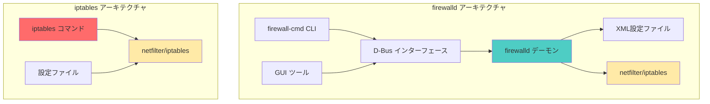
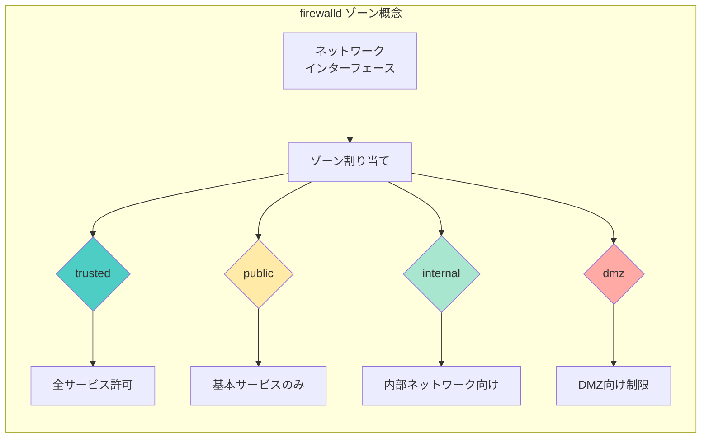
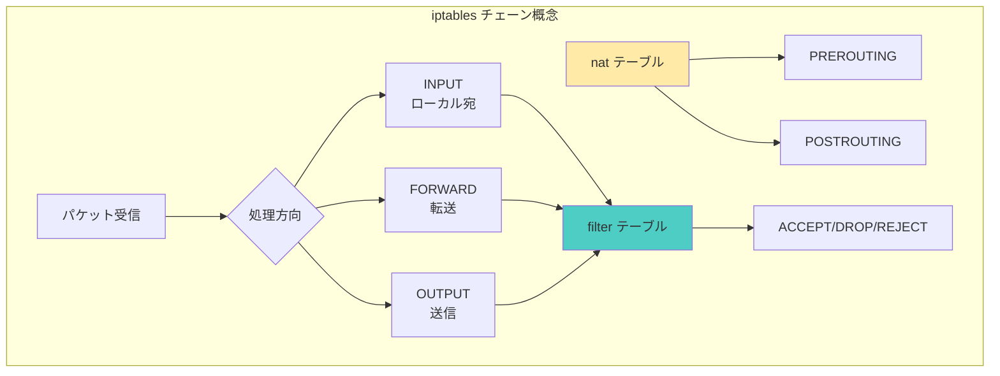
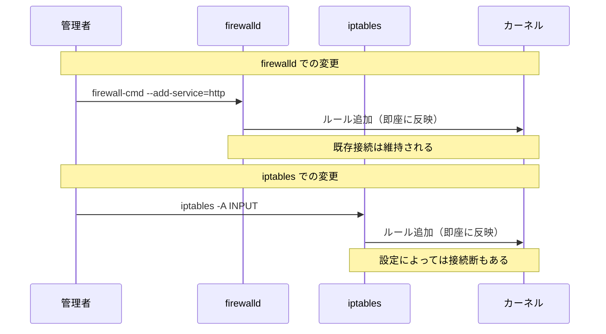
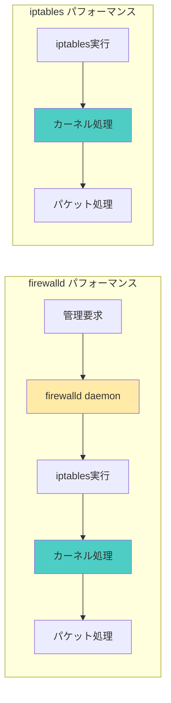
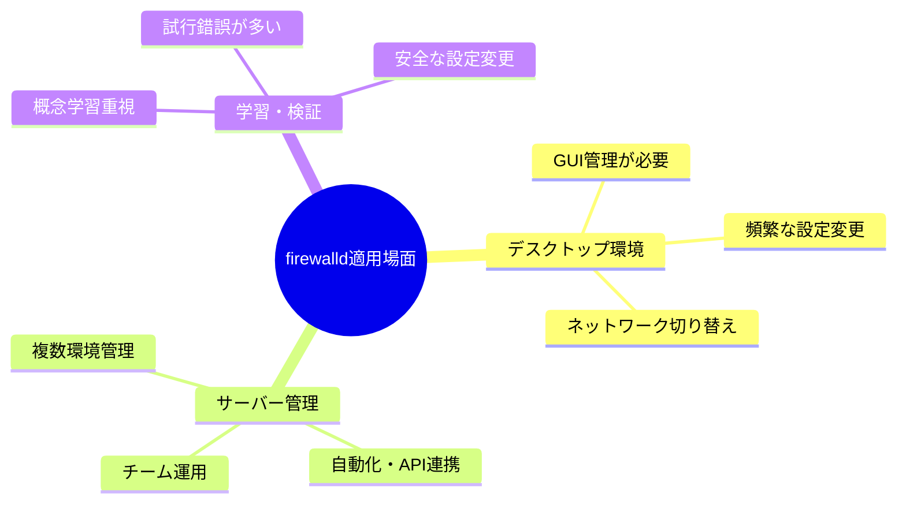
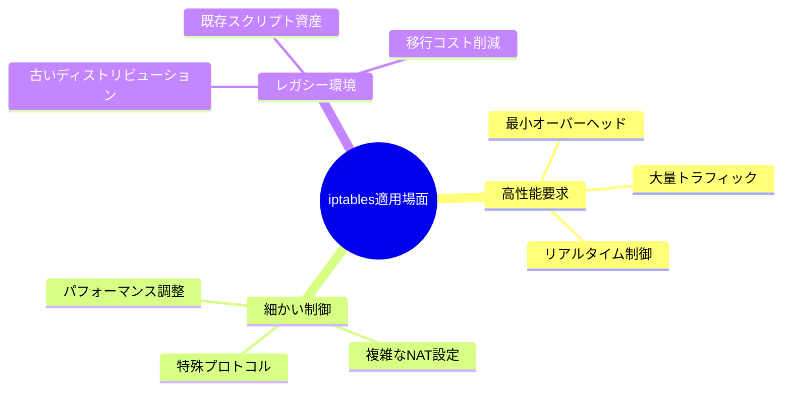
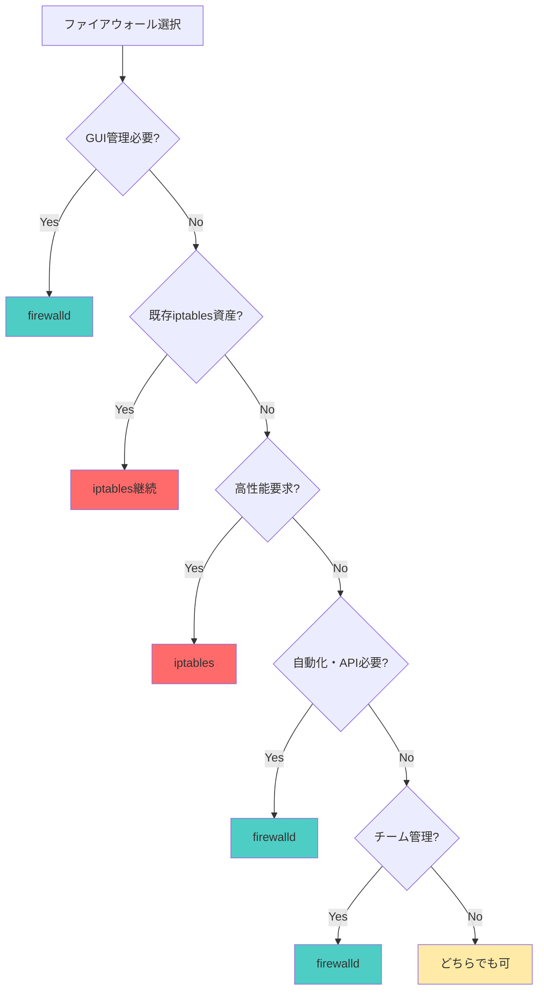

# firewalldとiptablesの違いと使い分け

Linux環境における2つの主要なファイアウォール管理ツールの特徴、違い、使い分けについて詳しく解説します。

## 実現できること

<div class="grid cards" markdown>

-   :fontawesome-solid-balance-scale:{ .lg .middle } __適切な選択__

    ---

    環境と要件に応じた最適なツール選択

-   :fontawesome-solid-arrows-rotate:{ .lg .middle } __移行戦略__

    ---

    既存環境からの安全な移行方法

-   :fontawesome-solid-chart-line:{ .lg .middle } __パフォーマンス比較__

    ---

    用途別の性能特性理解

-   :fontawesome-solid-tools:{ .lg .middle } __統合管理__

    ---

    複数環境での一貫した管理手法

</div>

## アーキテクチャの違い

### システム構成比較



### 管理レイヤーの違い

| 項目 | firewalld | iptables |
|------|-----------|----------|
| **管理レベル** | 高レベル（抽象化） | 低レベル（直接制御） |
| **設定方法** | サービス・ゾーンベース | ルールベース |
| **設定反映** | 動的（再起動不要） | 静的（再読み込み必要） |
| **バックエンド** | iptables/nftables | カーネル直接 |
| **GUI** | 利用可能 | コマンドラインのみ |

## 基本概念の比較

### firewalldのゾーンベース管理



### iptablesのチェーンベース管理



## 設定方法の比較

### 基本的なWebサーバー設定

#### firewalldでの設定

```bash
# サービスベースの設定
sudo firewall-cmd --add-service=http --permanent
sudo firewall-cmd --add-service=https --permanent
sudo firewall-cmd --add-service=ssh --permanent

# ゾーン変更
sudo firewall-cmd --set-default-zone=public

# 設定反映
sudo firewall-cmd --reload

# 確認
sudo firewall-cmd --list-all
```

#### iptablesでの設定

```bash
# ルールベースの設定
sudo iptables -A INPUT -p tcp --dport 80 -j ACCEPT
sudo iptables -A INPUT -p tcp --dport 443 -j ACCEPT
sudo iptables -A INPUT -p tcp --dport 22 -j ACCEPT

# デフォルトポリシー
sudo iptables -P INPUT DROP
sudo iptables -P OUTPUT ACCEPT
sudo iptables -P FORWARD DROP

# 設定保存
sudo iptables-save > /etc/iptables/rules.v4
```

### 高度な設定例の比較

#### IP制限設定

**firewalld:**
```bash
# Rich Ruleを使用
sudo firewall-cmd --add-rich-rule='rule family="ipv4" source address="192.168.1.0/24" service name="ssh" accept' --permanent
sudo firewall-cmd --add-rich-rule='rule family="ipv4" source address="10.0.0.0/8" reject' --permanent
```

**iptables:**
```bash
# 直接ルール指定
sudo iptables -A INPUT -s 192.168.1.0/24 -p tcp --dport 22 -j ACCEPT
sudo iptables -A INPUT -s 10.0.0.0/8 -j REJECT
```

## 運用面での比較

### 設定変更の影響範囲



### 管理コストの比較

| 項目 | firewalld | iptables |
|------|-----------|----------|
| **学習コスト** | 中（概念理解が重要） | 高（詳細知識必要） |
| **設定複雑度** | 低（サービス定義活用） | 高（ルール詳細指定） |
| **保守性** | 高（構造化された設定） | 中（ルール数に依存） |
| **デバッグ** | 中（ログ出力は詳細） | 高（ルール追跡が容易） |
| **自動化** | 高（API/D-Bus活用） | 中（スクリプト化） |

## パフォーマンス比較

### 処理性能の違い



### パフォーマンス特性

| 項目 | firewalld | iptables |
|------|-----------|----------|
| **起動時間** | やや遅い（daemon起動） | 早い（直接実行） |
| **設定反映** | 早い（差分更新） | 中（全体再読み込み） |
| **実行時性能** | 同等（同じbackend） | 同等（カーネル処理） |
| **メモリ使用量** | 多い（daemon常駐） | 少ない（ルールのみ） |
| **大量ルール** | 良好（構造化管理） | 性能低下可能性 |

## 使い分けガイドライン

### firewalldが適している場面



**推奨ケース:**
- CentOS/RHEL 7以降の標準環境
- GUI管理ツールを活用したい場合
- ネットワーク環境が動的に変わる環境
- チーム開発での一貫した管理が必要
- 自動化・オーケストレーション環境

### iptablesが適している場面



**推奨ケース:**
- 高トラフィック環境での最適性能が必要
- 細かいパケット制御が必要な用途
- 既存のiptables資産を活用したい場合
- 古いLinuxディストリビューション
- 最小限のシステムリソース使用が必要

## 移行戦略

### iptables → firewalld 移行

```bash
# 1. 現在の設定を確認・保存
sudo iptables-save > /backup/iptables-backup.rules

# 2. firewalldインストール・有効化
sudo yum install firewalld  # CentOS/RHEL
sudo systemctl enable firewalld

# 3. iptablesを無効化
sudo systemctl disable iptables
sudo systemctl stop iptables

# 4. 基本設定移行
# iptables: -A INPUT -p tcp --dport 80 -j ACCEPT
# ↓
sudo firewall-cmd --add-service=http --permanent

# 5. 設定反映・確認
sudo systemctl start firewalld
sudo firewall-cmd --reload
sudo firewall-cmd --list-all
```

### firewalld → iptables 移行

```bash
# 1. firewalld設定をiptablesで確認
sudo iptables -L -n

# 2. iptables設定を手動で構築
sudo iptables -A INPUT -p tcp --dport 22 -j ACCEPT
sudo iptables -A INPUT -p tcp --dport 80 -j ACCEPT
sudo iptables -P INPUT DROP

# 3. 設定保存
sudo iptables-save > /etc/iptables/rules.v4

# 4. firewalld停止・iptables有効化
sudo systemctl stop firewalld
sudo systemctl disable firewalld
sudo systemctl enable iptables
```

## トラブルシューティング

### 共通的な問題と対処

#### 1. 設定が反映されない

**firewalld:**
```bash
# 設定確認
sudo firewall-cmd --list-all
sudo firewall-cmd --list-all --permanent

# permanent設定を忘れていないか確認
sudo firewall-cmd --reload
```

**iptables:**
```bash
# ルール確認
sudo iptables -L -n --line-numbers

# 保存を忘れていないか確認
sudo iptables-save
```

#### 2. 両方が同時に動作している

```bash
# 状態確認
sudo systemctl status firewalld
sudo systemctl status iptables

# 片方を停止
sudo systemctl stop firewalld
sudo systemctl disable firewalld
```

#### 3. 設定バックアップ・復元

**firewalld:**
```bash
# バックアップ
sudo tar -czf firewalld-backup.tar.gz /etc/firewalld/

# 復元
sudo tar -xzf firewalld-backup.tar.gz -C /
sudo firewall-cmd --reload
```

**iptables:**
```bash
# バックアップ
sudo iptables-save > iptables-backup.rules

# 復元
sudo iptables-restore < iptables-backup.rules
```

## 実環境での選択基準

### 環境別推奨設定

| 環境タイプ | 推奨ツール | 理由 |
|------------|------------|------|
| **エンタープライズサーバー** | firewalld | 管理性・自動化対応 |
| **高性能Webサーバー** | iptables | 最小オーバーヘッド |
| **開発・検証環境** | firewalld | 柔軟な設定変更 |
| **組み込み・IoT** | iptables | リソース効率性 |
| **コンテナ環境** | iptables | シンプル・軽量 |
| **デスクトップ** | firewalld | GUI管理・動的環境 |

### 決定フローチャート



## まとめ

firewalldとiptablesは、それぞれ異なる管理哲学とアプローチを持つツールです。

**選択のポイント:**
- ✅ 管理性重視 → firewalld
- ✅ 性能・効率重視 → iptables  
- ✅ 既存資産活用 → 現在使用中のツール継続
- ✅ 将来性考慮 → 環境に応じた適切な選択

どちらも強力なツールであり、要件と環境に応じた適切な選択が重要です。

## 関連記事

- [firewalldコマンドガイド](./firewalld設定.md)
- [iptablesコマンドガイド](./iptables設定.md)
- [ネットワーク診断コマンド](./ネットワーク診断.md)
- [SELinux設定](./SELinux.md)