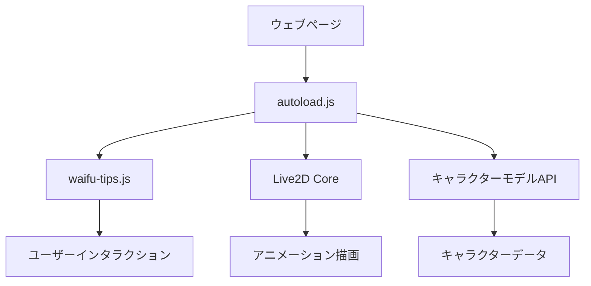

# Live2Dウィジェット実装ガイド

## はじめに

Live2Dウィジェットは、ウェブサイトにアニメーションキャラクターを追加できる無料のJavaScriptライブラリです。ユーザーの操作に反応して動くインタラクティブなキャラクターをサイトに配置できます。

## 🎯 実現できること

!!! tip "Live2Dウィジェットの主な機能"
    - **インタラクティブキャラクター**: マウスオーバーやクリックに反応
    - **自動アニメーション**: アイドル状態での自然な動き
    - **カスタムメッセージ**: 時間帯や操作に応じたメッセージ表示
    - **レスポンシブ対応**: スマートフォンでは非表示設定可能
    - **ドラッグ移動**: キャラクターの位置調整
    - **複数キャラクター**: 様々なキャラクターモデルから選択可能

## 📚 技術的な仕組み

### アーキテクチャ概要



### 主要コンポーネント

| コンポーネント | 役割 | 説明 |
|---------------|------|------|
| `autoload.js` | 初期化 | 必要なリソースを自動読み込み |
| `waifu-tips.js` | ウィジェット制御 | キャラクター表示とインタラクション |
| `waifu.css` | スタイリング | キャラクターとメッセージボックスのデザイン |
| `Live2D Core` | 描画エンジン | キャラクターアニメーションの描画 |
| Model API | データ提供 | キャラクターモデルとアニメーションデータ |

## 🚀 基本実装

### 1. 最小構成での実装

```html
<!-- MkDocsのmkdocs.ymlに追加 -->
extra_javascript:
  - https://fastly.jsdelivr.net/gh/stevenjoezhang/live2d-widget@latest/autoload.js

extra_css:
  - https://fastly.jsdelivr.net/gh/stevenjoezhang/live2d-widget@latest/waifu.css
```

### 2. カスタム設定での実装

```javascript
// live2d-config.js
window.live2d_settings = {
    // CDN設定
    "cdnPath": "https://fastly.jsdelivr.net/gh/stevenjoezhang/live2d-widget@latest/",
    
    // キャラクター設定
    "waifuSize": "280x250",
    "waifuMinWidth": "768px",  // スマホ非表示
    
    // モデルAPI設定
    "modelAPI": "https://live2d.fghrsh.net/api/",
    "modelList": [1, 2, 3, 4, 5, 6, 7], // 使用するモデルID
    
    // インタラクション設定
    "waifuWelcomeMessage": {
        "homepage": "サイトへようこそ！",
        "console": "開発者ツールを開いていますね"
    }
};
```

## 👥 利用可能なキャラクター

### キャラクターカタログ

| ID | キャラクター名 | シリーズ | 特徴 |
|----|--------------|----------|------|
| 1 | Pio | Potion-Maker | 錬金術師の女の子 |
| 2 | Tia | Potion-Maker | 元気な助手キャラ |
| 3 | 22 | bilibili-live | ライブ配信キャラ |
| 4 | 33 | bilibili-live | ライブ配信キャラ |
| 5 | shizuku | ShizukuTalk | 静かな雰囲気のキャラ |
| 6 | neptune | HyperdimensionNeptunia | ゲームキャラクター |
| 7 | murakumo | KantaiCollection | 艦これキャラクター |

### キャラクター切り替え方法

```javascript
// 特定のキャラクターを指定
window.live2d_settings = {
    "modelAPI": "https://live2d.fghrsh.net/api/",
    "modelList": [2], // Tiaのみ使用
    "modelStorage": false // ランダム切り替え無効
};

// ランダム切り替え
window.live2d_settings = {
    "modelList": [1, 2, 5], // 複数指定でランダム
    "modelRandMode": "switch" // 順次切り替え
};
```

## 🎨 カスタマイズ例

### メッセージのカスタマイズ

```javascript
"waifuTips": {
    "mouseover[data-md-toggle=drawer]": [
        "メニューを開こうとしていますね！",
        "ナビゲーションはここから操作できます"
    ],
    "click.md-nav__link": [
        "その記事、面白そうですね！",
        "学習がんばってください！"
    ]
},

"waifuIdleMessage": {
    "message": [
        "何かお手伝いできることはありますか？",
        "技術学習、がんばってくださいね！"
    ],
    "timeout": 6000
}
```

### 時間帯別メッセージ

```javascript
"waifuTimeMessage": {
    "morning": ["おはようございます！今日も学習がんばりましょう！"],
    "afternoon": ["お疲れ様です！午後の学習はいかがですか？"],
    "evening": ["お疲れ様でした！今日の学習成果はいかがでしたか？"],
    "night": ["夜遅くまでお疲れ様です！体調管理も大切ですよ"]
}
```

## ⚖️ ライセンスと利用制限

### ライセンス構成

| コンポーネント | ライセンス | 制限事項 |
|---------------|-----------|---------|
| Widget Code | GPL-3.0 | コード改変時はGPL-3.0継承 |
| API Code | MIT | 自由利用可能 |
| **キャラクターモデル** | **原作者著作権** | **非商用利用のみ** |

!!! warning "重要な制限事項"
    - **キャラクターモデルは研究・学習目的のみ**
    - **商用利用には独自ライセンス取得が必要**
    - 個人ブログ・技術サイトでの利用は通常問題なし

### 商用利用を検討する場合

1. **Live2D公式ライセンス**: 直接Live2D社から取得
2. **独自キャラクター作成**: オリジナルモデルの制作
3. **商用対応API**: 有料のキャラクターサービス利用

## 🔧 高度な設定

### パフォーマンス最適化

```javascript
// レスポンシブ設定
"waifuMinWidth": "768px",  // タブレット以下で非表示
"waifuDraggable": "disable", // ドラッグ無効でCPU負荷軽減

// アニメーション制御
"modelRandMode": "switch",   // ランダムより軽量
"modelStorage": true,        // モデル状態保存
```

### MkDocs Material連携

```javascript
// Material Designテーマ専用設定
"waifuTips": {
    "mouseover.md-header__title": [
        "これは技術ノートサイトです！"
    ],
    "click[data-md-toggle=search]": [
        "検索機能を使ってくださいね！"
    ],
    "mouseover.md-nav__link": [
        "その記事、気になりますね！"
    ]
}
```

## 🚨 トラブルシューティング

### よくある問題と解決法

| 問題 | 原因 | 解決法 |
|-----|------|-------|
| キャラが表示されない | CDN接続エラー | ネットワーク確認・CDN変更 |
| スマホで表示される | 最小幅設定なし | `waifuMinWidth`設定追加 |
| メッセージが出ない | セレクタ間違い | 開発者ツールで要素確認 |
| 動作が重い | 高解像度モデル | サイズ縮小・アニメーション制限 |

### デバッグ方法

```javascript
// デバッグモード有効化
window.live2d_settings = {
    "showLog": true,  // コンソールログ表示
    // 設定内容...
};

// ブラウザ開発者ツールでの確認
console.log(window.live2d_settings);
```

## 📖 応用例

### 技術ドキュメントサイト向け設定

```javascript
window.live2d_settings = {
    "cdnPath": "https://fastly.jsdelivr.net/gh/stevenjoezhang/live2d-widget@latest/",
    "waifuSize": "280x250",
    "waifuMinWidth": "768px",
    "modelAPI": "https://live2d.fghrsh.net/api/",
    "modelList": [1, 2], // 落ち着いたキャラクター
    
    "waifuTips": {
        "copy": ["コードをコピーしましたね！", "実行時は注意してください"],
        "mouseover.admonition": ["重要な情報ボックスです！"],
        "click.md-nav__link": ["その記事、面白そうですね！"]
    },
    
    "waifuIdleMessage": {
        "message": [
            "何かお手伝いできることはありますか？",
            "技術学習、がんばってくださいね！",
            "質問があれば、検索機能を使ってみてください"
        ],
        "timeout": 8000
    }
};
```

## 🔗 関連リソース

- [Live2D Widget GitHub](https://github.com/stevenjoezhang/live2d-widget)
- [Model API GitHub](https://github.com/fghrsh/live2d_api)
- [Live2D 公式サイト](https://www.live2d.com/)
- [MkDocs Material](https://squidfunk.github.io/mkdocs-material/)

---

*この実装により、技術ドキュメントサイトにインタラクティブなキャラクターを追加し、ユーザーエンゲージメントを向上させることができます。*