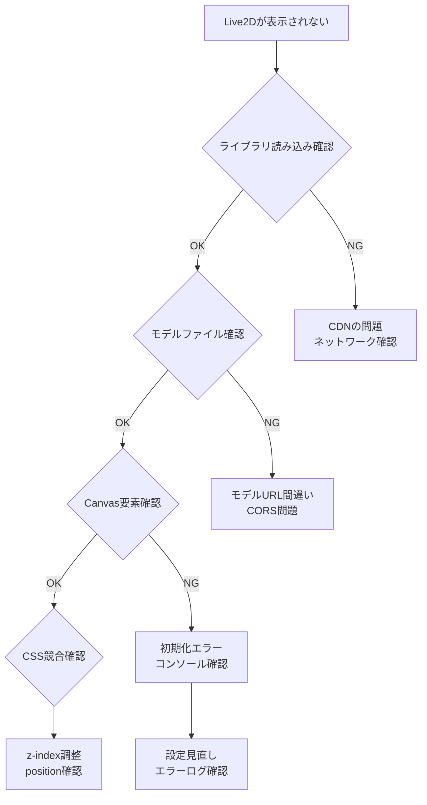

# ウェブサイトに動くキャラクターを追加する方法｜Live2D無料実装ガイド

## ホームページにアニメーションキャラクターを簡単に設置できる

「サイトにキャラクターを表示させたい」「ホームページにマスコットキャラクターを追加したい」と思ったことはありませんか？

Live2Dウィジェットを使えば、**無料で簡単に**ウェブサイトに動くアニメーションキャラクターを追加できます。プログラミング知識がなくても、コピー&ペーストだけで実装可能です。

このガイドでは、初心者でもわかりやすく、サイトにキャラクターを表示する方法から高度なカスタマイズまで、実践的な内容を詳しく解説します。

## よくある質問（FAQ）

!!! question "サイトにキャラクターを追加したい人の疑問"
    
    **Q. 本当に無料で使えるの？**  
    A. はい。Live2Dウィジェットは完全無料で商用利用も可能です。
    
    **Q. プログラミングできなくても大丈夫？**  
    A. 大丈夫です。HTMLファイルに数行コピー&ペーストするだけで設置できます。
    
    **Q. どんなキャラクターが使える？**  
    A. 猫キャラクター、アニメ風キャラクター、オリジナルキャラクターなど豊富な選択肢があります。
    
    **Q. スマートフォンでも表示される？**  
    A. 設定で制御可能です。スマホでは非表示にして、PC版のみ表示することも可能。
    
    **Q. サイトが重くならない？**  
    A. 軽量設計のため、ページ表示速度への影響は最小限です。

## 🎯 ウェブサイトにキャラクターを追加するとできること

!!! tip "動くマスコットキャラクターの機能"
    - **ユーザーと会話**: クリックするとメッセージを表示
    - **自然なアニメーション**: まばたき、呼吸、待機モーション
    - **操作に反応**: コピー操作や開発者ツール起動を検知
    - **スマホ対応**: モバイル端末では自動で非表示
    - **自由な配置**: ドラッグで好きな位置に移動可能
    - **豊富なキャラクター**: 猫、女の子、オリジナルキャラから選択

### なぜサイトにキャラクターを設置するのか？

- **ユーザーエンゲージメント向上**: 滞在時間とリピート率の増加
- **ブランド認知度アップ**: 印象に残りやすいサイトに
- **コンバージョン改善**: 親しみやすさでアクション率向上
- **差別化**: 競合サイトとの明確な差別化

## 🚀 初心者でも簡単！3つの実装方法

### 方法1: 5分で完成！基本の設置方法

```javascript
// 設定ファイル: live2d-config.js
window.live2d_settings = {
    "cdnPath": "https://fastly.jsdelivr.net/gh/stevenjoezhang/live2d-widget@latest/",
    "waifuSize": "280x250",
    "waifuMinWidth": "768px",
    "modelAPI": "https://live2d.fghrsh.net/api/",
    "modelList": [1, 2, 3]
};
```

```yaml
# mkdocs.yml
extra_javascript:
  - 'javascripts/live2d-config.js'
  - https://fastly.jsdelivr.net/gh/stevenjoezhang/live2d-widget@latest/autoload.js

extra_css:
  - https://fastly.jsdelivr.net/gh/stevenjoezhang/live2d-widget@latest/waifu.css
```

**特徴:**
- 高機能だが設定が複雑
- メッセージ機能が豊富
- API依存度が高い

### 方法2: L2Dwidget（シンプル型）

```javascript
// 設定ファイル: live2d-init.js
function initializeLive2D() {
    if (typeof L2Dwidget !== 'undefined') {
        L2Dwidget.init({
            "model": {
                "jsonPath": "https://unpkg.com/live2d-widget-model-tororo@1.0.5/assets/tororo.model.json",
                "scale": 1
            },
            "display": {
                "position": "left",
                "width": 150,
                "height": 200
            },
            "mobile": {
                "show": false
            }
        });
    }
}

if (document.readyState === 'loading') {
    document.addEventListener('DOMContentLoaded', initializeLive2D);
} else {
    initializeLive2D();
}
```

```yaml
# mkdocs.yml
extra_javascript:
  - https://unpkg.com/live2d-widget@3.x/lib/L2Dwidget.min.js
  - 'javascripts/live2d-init.js'
```

**特徴:**
- シンプルで軽量
- 設定が簡単
- 独立性が高い

## 🐱 商用安全なキャラクター実装

### Tororo & Hijiki（推奨）

```javascript
// 商用利用可能な猫キャラクター
const safeModels = {
    tororo: "https://unpkg.com/live2d-widget-model-tororo@1.0.5/assets/tororo.model.json",
    hijiki: "https://unpkg.com/live2d-widget-model-hijiki@1.0.5/assets/hijiki.model.json"
};

function initializeSafeLive2D() {
    L2Dwidget.init({
        "model": {
            "jsonPath": safeModels.tororo, // または safeModels.hijiki
            "scale": 1
        },
        "display": {
            "position": "left",
            "width": 150,
            "height": 200,
            "hOffset": 0,
            "vOffset": -20
        },
        "mobile": {
            "show": false
        },
        "react": {
            "opacity": 0.8
        }
    });
}
```

## 💬 カスタムメッセージシステム実装

### 基本的なメッセージ表示

```javascript
// メッセージ表示機能
function setupCatMessages() {
    const messages = [
        "にゃーん！このサイトへようこそ！",
        "技術ドキュメントを見に来てくれてありがとう！",
        "何か質問があったら遠慮なく聞いてね〜"
    ];
    
    // CSS追加
    if (!document.querySelector('#cat-message-styles')) {
        const style = document.createElement('style');
        style.id = 'cat-message-styles';
        style.textContent = `
            .cat-message {
                position: fixed !important;
                left: 20px !important;
                bottom: 220px !important;
                background: #333 !important;
                color: #fff !important;
                padding: 12px 16px !important;
                border-radius: 12px !important;
                font-size: 14px !important;
                z-index: 999999 !important;
                max-width: 200px !important;
                box-shadow: 0 4px 12px rgba(0, 0, 0, 0.3) !important;
                animation: fadeInOut 4s ease-in-out forwards !important;
            }
            
            @keyframes fadeInOut {
                0% { opacity: 0; transform: translateY(20px); }
                15% { opacity: 1; transform: translateY(0); }
                85% { opacity: 1; transform: translateY(0); }
                100% { opacity: 0; transform: translateY(-10px); }
            }
        `;
        document.head.appendChild(style);
    }
    
    // イベントリスナー追加
    document.addEventListener('click', function(e) {
        if (e.target.tagName === 'CANVAS' || 
            (e.clientX < 200 && e.clientY > window.innerHeight - 250)) {
            showMessage(messages[Math.floor(Math.random() * messages.length)]);
        }
    });
    
    // 初回メッセージ
    setTimeout(() => showMessage("にゃーん！このサイトへようこそ！"), 3000);
}

function showMessage(text) {
    // 既存メッセージ削除
    const existing = document.querySelector('.cat-message');
    if (existing) existing.remove();
    
    // 新メッセージ作成
    const messageDiv = document.createElement('div');
    messageDiv.className = 'cat-message';
    messageDiv.textContent = text;
    document.body.appendChild(messageDiv);
    
    // 4秒後削除
    setTimeout(() => {
        if (messageDiv.parentNode) messageDiv.remove();
    }, 4000);
}
```

### 高度なインタラクション

```javascript
// 高度なインタラクションシステム
function setupAdvancedInteractions() {
    // コピー検出
    document.addEventListener('copy', () => {
        showMessage("コピーしたにゃ〜");
    });
    
    // 開発者ツール検出
    let devtools = { open: false };
    setInterval(() => {
        if (window.outerHeight - window.innerHeight > 160) {
            if (!devtools.open) {
                devtools.open = true;
                showMessage("開発者ツールを開いてるにゃ〜");
            }
        } else {
            devtools.open = false;
        }
    }, 1000);
    
    // ページ離脱・復帰検出
    document.addEventListener('visibilitychange', () => {
        if (!document.hidden) {
            showMessage("おかえりなさい〜");
        }
    });
    
    // スクロール検出
    let scrollTimer;
    window.addEventListener('scroll', () => {
        clearTimeout(scrollTimer);
        scrollTimer = setTimeout(() => {
            if (Math.random() < 0.1) { // 10%の確率
                showMessage("読んでくれてありがとう〜");
            }
        }, 1000);
    });
}
```

## 🔍 デバッグとトラブルシューティング

### デバッグ機能付きの実装

```javascript
// デバッグ機能付きLive2D初期化
function initializeDebugLive2D() {
    console.log('🐱 Live2D Debug Mode: Starting initialization...');
    
    // ライブラリ確認
    if (typeof L2Dwidget === 'undefined') {
        console.error('❌ L2Dwidget library not loaded!');
        console.log('📋 Check if this script is loaded:');
        console.log('https://unpkg.com/live2d-widget@3.x/lib/L2Dwidget.min.js');
        return;
    }
    
    console.log('✅ L2Dwidget library loaded successfully');
    
    // モデル読み込み確認
    const modelUrl = "https://unpkg.com/live2d-widget-model-tororo@1.0.5/assets/tororo.model.json";
    fetch(modelUrl)
        .then(response => {
            if (response.ok) {
                console.log('✅ Model file accessible:', modelUrl);
            } else {
                console.error('❌ Model file not accessible:', response.status);
            }
        })
        .catch(error => {
            console.error('❌ Network error accessing model:', error);
        });
    
    // 初期化実行
    try {
        L2Dwidget.init({
            "model": {
                "jsonPath": modelUrl,
                "scale": 1
            },
            "display": {
                "position": "left",
                "width": 150,
                "height": 200,
                "hOffset": 0,
                "vOffset": -20
            },
            "mobile": {
                "show": false
            },
            "react": {
                "opacity": 0.8
            },
            "log": true // デバッグログ有効
        });
        
        console.log('✅ L2Dwidget initialized successfully');
        
        // 初期化後のチェック
        setTimeout(() => {
            const canvas = document.querySelector('canvas');
            if (canvas) {
                console.log('✅ Canvas element found:', canvas);
                console.log('📋 Canvas dimensions:', canvas.width, 'x', canvas.height);
            } else {
                console.error('❌ Canvas element not found - model may not be loaded');
            }
        }, 2000);
        
    } catch (error) {
        console.error('❌ L2Dwidget initialization failed:', error);
    }
}

// グローバルテスト関数
window.debugLive2D = {
    // モデル再初期化
    reinit: () => {
        const canvas = document.querySelector('canvas');
        if (canvas) canvas.remove();
        initializeDebugLive2D();
    },
    
    // メッセージテスト
    testMessage: (text = "テストメッセージだにゃ〜") => {
        showMessage(text);
    },
    
    // システム情報表示
    info: () => {
        console.log('📋 Live2D System Info:');
        console.log('- Screen size:', window.innerWidth, 'x', window.innerHeight);
        console.log('- Is mobile:', window.innerWidth < 768);
        console.log('- Canvas elements:', document.querySelectorAll('canvas').length);
        console.log('- L2Dwidget available:', typeof L2Dwidget !== 'undefined');
    }
};
```

### よくある問題の診断フローチャート



### トラブルシューティング表

| 症状 | 原因 | 解決方法 | 確認コマンド |
|------|------|----------|-------------|
| キャラが表示されない | ライブラリ未読み込み | CDN確認・再読み込み | `typeof L2Dwidget` |
| メッセージが出ない | CSS競合 | z-index調整 | `document.querySelector('.cat-message')` |
| スマホで表示される | 設定ミス | mobile.show: false | `window.innerWidth` |
| 動作が重い | 高解像度モデル | サイズ縮小 | `debugLive2D.info()` |
| コンソールエラー | CORS問題 | CDN変更 | ネットワークタブ確認 |

## 📱 レスポンシブ対応

### 画面サイズ別設定

```javascript
function getResponsiveConfig() {
    const width = window.innerWidth;
    
    if (width < 768) {
        // スマートフォン: 非表示
        return { mobile: { show: false } };
    } else if (width < 1024) {
        // タブレット: 小さめ表示
        return {
            display: {
                width: 120,
                height: 160,
                position: "left"
            }
        };
    } else {
        // デスクトップ: 通常表示
        return {
            display: {
                width: 150,
                height: 200,
                position: "left"
            }
        };
    }
}

// 画面サイズ変更時の対応
window.addEventListener('resize', () => {
    const newConfig = getResponsiveConfig();
    if (newConfig.mobile && !newConfig.mobile.show) {
        // スマホサイズになったら非表示
        const canvas = document.querySelector('canvas');
        if (canvas) canvas.style.display = 'none';
    }
});
```

## ⚡ パフォーマンス最適化

### 軽量化設定

```javascript
// パフォーマンス重視の設定
const performanceConfig = {
    "model": {
        "jsonPath": "https://unpkg.com/live2d-widget-model-tororo@1.0.5/assets/tororo.model.json",
        "scale": 0.8 // サイズ縮小でCPU負荷軽減
    },
    "display": {
        "position": "left",
        "width": 120, // 小さめサイズ
        "height": 160,
        "superSample": 1 // アンチエイリアス無効
    },
    "mobile": {
        "show": false // モバイル完全無効
    },
    "react": {
        "opacity": 0.8
    },
    "log": false // ログ無効
};
```

### 遅延読み込み

```javascript
// Intersection Observer による遅延読み込み
function lazyLoadLive2D() {
    const observer = new IntersectionObserver((entries) => {
        entries.forEach(entry => {
            if (entry.isIntersecting) {
                initializeLive2D();
                observer.disconnect();
            }
        });
    });
    
    // フッター要素で検知
    const footer = document.querySelector('footer');
    if (footer) observer.observe(footer);
}

// ページ読み込み完了後に遅延実行
window.addEventListener('load', lazyLoadLive2D);
```

## 🔐 セキュリティとライセンス

### 安全な実装のチェックリスト

- [ ] **モデルライセンス確認**: 商用利用可能なモデルを使用
- [ ] **CDN信頼性**: 公式・信頼できるCDNを使用
- [ ] **HTTPS確認**: 全てのリソースをHTTPS経由で読み込み
- [ ] **CSP対応**: Content Security Policyに準拠
- [ ] **プライバシー**: ユーザー情報を外部送信しない

### ライセンス情報

| コンポーネント | ライセンス | 商用利用 |
|---------------|-----------|---------|
| L2Dwidget | MIT | ✅ 可能 |
| Tororo/Hijiki | Live2D公式 | ✅ 可能 |
| fghrsh API models | 原作者著作権 | ❌ 研究用のみ |

## 🛠️ 実用的な設定例

### 技術ブログ向け完全設定

```javascript
// 完全版: live2d-complete.js
(function() {
    'use strict';
    
    // 設定
    const config = {
        model: {
            jsonPath: "https://unpkg.com/live2d-widget-model-tororo@1.0.5/assets/tororo.model.json",
            scale: 1
        },
        display: {
            position: "left",
            width: 150,
            height: 200,
            hOffset: 0,
            vOffset: -20
        },
        mobile: {
            show: false
        },
        react: {
            opacity: 0.8
        }
    };
    
    const messages = {
        welcome: [
            "にゃーん！技術ブログへようこそ！",
            "今日はどんな技術を学びますか？",
            "質問があったら気軽に聞いてくださいね〜"
        ],
        copy: [
            "コードをコピーしたにゃ〜",
            "実行する時は注意してね！",
            "動かなかったら確認してみてください"
        ],
        console: [
            "開発者ツールを開いてるにゃ〜",
            "何かデバッグしてるの？",
            "がんばって！"
        ],
        idle: [
            "何かお手伝いできることはありますか？",
            "記事は参考になりましたか？",
            "他の記事も見てみてくださいね〜"
        ]
    };
    
    // メッセージスタイル追加
    function addMessageStyles() {
        if (document.querySelector('#live2d-message-styles')) return;
        
        const style = document.createElement('style');
        style.id = 'live2d-message-styles';
        style.textContent = `
            .live2d-message {
                position: fixed !important;
                left: 20px !important;
                bottom: 220px !important;
                background: linear-gradient(135deg, #667eea 0%, #764ba2 100%) !important;
                color: #fff !important;
                padding: 12px 16px !important;
                border-radius: 12px !important;
                font-size: 14px !important;
                font-family: -apple-system, BlinkMacSystemFont, "Segoe UI", Helvetica, Arial, sans-serif !important;
                z-index: 999999 !important;
                max-width: 200px !important;
                word-wrap: break-word !important;
                box-shadow: 0 8px 32px rgba(0, 0, 0, 0.3) !important;
                border: 1px solid rgba(255, 255, 255, 0.2) !important;
                backdrop-filter: blur(10px) !important;
                animation: messageSlideIn 0.3s ease-out, messageSlideOut 0.3s ease-in 3.7s forwards !important;
                pointer-events: none !important;
            }
            
            @keyframes messageSlideIn {
                from { 
                    opacity: 0; 
                    transform: translateX(-100%) scale(0.8); 
                }
                to { 
                    opacity: 1; 
                    transform: translateX(0) scale(1); 
                }
            }
            
            @keyframes messageSlideOut {
                from { 
                    opacity: 1; 
                    transform: translateX(0) scale(1); 
                }
                to { 
                    opacity: 0; 
                    transform: translateX(-20px) scale(0.9); 
                }
            }
        `;
        document.head.appendChild(style);
    }
    
    // メッセージ表示
    function showMessage(text) {
        console.log('🐱 Showing message:', text);
        
        // 既存メッセージ削除
        const existing = document.querySelectorAll('.live2d-message');
        existing.forEach(msg => msg.remove());
        
        // 新メッセージ作成
        const messageDiv = document.createElement('div');
        messageDiv.className = 'live2d-message';
        messageDiv.textContent = text;
        document.body.appendChild(messageDiv);
        
        // 4秒後削除
        setTimeout(() => {
            if (messageDiv.parentNode) {
                messageDiv.remove();
            }
        }, 4000);
    }
    
    // ランダムメッセージ選択
    function getRandomMessage(type) {
        const msgArray = messages[type] || messages.welcome;
        return msgArray[Math.floor(Math.random() * msgArray.length)];
    }
    
    // イベント設定
    function setupEvents() {
        // キャラクタークリック
        document.addEventListener('click', (e) => {
            if (e.target.tagName === 'CANVAS' || 
                (e.clientX < 200 && e.clientY > window.innerHeight - 250)) {
                showMessage(getRandomMessage('welcome'));
            }
        });
        
        // コピー検出
        document.addEventListener('copy', () => {
            showMessage(getRandomMessage('copy'));
        });
        
        // 開発者ツール検出
        let devtools = { open: false };
        setInterval(() => {
            if (window.outerHeight - window.innerHeight > 160) {
                if (!devtools.open) {
                    devtools.open = true;
                    showMessage(getRandomMessage('console'));
                }
            } else {
                devtools.open = false;
            }
        }, 1000);
        
        // アイドルメッセージ
        let idleTimer;
        function resetIdleTimer() {
            clearTimeout(idleTimer);
            idleTimer = setTimeout(() => {
                showMessage(getRandomMessage('idle'));
                resetIdleTimer(); // 繰り返し
            }, 30000); // 30秒
        }
        
        ['click', 'scroll', 'mousemove', 'keypress'].forEach(event => {
            document.addEventListener(event, resetIdleTimer);
        });
        
        resetIdleTimer();
    }
    
    // Live2D初期化
    function initializeLive2D() {
        console.log('🐱 Starting Live2D initialization...');
        
        if (window.innerWidth < 768) {
            console.log('📱 Mobile device detected, skipping Live2D');
            return;
        }
        
        if (typeof L2Dwidget === 'undefined') {
            console.error('❌ L2Dwidget library not found');
            return;
        }
        
        try {
            L2Dwidget.init(config);
            console.log('✅ Live2D initialized successfully');
            
            // スタイルとイベント設定
            addMessageStyles();
            setTimeout(() => {
                setupEvents();
                showMessage(getRandomMessage('welcome'));
            }, 2000);
            
        } catch (error) {
            console.error('❌ Live2D initialization failed:', error);
        }
    }
    
    // グローバルテスト関数
    window.live2dTest = {
        message: (text) => showMessage(text || "テストメッセージにゃ〜"),
        reinit: initializeLive2D,
        info: () => {
            console.log('📋 Live2D Info:');
            console.log('- Canvas:', document.querySelectorAll('canvas').length);
            console.log('- Screen:', window.innerWidth + 'x' + window.innerHeight);
            console.log('- Library:', typeof L2Dwidget !== 'undefined');
        }
    };
    
    // 初期化実行
    if (document.readyState === 'loading') {
        document.addEventListener('DOMContentLoaded', initializeLive2D);
    } else {
        initializeLive2D();
    }
})();
```

## 🚀 本サイトでの実装例

当サイトでは以下の設定でTororoキャラクターを実装しています：

```yaml
# mkdocs.yml での設定
extra_javascript:
  - https://unpkg.com/live2d-widget@3.x/lib/L2Dwidget.min.js
  - 'javascripts/live2d-init.js'
```

**実装のポイント:**
- 商用安全なTororoモデルを使用
- モバイル端末では非表示
- インタラクティブなメッセージ機能
- デバッグ機能付き

**テスト方法:**
開発者ツールで以下のコマンドを実行：
```javascript
// メッセージテスト
testCatMessage("テストだにゃ〜");

// システム情報確認
console.log('Canvas elements:', document.querySelectorAll('canvas').length);
```

## 🚀 今すぐ始めよう！キャラクター設置の手順まとめ

### ステップ1: まずは試してみる（所要時間: 5分）
1. HTMLファイルの`<head>`タグに以下を追加
2. ライブラリのスクリプトタグを挿入
3. 基本設定をコピー&ペースト
4. ブラウザで確認

### ステップ2: キャラクターをカスタマイズ（所要時間: 10分）
1. 好みのキャラクターに変更
2. メッセージ内容を編集
3. 表示位置とサイズを調整
4. スマホ表示の設定

### ステップ3: 高度な機能を追加（所要時間: 30分）
1. インタラクション機能の実装
2. アニメーション効果の追加
3. デバッグ機能の設定
4. パフォーマンス最適化

## 🔗 参考リンク・関連資料

### 公式リソース
- [Live2D Widget GitHub](https://github.com/stevenjoezhang/live2d-widget) - メインライブラリ
- [L2Dwidget GitHub](https://github.com/xiazeyu/live2d-widget.js) - シンプル版ライブラリ  
- [Live2D 公式サイト](https://www.live2d.com/) - 公式情報
- [Tororo Model Package](https://www.npmjs.com/package/live2d-widget-model-tororo) - 商用安全モデル

### 関連記事
- [ウェブサイト制作の基本](../../MkDocs/index.md) - サイト構築の基礎
- [JavaScript基礎](../../Programming/index.md) - プログラミング入門
- [SEO最適化](../../SEO/index.md) - アクセス向上のコツ

## まとめ：あなたのサイトも今日からキャラクターサイトに

ウェブサイトにキャラクターを追加することで：

✅ **ユーザーの印象に残る**サイトに変身  
✅ **エンゲージメントが向上**し滞在時間が増加  
✅ **ブランディング効果**で差別化を実現  
✅ **無料で簡単**に実装可能  

このガイドの手順に従えば、プログラミング初心者でも今日からキャラクターが動くサイトを作ることができます。

まずは基本的な実装から始めて、徐々に高度な機能を追加していきましょう。あなたのサイトに新しい命を吹き込んでください！

---

*🐱 当サイトでも実際にTororoキャラクターが左下で皆さんをお出迎えしています。ぜひクリックして話しかけてみてください！*