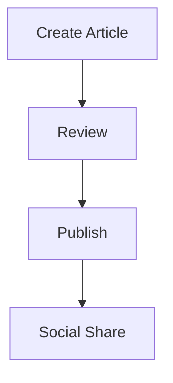

# Complete Guide to Free MkDocs Plugins: Essential Tools to Dramatically Enhance Your Site


## What You Can Achieve

<div class="grid cards" markdown>

-   :material-rocket-launch: **Site Enhancement**
    
    Boost traffic with SEO optimization, social card generation, and RSS feeds

-   :material-chart-line: **Content Management**
    
    Improve usability with blog features, tag classification, and search functionality

-   :material-language: **Multilingual Support**
    
    Enable global expansion with internationalization, auto-translation, and localization

-   :material-speedometer: **Performance Optimization**
    
    Accelerate with image compression, HTML minification, and cache optimization

</div>

## 📖 Overview

MkDocs has a rich ecosystem of free plugins that enable advanced functionality beyond standard features. This article categorizes carefully selected plugins available in 2025 by function and provides practical information for real blog site management.

## 🚀 Built-in Material for MkDocs Plugins

### 1. **Social Plugin** (Automatic Social Card Generation)

```yaml
plugins:
  - social:
      cards_layout_options:
        background_color: "#1976d2"
        color: "#ffffff"
      cards_layout: default
```

**Benefits**:
- Automatically generates beautiful preview cards for Twitter and Facebook shares
- Significantly improves SEO and click-through rates
- Unifies brand image

**Configuration Example**:
```yaml
plugins:
  - social:
      cards: true
      cards_dir: assets/images/social
      cards_layout_options:
        title: "Technical Documentation"
        description: "Publishing latest development insights"
        logo: assets/logo.png
```

### 2. **Blog Plugin** (Blog Features)

```yaml
plugins:
  - blog:
      blog_dir: blog
      post_dir: "{blog}/posts"
      post_date_format: "yyyy/MM/dd"
      post_url_format: "{slug}"
      archive_toc: true
```

**Features**:
- Chronological article management
- Tag and category classification
- Author profiles
- Automatic archive page generation

### 3. **Tags Plugin** (Tag Management)

```yaml
plugins:
  - tags:
      tags_file: tags.md
```

**Usage Example**:
```markdown
---
tags:
  - MkDocs
  - Plugins
  - SEO
---
```

### 4. **Search Plugin** (Search Functionality)

```yaml
plugins:
  - search:
      lang: 
        - ja
        - en
      separator: '[\s\-\.]+'
```

## 🔧 SEO & Optimization Plugins

### 1. **mkdocs-minify-plugin** (HTML/CSS/JS Minification)

```bash
pip install mkdocs-minify-plugin
```

```yaml
plugins:
  - minify:
      minify_html: true
      minify_js: true
      minify_css: true
      htmlmin_opts:
        remove_comments: true
        remove_empty_space: true
```

**Effect**: 30-50% page size reduction, improved loading speed

### 2. **mkdocs-rss-plugin** (RSS Distribution)

```bash
pip install mkdocs-rss-plugin
```

```yaml
plugins:
  - rss:
      match_path: ".*"
      date_from_meta:
        - date
        - lastmod
      categories:
        - tags
      length: 20
      pretty_print: true
```

**Features**:
- Automatic RSS feed generation for latest articles
- Update date-based distribution
- Category-specific feed support

### 3. **mkdocs-redirects** (Redirect Management)

```bash
pip install mkdocs-redirects
```

```yaml
plugins:
  - redirects:
      redirect_maps:
        'old-page.md': 'new-page.md'
        'legacy/': 'current/'
```

## 🌐 Multilingual & Internationalization Plugins

### 1. **mkdocs-static-i18n** (Static Multilingual Support)

```bash
pip install mkdocs-static-i18n
```

```yaml
plugins:
  - i18n:
      default_language: ja
      languages:
        - locale: ja
          name: 日本語
          build: true
          default: true
        - locale: en
          name: English
          build: true
      nav_translations:
        en:
          ホーム: Home
          ガイド: Guide
```

**Features**:
- Static file-based multilingual support
- Complete integration with Material for MkDocs
- Automatic language switcher UI generation

## 📊 Content Enhancement Plugins

### 1. **mkdocs-mermaid2-plugin** (Diagram Creation)

```bash
pip install mkdocs-mermaid2-plugin
```

```yaml
plugins:
  - mermaid2:
      arguments:
        theme: neutral
        themeVariables:
          primaryColor: '#1976d2'
```

**Usage Example**:


### 2. **mkdocs-glightbox** (Image Lightbox)

```bash
pip install mkdocs-glightbox
```

```yaml
plugins:
  - glightbox:
      touchNavigation: true
      loop: false
      effect: zoom
      slide_effect: slide
      width: 100%
      height: auto
```

### 3. **mkdocs-table-reader-plugin** (Table Management)

```bash
pip install mkdocs-table-reader-plugin
```

```yaml
plugins:
  - table-reader:
      data_path: "docs/assets/tables"
      select_readers:
        - read_csv
        - read_excel
```

**Usage Example**:
```markdown
{{ read_csv('data.csv') }}
```

## 🕒 Git Integration Plugins

### 1. **mkdocs-git-revision-date-localized-plugin**

```bash
pip install mkdocs-git-revision-date-localized-plugin
```

```yaml
plugins:
  - git-revision-date-localized:
      type: datetime
      timezone: Asia/Tokyo
      locale: en
      fallback_to_build_date: true
      custom_format: "%B %d, %Y at %H:%M"
```

### 2. **mkdocs-git-authors-plugin** (Author Information)

```bash
pip install mkdocs-git-authors-plugin
```

```yaml
plugins:
  - git-authors:
      show_contribution: true
      show_line_count: true
      count_empty_lines: false
```

## ⚙️ Development Support Plugins

### 1. **mkdocs-exclude** (File Exclusion)

```bash
pip install mkdocs-exclude
```

```yaml
plugins:
  - exclude:
      glob:
        - "*.tmp"
        - "drafts/*"
        - "internal/*"
```

### 2. **mkdocs-awesome-pages-plugin** (Navigation Control)

```bash
pip install mkdocs-awesome-pages-plugin
```

```yaml
plugins:
  - awesome-pages:
      filename: .pages
      collapse_single_pages: true
      strict: false
```

**`.pages` File Example**:
```yaml
title: AI Development
nav:
  - index.md
  - "Basic Guide": basics
  - "Advanced": advanced
  - ...
```

## 🎯 Recommended Plugin Configuration for Your Blog

### Priority: High (Immediate Implementation Recommended)

```yaml
plugins:
  - search:
      lang: [ja, en]
  - tags
  - minify:
      minify_html: true
      minify_css: true
      minify_js: true
  - rss:
      match_path: ".*"
      length: 20
  - social:
      cards: true
```

### Priority: Medium (Consider for Feature Expansion)

```yaml
plugins:
  - blog:
      blog_dir: blog
  - glightbox
  - mermaid2
  - redirects
```

### Priority: Low (For Specific Use Cases)

```yaml
plugins:
  - git-authors
  - table-reader
  - exclude
```

## 📋 Pre-Implementation Checklist

### Dependency Verification
- [ ] Check Python environment version (3.8+ recommended)
- [ ] Verify MkDocs Material version
- [ ] Check for conflicts with other plugins

### Performance Testing
- [ ] Measure build time (before/after implementation)
- [ ] Compare page sizes
- [ ] Verify loading speed

### Configuration Optimization
- [ ] Customize plugin settings
- [ ] Adjust cache settings
- [ ] Verify error handling

## ⚠️ Important Notes and Best Practices

### 1. **Plugin Combination**
```yaml
# Place plugins in correct order
plugins:
  - search    # Search first
  - tags      # Tags after search
  - blog      # Blog after tags
  - minify    # Minification last
```

### 2. **Build Time Optimization**
```yaml
# Parallel processing in CI/CD environments
env:
  MKDOCS_BUILD_PARALLEL: true
```

### 3. **Memory Usage Management**
```yaml
# Memory limits for large sites
plugins:
  - search:
      prebuild_index: true
  - social:
      cards_layout_options:
        cache_dir: .cache/social
```

## 🔗 Resources and References

### Official Catalogs
- [MkDocs Official Plugin Catalog](https://github.com/mkdocs/catalog)
- [Best-of-MkDocs](https://github.com/entangled/best-of-mkdocs)

### Developer Resources
- [MkDocs Plugin Development Guide](https://www.mkdocs.org/dev-guide/plugins/)
- [Material for MkDocs Configuration Reference](https://squidfunk.github.io/mkdocs-material/setup/)

### Related Articles
- [MkDocs Advanced Configuration Guide](./高度な設定.md)
- [Site Operations Guide](./サイト運用ガイド.md)
- [Design Improvement Guide](./デザイン改善ガイド.md)

---

*Last updated: 2025-07-12*