# MkDocs無償プラグイン完全ガイド：サイト機能を劇的に向上させる厳選ツール集


## 実現できること

<div class="grid cards" markdown>

-   :material-rocket-launch: **サイト機能強化**
    
    SEO最適化、ソーシャルカード生成、RSS配信で集客力向上

-   :material-chart-line: **コンテンツ管理**
    
    ブログ機能、タグ分類、検索機能でユーザビリティ向上

-   :material-language: **多言語対応**
    
    国際化対応、自動翻訳、地域最適化でグローバル展開

-   :material-speedometer: **パフォーマンス最適化**
    
    画像圧縮、HTML最小化、キャッシュ最適化で高速化

</div>

## 📖 概要

MkDocsは豊富な無償プラグインエコシステムを持ち、標準機能では実現できない高度な機能を簡単に追加できます。この記事では、2025年現在利用可能な厳選プラグインを機能別に分類し、実際のブログサイト運営に活用できる実践的な情報をまとめました。

## 🚀 Material for MkDocs内蔵プラグイン

### 1. **Social Plugin**（ソーシャルカード自動生成）

```yaml
plugins:
  - social:
      cards_layout_options:
        background_color: "#1976d2"
        color: "#ffffff"
      cards_layout: default
```

**効果**:
- TwitterやFacebookでのシェア時に美しいプレビューカードを自動生成
- SEO効果とクリック率の大幅改善
- ブランドイメージの統一

**設定例**:
```yaml
plugins:
  - social:
      cards: true
      cards_dir: assets/images/social
      cards_layout_options:
        title: "技術ドキュメント"
        description: "最新の開発情報を発信"
        logo: assets/logo.png
```

### 2. **Blog Plugin**（ブログ機能）

```yaml
plugins:
  - blog:
      blog_dir: blog
      post_dir: "{blog}/posts"
      post_date_format: "yyyy/MM/dd"
      post_url_format: "{slug}"
      archive_toc: true
```

**機能**:
- 記事の時系列管理
- タグとカテゴリ分類
- 投稿者プロフィール
- アーカイブページ自動生成

### 3. **Tags Plugin**（タグ管理）

```yaml
plugins:
  - tags:
      tags_file: tags.md
```

**活用例**:
```markdown
---
tags:
  - MkDocs
  - プラグイン
  - SEO
---
```

### 4. **Search Plugin**（検索機能）

```yaml
plugins:
  - search:
      lang: 
        - ja
        - en
      separator: '[\s\-\.]+'
```

## 🔧 SEO・最適化プラグイン

### 1. **mkdocs-minify-plugin**（HTML/CSS/JS最小化）

```bash
pip install mkdocs-minify-plugin
```

```yaml
plugins:
  - minify:
      minify_html: true
      minify_js: true
      minify_css: true
      htmlmin_opts:
        remove_comments: true
        remove_empty_space: true
```

**効果**: ページサイズ30-50%削減、読み込み速度向上

### 2. **mkdocs-rss-plugin**（RSS配信）

```bash
pip install mkdocs-rss-plugin
```

```yaml
plugins:
  - rss:
      match_path: ".*"
      date_from_meta:
        - date
        - lastmod
      categories:
        - tags
      length: 20
      pretty_print: true
```

**機能**:
- 最新記事のRSSフィード自動生成
- 更新日ベースの配信
- カテゴリ別フィード対応

### 3. **mkdocs-redirects**（リダイレクト管理）

```bash
pip install mkdocs-redirects
```

```yaml
plugins:
  - redirects:
      redirect_maps:
        'old-page.md': 'new-page.md'
        'legacy/': 'current/'
```

## 🌐 多言語・国際化プラグイン

### 1. **mkdocs-static-i18n**（静的多言語対応）

```bash
pip install mkdocs-static-i18n
```

```yaml
plugins:
  - i18n:
      default_language: ja
      languages:
        - locale: ja
          name: 日本語
          build: true
          default: true
        - locale: en
          name: English
          build: true
      nav_translations:
        en:
          ホーム: Home
          ガイド: Guide
```

**特徴**:
- 静的ファイルベースの多言語対応
- Material for MkDocsとの完全統合
- 言語切り替えUI自動生成

## 📊 コンテンツ強化プラグイン

### 1. **mkdocs-mermaid2-plugin**（図表作成）

```bash
pip install mkdocs-mermaid2-plugin
```

```yaml
plugins:
  - mermaid2:
      arguments:
        theme: neutral
        themeVariables:
          primaryColor: '#1976d2'
```

**使用例**:


```mermaid
graph TD
    A[記事作成] --> B[レビュー]
    B --> C[公開]
    C --> D[SNS共有]
```

### 2. **mkdocs-glightbox**（画像ライトボックス）

```bash
pip install mkdocs-glightbox
```

```yaml
plugins:
  - glightbox:
      touchNavigation: true
      loop: false
      effect: zoom
      slide_effect: slide
      width: 100%
      height: auto
```

### 3. **mkdocs-table-reader-plugin**（テーブル管理）

```bash
pip install mkdocs-table-reader-plugin
```

```yaml
plugins:
  - table-reader:
      data_path: "docs/assets/tables"
      select_readers:
        - read_csv
        - read_excel
```

**使用例**:
```markdown
{{ read_csv('data.csv') }}
```

## 🕒 Git連携プラグイン

### 1. **mkdocs-git-revision-date-localized-plugin**

```bash
pip install mkdocs-git-revision-date-localized-plugin
```

```yaml
plugins:
  - git-revision-date-localized:
      type: datetime
      timezone: Asia/Tokyo
      locale: ja
      fallback_to_build_date: true
      custom_format: "%Y年%m月%d日 %H:%M"
```

### 2. **mkdocs-git-authors-plugin**（投稿者情報）

```bash
pip install mkdocs-git-authors-plugin
```

```yaml
plugins:
  - git-authors:
      show_contribution: true
      show_line_count: true
      count_empty_lines: false
```

## ⚙️ 開発支援プラグイン

### 1. **mkdocs-exclude**（ファイル除外）

```bash
pip install mkdocs-exclude
```

```yaml
plugins:
  - exclude:
      glob:
        - "*.tmp"
        - "drafts/*"
        - "internal/*"
```

### 2. **mkdocs-awesome-pages-plugin**（ナビゲーション制御）

```bash
pip install mkdocs-awesome-pages-plugin
```

```yaml
plugins:
  - awesome-pages:
      filename: .pages
      collapse_single_pages: true
      strict: false
```

**`.pages`ファイル例**:
```yaml
title: AI開発
nav:
  - index.md
  - "基本ガイド": basics
  - "応用編": advanced
  - ...
```

## 🎯 あなたのブログに推奨するプラグイン構成

### 優先度：高（即座に導入推奨）

```yaml
plugins:
  - search:
      lang: [ja, en]
  - tags
  - minify:
      minify_html: true
      minify_css: true
      minify_js: true
  - rss:
      match_path: ".*"
      length: 20
  - social:
      cards: true
```

### 優先度：中（機能拡張時に検討）

```yaml
plugins:
  - blog:
      blog_dir: blog
  - glightbox
  - mermaid2
  - redirects
```

### 優先度：低（特定用途向け）

```yaml
plugins:
  - git-authors
  - table-reader
  - exclude
```

## 📋 導入前チェックリスト

### 依存関係確認
- [ ] Python環境のバージョン確認（3.8以上推奨）
- [ ] MkDocs Materialのバージョン確認
- [ ] 他プラグインとの競合チェック

### パフォーマンステスト
- [ ] ビルド時間測定（導入前後）
- [ ] ページサイズ比較
- [ ] 読み込み速度検証

### 設定最適化
- [ ] プラグイン設定のカスタマイズ
- [ ] キャッシュ設定の調整
- [ ] エラーハンドリングの確認

## ⚠️ 注意事項とベストプラクティス

### 1. **プラグインの組み合わせ**
```yaml
# 正しい順序でプラグインを配置
plugins:
  - search    # 検索は最初に
  - tags      # タグは検索の後
  - blog      # ブログはタグの後
  - minify    # 最小化は最後に
```

### 2. **ビルド時間最適化**
```yaml
# CI/CD環境での並列処理
env:
  MKDOCS_BUILD_PARALLEL: true
```

### 3. **メモリ使用量管理**
```yaml
# 大規模サイトでのメモリ制限
plugins:
  - search:
      prebuild_index: true
  - social:
      cards_layout_options:
        cache_dir: .cache/social
```

## 🔗 リソースと参考情報

### 公式カタログ
- [MkDocs公式プラグインカタログ](https://github.com/mkdocs/catalog)
- [Best-of-MkDocs](https://github.com/entangled/best-of-mkdocs)

### 開発者向けリソース
- [MkDocsプラグイン開発ガイド](https://www.mkdocs.org/dev-guide/plugins/)
- [Material for MkDocs設定リファレンス](https://squidfunk.github.io/mkdocs-material/setup/)

### 関連記事
- [MkDocs高度な設定ガイド](./高度な設定.md)
- [サイト運用ガイド](./サイト運用ガイド.md)
- [デザイン改善ガイド](./デザイン改善ガイド.md)

---

*最終更新: 2025-07-12*