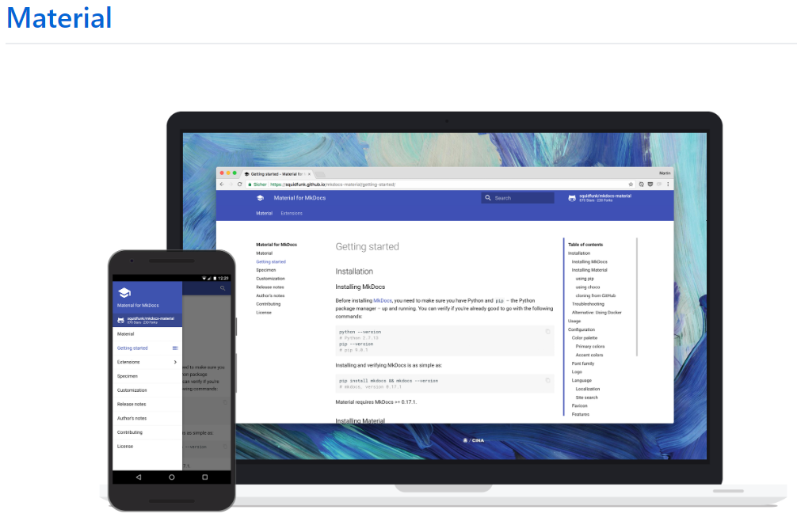
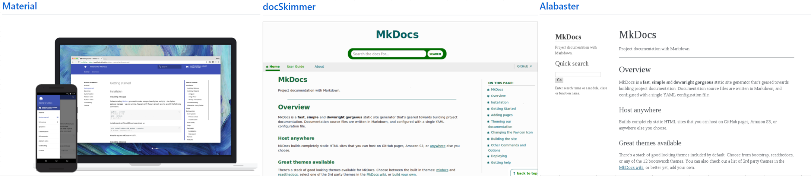
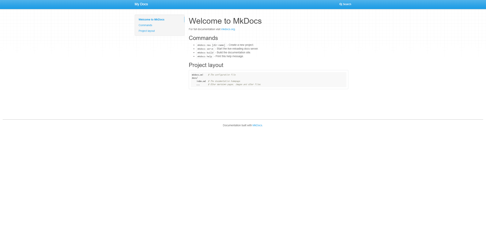
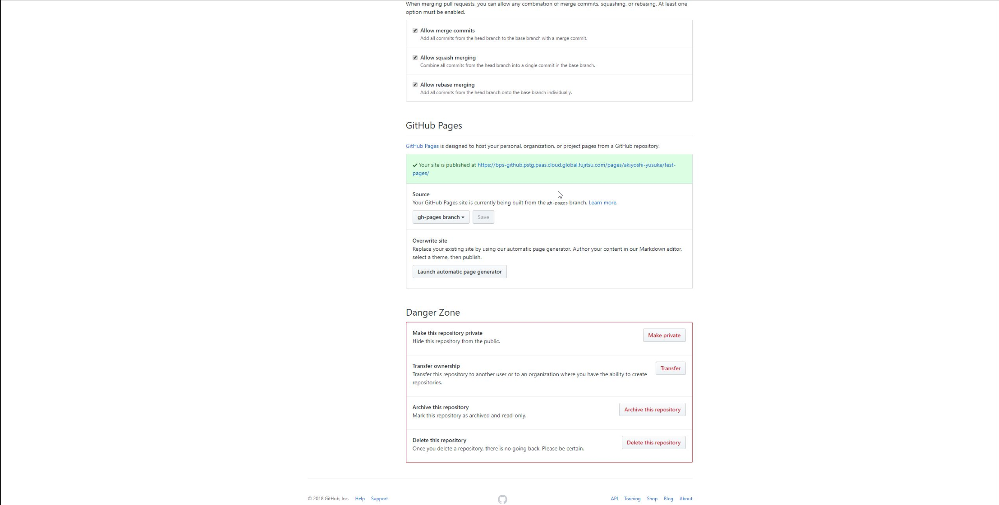

# mkdocsを使ったGitHub Pagesの作成方法

!!! tip "関連記事"
    - [MkDocsデザイン改善ガイド](./デザイン改善ガイド.md) - UI/UX最適化手順
    - [Google Analytics設定](./アナリティクス設定.md) - アクセス解析の導入
    - [MkDocs高度な設定](./高度な設定.md) - カスタマイズとプラグイン

## 実現できること

<div class="grid cards" markdown>

-   :fontawesome-solid-globe:{ .lg .middle } __完全無料のプロサイト__

    ---

    企業レベルの美しいサイトが無料で作成可能

-   :fontawesome-solid-file-code:{ .lg .middle } __HTMLなしで構築__

    ---

    Markdownだけでプロフェッショナルサイトが完成

-   :fontawesome-brands-git-alt:{ .lg .middle } __Git完全統合__

    ---

    コードとドキュメントを統一管理・レビュー

-   :fontawesome-solid-rocket:{ .lg .middle } __ワンコマンドデプロイ__

    ---

    `mkdocs gh-deploy`で即座に本番公開

-   :fontawesome-solid-palette:{ .lg .middle } __無限カスタマイズ__

    ---

    Material Designベースで自由自在にデザイン

-   :fontawesome-solid-search:{ .lg .middle } __高速検索・SEO対応__

    ---

    爆速表示と検索エンジン最適化を標準装備

</div>

## 1. GitHub Pagesとは

GitHub Pagesとはレンタルサーバなど用意しなくても、無料で簡単にウェブサイトを作成できるGitHub機能の１つです。実はmicrosoftやyahooなどの大手企業もGitHub Pagesを自身の企業ページとして活用しています。

- https://opensource.microsoft.com/

- http://yahoo.github.io/

このようにGitHub Pagesは使い方次第ではプロジェクト管理、ドキュメント管理または個人ブログなどにも活用することが可能です。

またウェブサイトの資産(HTML等)は全てGitHubのリポジトリで管理されるため、使い方次第ではサイトの版数管理や課題の管理、プルリクエストを使ったレビューなどもまとめて行えます。

ただ1つめんどうな点があるとすれば、それは**ウェブサイトなのでHTMLを書かなければならない**。(逆に言うとHTMLを書くだけでいい)

このページにたどり着いた方なら「HTML書くのめんどくさい」、「ドキュメントは全てmarkdownで版数管理したい」と考えている方も多いのではないでしょうか。

そんな皆さんの悩みを解決してくれるのが**Mkdocs**です。

## 2. Mkdocsとは

Mkdocsとは一言でいうと、markdownで書いたドキュメントを自動的にHTMLに変換し、静的なHTMLサイトを構築してくれる静的サイトジェネレータです。

開発者なら誰でもmarkdownで議事録や手順書などを書き、管理したいと考えていると思います。mkdocsを使えば、markdownで書かれたテキストを高速かつシンプルにウェブサイトとして構築することができます。

またmkdocsには様々な"theme"が存在し、そのthemeを選択することで自分好みのウェブサイトを作成することが可能です。またそのthemeをさらにカスタマイズし、オリジナルなるのページを作成することも可能です。



## 3. mkdocsでGitHub Pagesを作成する

では実際にGitHub Pagesをmkdocsで作成してみましょう。作成方法はとても簡単です。

以下の流れでGitHubページを作成していきます。

1. Mkdocsのインストール
2. GitHubリポジトリの作成し、ローカル環境へclone
3. MkdocsでGitHub Pagesを作成

### 事前準備

- **Python 3.8以上**のインストール（推奨：Python 3.9以上）
- GitHubアカウントの作成（無料）
- Gitがインストールされていること

!!! warning "Python バージョンについて"
    Python 2.7は2020年にサポート終了しました。現在はPython 3.8以上が必要です。

事前準備として作業端末にPython 3.8以上のインストールと、GitHubアカウントを作成しておいてください。

!!! info "Python環境の準備"
    Pythonのインストールで困った場合は、[Pythonインストールガイド](../../Infrastructure/OSコマンド/pythonのインストール.md)で各OS別の詳細な手順を確認できます。

### ①Mkdocsのインストール

最初に以下のコマンドを実施し、作業端末へMkdocsをインストールします。

```bash
# 推奨：MkDocs MaterialテーマとMkDocs本体を同時インストール
pip install mkdocs-material

# または、MkDocs本体のみ
pip install mkdocs
```

!!! tip "推奨インストール方法"
    `mkdocs-material`をインストールすると、MkDocs本体と人気のMaterialテーマが同時にインストールされます。

※pipが古い場合は以下のコマンドでアップグレードしてください

```bash
pip install --upgrade pip
```

インストールが終わると以下のコマンドを実行し、mkdocsがインストールされていることを確認します

```bash
mkdocs --version
# 出力例: mkdocs, version 1.6.0 from /usr/local/lib/python3.11/site-packages/mkdocs (Python 3.11)
```

詳しいインストール方法について公式サイトを参考してください。

Mkdocsの公式サイト→https://www.mkdocs.org/

※ちなみにこのサイトもMkdocsを使ったGitHub Pagesで作られています。

### ②GitHubリポジトリの作成とクローン

次に**GitHub Pages専用**のリポジトリを作成します。

!!! note "リポジトリ名について"
    このリポジトリ名がサイトのURL（https://ユーザー名.github.io/リポジトリ名/）に使われるため、分かりやすい名前にしてください。

#### リポジトリ作成手順

1. [GitHub](https://github.com)にログイン
2. 右上の「+」→「New repository」をクリック
3. Repository name に任意の名前を入力（例：`my-docs`）
4. 「Public」を選択（GitHub Pages無料版はPublicのみ）
5. 「Add a README file」のチェックは**外す**
6. 「Create repository」をクリック



#### ローカル環境にクローン

リポジトリを作成したら、ローカル環境にgit cloneします。

```bash
git clone https://github.com/ユーザー名/リポジトリ名.git
cd リポジトリ名
```

実行結果例：
```bash
$ git clone https://github.com/github-user-001/test-pages.git
Cloning into 'test-pages'...
warning: You appear to have cloned an empty repository.
$ cd test-pages
```

### ③MkDocsプロジェクトの作成

クローンしたリポジトリディレクトリ内で、MkDocsプロジェクトを作成します。

```bash
# 現在のディレクトリにMkDocsプロジェクトを作成
mkdocs new .
```

実行結果例：
```bash
$ mkdocs new .
INFO    -  Writing config file: ./mkdocs.yml
INFO    -  Writing initial docs: ./docs/index.md
```

作成されたファイル構造を確認します。

```bash
ls -la
```

以下のような構造が作成されます：
```
.
├── docs/
│   └── index.md      # ホームページ
├── mkdocs.yml        # 設定ファイル
└── .git/             # Gitディレクトリ
```

#### 初期設定ファイルの確認

`docs/index.md`の内容を確認してみましょう。

```bash
cat docs/index.md
```

実行結果例：
```markdown
# Welcome to MkDocs

For full documentation visit [mkdocs.org](https://mkdocs.org).

## Commands

* `mkdocs new [dir-name]` - Create a new project.
* `mkdocs serve` - Start the live-reloading docs server.
* `mkdocs build` - Build the documentation site.
* `mkdocs help` - Print this help message.

## Project layout

    mkdocs.yml    # The configuration file.
    docs/
        index.md  # The documentation homepage.
        ...       # Other markdown pages, images and other files.
```

#### ローカルでの確認

まず、ローカルでサイトが正常に動作することを確認します。

```bash
mkdocs serve
```

ブラウザで http://127.0.0.1:8000 にアクセスして確認してください。

#### .gitignoreファイルの作成

ビルド成果物をGitで管理しないように`.gitignore`を作成します。

```bash
echo "site/" > .gitignore
```

#### GitHub Pagesへのデプロイ

以下のコマンドでGitHub Pagesに一発デプロイできます。

```bash
mkdocs gh-deploy
```

実行結果例：
```bash
$ mkdocs gh-deploy
INFO    -  Cleaning site directory
INFO    -  Building documentation to directory: /path/to/test-pages/site
INFO    -  Copying '/path/to/test-pages/site' to 'gh-pages' branch and pushing to GitHub.
INFO    -  Your documentation should shortly be available at: https://github-user-001.github.io/test-pages/
```

!!! success "デプロイ完了"
    数分後に https://github-user-001.github.io/test-pages/ でサイトにアクセスできるようになります。

## 4. コンテンツの更新と管理

### ①ホームページの更新

デフォルトページである `docs/index.md` を編集してホームページをカスタマイズできます。

試しに`index.md`の内容を以下のように変更してみましょう。

```bash
# エディタで編集（VS Code、vim、nanoなど）
code docs/index.md  # VS Codeの場合
# または
vi docs/index.md    # vimの場合
```

編集例：
```markdown
# Welcome to MkDocs
↓ 変更
# Welcome to My Documentation Site

このサイトでは、○○についての情報を提供しています。

## 主なコンテンツ

- [はじめに](./getting-started/)
- [チュートリアル](./tutorial/)
- [リファレンス](./reference/)

## 最新情報

最終更新日: 2024年3月
```

#### ローカルで確認

変更内容をローカルで確認します。

```bash
mkdocs serve
```

http://127.0.0.1:8000 にアクセスして変更を確認してください。

#### GitHub Pagesに反映

内容に満足したら、GitHub Pagesに反映します。

```bash
# 変更をGitにコミット（推奨）
git add .
git commit -m "Update homepage content"
git push origin main

# GitHub Pagesにデプロイ
mkdocs gh-deploy
```

!!! tip "ベストプラクティス"
    ソースコードの変更は必ずGitでバージョン管理することを推奨します。

数分後にサイトで変更が反映されます。



### ②新しいページの作成

ホームページ以外にも複数のページを作成してサイトを充実させましょう。

#### ページ作成の基本

**`docs/`配下にMarkdownファイルを作成**することで新しいページができます。

```bash
# ディレクトリを作成
mkdir docs/guide
mkdir docs/reference

# ページファイルを作成
echo "# はじめに

このページでは、基本的な使い方を説明します。

## 概要

- 手順1
- 手順2  
- 手順3" > docs/guide/getting-started.md

echo "# リファレンス

各機能の詳細説明です。

## API一覧

- function1()
- function2()
- function3()" > docs/reference/api.md
```

#### ナビゲーションの設定

`mkdocs.yml`を編集してナビゲーションメニューを設定します。

```yaml
# mkdocs.yml
site_name: My Documentation Site

nav:
  - ホーム: index.md
  - ガイド:
    - はじめに: guide/getting-started.md
  - リファレンス:
    - API: reference/api.md

theme:
  name: material  # 推奨テーマ
```

#### ローカルで確認

```bash
mkdocs serve
```

ナビゲーションメニューに新しいページが表示されることを確認してください。

#### デプロイ

```bash
# ソースコードをコミット
git add .
git commit -m "Add guide and reference pages"
git push origin main

# GitHub Pagesに反映
mkdocs gh-deploy
```

これで以下のようなURL構造でアクセスできるようになります：

- https://github-user-001.github.io/test-pages/ （ホーム）
- https://github-user-001.github.io/test-pages/guide/getting-started/ （ガイド）  
- https://github-user-001.github.io/test-pages/reference/api/ （リファレンス）

## 5. MkDocsとGitHub Pagesの仕組み

MkDocsを使えば、Markdownファイルから美しいWebサイトを簡単に作成・公開できることが分かったと思います。

### デプロイの仕組み

`mkdocs gh-deploy`コマンドは以下の処理を自動で行います：

1. **ビルド**: Markdownファイル → HTMLファイルに変換
2. **ブランチ作成**: `gh-pages`ブランチを作成/更新
3. **プッシュ**: 生成されたHTMLを`gh-pages`ブランチにプッシュ
4. **公開**: GitHub Pagesが`gh-pages`ブランチから自動配信

### ブランチ構造

```bash
main ブランチ:     ソースコード（Markdownファイル、設定ファイル）
     ├── docs/
     ├── mkdocs.yml
     └── .gitignore

gh-pages ブランチ: 生成されたWebサイト（HTMLファイル）
     ├── index.html
     ├── assets/
     └── sitemap.xml
```

### GitHub Pages設定の確認

GitHub Pagesの設定は以下で確認できます：

1. GitHubリポジトリページを開く
2. 「Settings」タブをクリック
3. 左メニューの「Pages」をクリック
4. Source が「Deploy from a branch: gh-pages」になっていることを確認



!!! note "デプロイ後の確認"
    `mkdocs gh-deploy`実行後、GitHubの「Actions」タブで自動デプロイの進行状況を確認できます。

## 6. 次のステップ

基本的なMkDocsサイトの作成方法を学びました。さらにサイトを改善したい場合は、以下の応用編をご覧ください。

### 高度なカスタマイズ

!!! tip "関連記事"
    - **[デザイン改善ガイド](./デザイン改善ガイド.md)** - モダンなUI・ダークモード対応
    - **[アナリティクス設定](./アナリティクス設定.md)** - Google Analytics導入
    - **[高度な設定](./高度な設定.md)** - プラグイン・CI/CD・多言語対応

### よくある活用例

実際にこのサイトでも以下のような活用をしています：

#### 📝 技術ドキュメント
- **チュートリアル**: [MkDocs作成ガイド](https://aiedoc.github.io/note/Tips/Mkdocs/mkdocsを使ったGitHubPages/) - 4,000語超の包括的な手順書
- **コマンドリファレンス**: [crontabの書き方](https://aiedoc.github.io/note/Infrastructure/OSコマンド/crontabの書き方/) - 実用的なコード例集
- **設定ガイド**: [デザイン改善ガイド](https://aiedoc.github.io/note/Tips/Mkdocs/デザイン改善ガイド/) - カスタマイズの実装例

#### 📚 ナレッジベース
- **リンク集**: [開発ツール](https://aiedoc.github.io/note/Info/リンク集/) - 分野別に整理された外部リソース
- **技術メモ**: [便利ツール](https://aiedoc.github.io/note/Tips/便利ツール/) - 実際に使っているツールの紹介
- **システム管理**: [インフラ情報](https://aiedoc.github.io/note/Infrastructure/) - DNS、crontab、SELinux等

#### 🎨 高度なカスタマイズ例
- **アナリティクス**: [Google Analytics設定](https://aiedoc.github.io/note/Tips/Mkdocs/アナリティクス設定/) - GA4導入とプライバシー対応
- **UI/UX**: 3列グリッドレイアウト、ダークモード、検索機能を実装済み
- **日本語最適化**: フォント設定、検索の日本語対応

### GitHub Pagesの利点

- **無料**: パブリックリポジトリなら完全無料
- **高速**: CDN配信で世界中から高速アクセス
- **信頼性**: GitHubのインフラで安定運用
- **バージョン管理**: Gitで履歴管理
- **独自ドメイン**: カスタムドメイン設定可能（[DNS設定ガイド](../../Infrastructure/OSコマンド/DNS設定.md)参照）

### 推奨ワークフロー

```bash
# 1. ローカルで編集・確認
mkdocs serve

# 2. 変更をコミット
git add .
git commit -m "Update documentation"
git push origin main

# 3. 本番環境にデプロイ
mkdocs gh-deploy
```

!!! tip "自動化のおすすめ"
    定期的な更新や自動デプロイを設定したい場合は、[crontabの書き方](../../Infrastructure/OSコマンド/crontabの書き方.md)を参考にスケジュール実行を設定できます。

## 終わりに

MkDocsとGitHub Pagesを組み合わせることで、**Markdownで書いた文書を美しいWebサイトとして簡単に公開**できます。

初期設定は少し手間ですが、一度構築すれば継続的なメンテナンスが非常に楽になります。技術者にとって馴染みのあるMarkdown記法とGitワークフローで、効率的にドキュメントサイトを運用できます。

独自ドメインを取得してブログサイトとして運用したり、チームの技術ドキュメント共有プラットフォームとして活用することも可能です。

ぜひ、あなたのプロジェクトでもMkDocsとGitHub Pagesを活用してみてください！

---

## 📚 次に読むべき記事

MkDocsサイトを作成できたら、次のステップでさらに充実させましょう：

### 🎨 見た目を改善する
- **[デザイン改善ガイド](./デザイン改善ガイド.md)** - カスタムCSS、フォント設定、レスポンシブデザインの実装方法
- **[アナリティクス設定](./アナリティクス設定.md)** - Google Analytics 4の導入とプライバシー対応

### ⚙️ 高度な機能を追加する
- **[高度な設定](./高度な設定.md)** - プラグイン活用、SEO対策、パフォーマンス最適化の包括ガイド

### 💻 サーバー管理の基礎知識
- **[crontabの書き方](../../Infrastructure/OSコマンド/crontabの書き方.md)** - 自動デプロイや定期処理の設定
- **[DNS設定](../../Infrastructure/OSコマンド/DNS設定.md)** - 独自ドメインを使う場合の設定方法

### 🛠️ 開発効率化
- **[便利ツール](../便利ツール.md)** - Markdown編集、Git操作を効率化するツール集
- **[リンク集](../リンク集.md)** - Web開発に役立つリソース集

!!! tip "学習順序のおすすめ"
    1. まずは **[デザイン改善ガイド](./デザイン改善ガイド.md)** でサイトの見た目を整える
    2. 次に **[アナリティクス設定](./アナリティクス設定.md)** でアクセス解析を導入
    3. 慣れてきたら **[高度な設定](./高度な設定.md)** で本格的な機能追加に挑戦