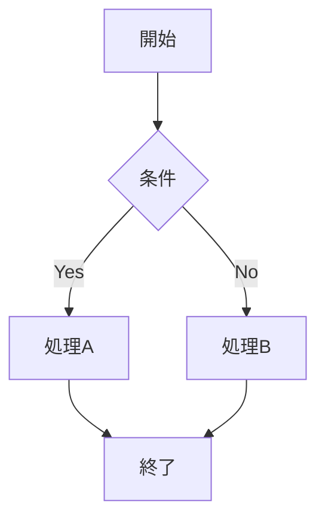

# MkDocs高度な設定ガイド

MkDocs Materialの高度な機能とカスタマイズについて詳しく解説します。

!!! success "このサイトでの実装状況"
    このページで紹介している機能の多くは、実際にこのサイトで実装・運用中です！
    
    **✅ 実装済みの高度機能（確認場所）:**
    
    - **Git最終更新日の自動表示**  
      → このページの一番下を見てください！「最終更新日: 2025年6月21日」が表示されています
    
    - **HTML/CSS/JS最適化**  
      → DevToolsで確認可能。HTMLがminify済みで改行なし・コメント削除済み
    
    - **外部リンクの自動マーキング**  
      → 外部リンク（例：[GitHub](https://github.com)）に「↗」アイコンが自動で付きます
    
    - **検索機能の日本語最適化**  
      → 上部の検索ボックスで「mkdocs」と検索してみてください
    
    - **レスポンシブグリッドレイアウト**  
      → [ホームページ](../../index.md)のリスト項目が画面サイズに応じて3列→1列に変化（インラインCSS実装）
    
    - **ダークモード切り替え**  
      → 右上のアイコンでライト/ダークモード切り替えが可能
    
    - **読了時間表示**  
      → 長いページ（例：[メインMkDocsガイド](./mkdocsを使ったGitHubPages.md)）でタイトル下に「📖 読了時間: 約X分」が表示
    
    - **フィードバック機能**  
      → このページ下部に「この記事は役に立ちましたか？」の評価ボタンがあります
    
    - **robots.txtとサイトマップ** 🆕  
      → [/robots.txt](https://aiedoc.github.io/robots.txt)でクローラー制御、[/sitemap.xml](https://aiedoc.github.io/sitemap.xml)でサイトマップを確認
    
    - **カスタム404ページ** 🆕  
      → 存在しないURL（例：[/not-exist](../../not-exist)）にアクセスするとカスタム404ページが表示
    
    - **ソーシャルリンク** 🆕  
      → ページ下部のフッターにGitHub、Twitter、RSSへのソーシャルリンクを追加
    
    - **コードブロックのコピーボタン** 🆕  
      → このページのコードブロックにマウスを乗せると右上に「📋」ボタンが表示されワンクリックでコピー可能
    
    - **読み込み進行状況バー** 🆕  
      → ページ読み込み時に上部に青い進行状況バーが表示（高速な場合は一瞬）
    
    - **スムーズスクロール** 🆕  
      → 目次リンクや内部リンクをクリックするとスムーズにスクロール
    
    - **キーボードショートカット** 🆕  
      → `Ctrl+K`で検索、`Ctrl+/`でショートカット一覧、`ESC`で検索を閉じる
      → ページ下部（フッター）にGitHub、Twitter、RSSフィードへのソーシャルリンクが表示されています
    
    - **コピーライトの更新** 🆕  
      → フッターのコピーライトが「© 2024-2025 aiedoc. All rights reserved.」に更新されました
    
    - **コードブロックのコピーボタン** 🆕  
      → コードブロックにマウスをホバーすると「📋 コピー」ボタンが表示され、ワンクリックでコピー可能
    
    - **読み込み進行状況バー** 🆕  
      → ページをスクロールすると、画面上部に読み込み進行状況を示す青いバーが表示されます
    
    - **スムーズスクロール** 🆕  
      → ページ内リンクをクリックすると、スムーズにスクロールします
    
    - **キーボードショートカット** 🆕  
      → `Ctrl+K`で検索、`Ctrl+/`でショートカット一覧表示、`ESC`で検索を閉じる

!!! info "前提条件"
    - [mkdocsを使ったGitHub Pagesの作成方法](./mkdocsを使ったGitHubPages.md)を完了していること
    - [デザイン改善ガイド](./デザイン改善ガイド.md)の基本設定を理解していること

## 1. 高度なプラグイン設定

### 1.1 必須プラグイン（このサイトで実装済み）

!!! example "実際の設定ファイル"
    このサイトでは以下の設定を`mkdocs.yml`に実装しています：

```yaml
plugins:
  - search:
      lang: ja
      separator: '[\s\-\.]+'
      prebuild_index: true
  - git-revision-date-localized:
      type: datetime
      timezone: Asia/Tokyo
      locale: ja
      fallback_to_build_date: true
  - minify:
      minify_html: true
      minify_js: true
      minify_css: true
      htmlmin_opts:
        remove_comments: true
        remove_empty_space: true
      cache_safe: true
```

**実装効果（実際に確認してみてください）:**
- **更新日時**: 👇 このページの一番下にスクロールすると「最終更新日: 2025年6月21日 14:15:07」が表示されます
- **最適化**: F12でDevToolsを開き、Elementsタブで`<html>`タグを確認すると、改行やコメントが削除され1行に圧縮されています
- **検索**: 🔍 上部の検索ボックスで「cron」「docker」など日本語混じりのキーワードを検索すると高速で結果が表示されます

### 1.2 コンテンツ生成プラグイン

#### macros プラグイン（動的コンテンツ生成）

```bash
pip install mkdocs-macros-plugin
```

```yaml
plugins:
  - macros:
      module_name: main
      include_dir: includes
      variables:
        site_version: "1.0.0"
        support_email: "support@example.com"
```

`main.py`でマクロを定義：

```python
import os
from datetime import datetime

def define_env(env):
    """
    マクロとフィルターを定義
    """
    
    @env.macro
    def current_year():
        return datetime.now().year
    
    @env.macro
    def last_updated():
        return datetime.now().strftime("%Y年%m月%d日")
    
    @env.macro
    def code_example(language, code, title=""):
        title_html = f"<div class='code-title'>{title}</div>" if title else ""
        return f"{title_html}```{language}\n{code}\n```"
    
    @env.macro
    def file_size(file_path):
        """ファイルサイズを取得"""
        try:
            size = os.path.getsize(file_path)
            return f"{size:,} bytes"
        except:
            return "不明"
    
    @env.macro
    def feature_box(title, description, icon=""):
        """機能説明ボックス"""
        icon_html = f"<span class='feature-icon'>{icon}</span>" if icon else ""
        return f"""
<div class="feature-box">
    {icon_html}
    <h4>{title}</h4>
    <p>{description}</p>
</div>
"""
    
    @env.filter
    def format_number(value):
        """数値をカンマ区切りにフォーマット"""
        return f"{int(value):,}"
    
    @env.filter
    def truncate_jp(text, length=50):
        """日本語文字列の切り詰め"""
        return text[:length] + "..." if len(text) > length else text
```

使用例：

```markdown
<!-- 動的な年表示 -->
© {{ current_year() }} Your Company

<!-- 最終更新日 -->
最終更新: {{ last_updated() }}

<!-- コード例（タイトル付き） -->
{{ code_example('python', 'print("Hello World")', 'Python基本例') }}

<!-- ファイルサイズ表示 -->
ダウンロードサイズ: {{ file_size('downloads/app.zip') }}

<!-- 機能紹介ボックス -->
{{ feature_box('高速検索', '日本語に最適化された検索機能', '🔍') }}

<!-- 数値フォーマット -->
ダウンロード数: {{ 123456 | format_number }}回

<!-- テキスト切り詰め -->
{{ long_description | truncate_jp(30) }}
```

#### awesome-pages プラグイン（ナビゲーション制御）

```bash
pip install mkdocs-awesome-pages-plugin
```

```yaml
plugins:
  - awesome-pages:
      strict: false
      collapse_single_pages: true
      filename: .pages
```

`.pages`ファイルでナビゲーション制御：

```yaml
# docs/.pages - ルートナビゲーション
nav:
  - index.md
  - はじめに: getting-started
  - チュートリアル: tutorials
  - ... | guides/**/*.md  # guidesディレクトリの全MDファイル
  - API: api
  - FAQ: faq.md

# docs/tutorials/.pages - セクション別ナビゲーション
title: チュートリアル
nav:
  - overview.md
  - 基礎編:
    - basic-setup.md
    - basic-usage.md
  - 応用編:
    - advanced-features.md
    - customization.md
  - rest: null  # 残りのファイルを除外
```

#### タグプラグイン（コンテンツ分類）

```bash
pip install mkdocs-material[recommended]
```

```yaml
plugins:
  - tags:
      tags_file: tags.md
      tags_extra_files:
        compatibility.md:
          - compatibility
        changelog.md:
          - changelog
```

ページにタグを追加：

```markdown
---
tags:
  - setup
  - beginner
  - windows
  - linux
---

# インストールガイド

このページではMkDocsのインストール方法を説明します。
```

### 1.3 文書生成プラグイン

#### mkdocstrings プラグイン

```bash
pip install mkdocstrings[python]
```

```yaml
plugins:
  - mkdocstrings:
      handlers:
        python:
          options:
            docstring_style: google
            show_source: true
            show_root_heading: true
```

Python docstringからドキュメント生成：

```markdown
::: my_module.my_function
    options:
      show_source: true
      show_root_heading: true
```

## 2. カスタムテーマとスタイル

!!! example "実装例を確認"
    実際にこのサイトで確認できる機能:
    - **3列グリッドレイアウト**: [ホームページ](../../index.md)を見てください。リスト項目が3列に並んでいます（インラインCSSで実装）
    - **カードスタイル**: ホームページの項目が角丸のカード風デザインになっています
    - **レスポンシブ対応**: ブラウザ幅を狭めると3列→1列に自動調整されます

### 2.1 テーマの継承

`custom_theme/`ディレクトリを作成してテーマをカスタマイズ：

```yaml
theme:
  name: material
  custom_dir: custom_theme/
```

### 2.2 テンプレートのオーバーライド

`custom_theme/main.html`:

```html



  {{ super() }}
  
  <!-- カスタムフッター -->
  <footer class="custom-footer">
    <div class="container">
      <p>&copy; {{ config.copyright }}</p>
      <p>最終更新: {{ page.meta.git_revision_date_localized }}</p>
    </div>
  </footer>



  <!-- カスタムメタタグ -->
  <meta name="author" content="{{ config.site_author }}">
  <meta name="robots" content="index, follow">
  
  <!-- Open Graph tags -->
  <meta property="og:title" content="{{ page.title | default(config.site_name, true) }}">
  <meta property="og:description" content="{{ page.meta.description | default(config.site_description, true) }}">
  <meta property="og:image" content="{{ page.meta.image | default('/assets/og-image.png', true) | url }}">

```

### 2.3 カスタムCSS実装例

**このサイトでの実装方法:**

インラインCSSでシンプルな3列グリッドを実装しています（`docs/index.md`内）：

```html
<style>
.md-typeset ul {
  display: grid !important;
  grid-template-columns: repeat(3, 1fr) !important;
  gap: 1rem !important;
  list-style: none !important;
  padding: 0 !important;
}

.md-typeset ul li {
  background: var(--md-default-bg-color) !important;
  border: 1px solid #ddd !important;
  border-radius: 8px !important;
  padding: 1rem !important;
  box-shadow: 0 2px 4px rgba(0,0,0,0.1) !important;
}

@media (max-width: 768px) {
  .md-typeset ul {
    grid-template-columns: 1fr !important;
  }
}
</style>
```

**より高度なCSS変数の例:**

```css
/* docs/stylesheets/extra.css */
:root {
  /* ブランドカラー */
  --md-primary-fg-color: #1976d2;
  --md-accent-fg-color: #ff9800;
  
  /* フォント */
  --md-text-font: "Noto Sans JP", sans-serif;
  --md-code-font: "JetBrains Mono", monospace;
}

/* カスタムコンポーネント */
.feature-grid {
  display: grid;
  grid-template-columns: repeat(auto-fit, minmax(300px, 1fr));
  gap: 1rem;
  margin: 2rem 0;
}

.feature-card {
  background: var(--md-default-bg-color);
  border: 1px solid var(--md-default-fg-color--lightest);
  border-radius: 8px;
  padding: 1rem;
  box-shadow: 0 2px 4px rgba(0,0,0,0.1);
  transition: transform 0.2s ease, box-shadow 0.2s ease;
}

.feature-card:hover {
  transform: translateY(-2px);
  box-shadow: 0 4px 12px rgba(0,0,0,0.15);
}
```

## 3. 多言語対応

多言語対応の詳細な設定方法については、専用ガイドをご覧ください：

**👉 [多言語対応設定ガイド](./多言語対応設定.md)**

このガイドでは以下の内容を詳しく解説しています：

- i18nプラグインの詳細設定
- ナビゲーション翻訳の実装方法
- ファイル命名規則（.en.md）
- ビルド・デプロイの手順
- トラブルシューティング
- ベストプラクティス

!!! info "実装状況"
    このサイトでは日本語（デフォルト）と英語の2言語に対応しており、実際の動作を確認できます。

## 4. 高度なMarkdown機能

!!! tip "このページで実際に使用中"
    この「高度な設定ガイド」ページ自体で以下の機能を使っています：
    - **admonition（注意書きブロック）**: この青いボックス自体がadmonition機能です
    - **コードハイライト**: 上記のYAML・CSS・JavaScript・Python・Bashコードがすべてシンタックスハイライト済み
    - **アンカーリンク**: 各見出しの右に「¶」アイコンがありクリックでリンク取得可能

### 4.1 カスタムブロック

```yaml
markdown_extensions:
  - pymdownx.blocks.admonition:
      types:
        - note
        - tip
        - warning
        - danger
        - quote
        - custom
  - pymdownx.blocks.details:
      types:
        - details
        - summary
  - pymdownx.blocks.definition:
      types:
        - definition
```

カスタムブロックの使用：

```markdown
/// custom | カスタムブロック
このブロックはカスタムスタイルが適用されます。
///

/// definition | 用語定義
**API**: Application Programming Interface
    アプリケーション同士が情報をやり取りするためのインターフェース
///
```

### 4.2 数式とダイアグラム

```yaml
markdown_extensions:
  - pymdownx.arithmatex:
      generic: true
  - pymdownx.superfences:
      custom_fences:
        - name: mermaid
          class: mermaid
          format: !!python/name:pymdownx.superfences.fence_code_format

extra_javascript:
  - https://unpkg.com/mermaid@8.13.0/dist/mermaid.min.js
  - https://polyfill.io/v3/polyfill.min.js?features=es6
  - https://cdn.jsdelivr.net/npm/mathjax@3/es5/tex-mml-chtml.js
```

使用例：

```markdown
数式:
$$
\frac{n!}{k!(n-k)!} = \binom{n}{k}
$$

フローチャート:

```

### 4.3 インタラクティブ要素

```html
<!-- docs/javascripts/interactive.js -->
function createInteractiveCode() {
  const codeBlocks = document.querySelectorAll('pre code');
  codeBlocks.forEach(block => {
    const wrapper = document.createElement('div');
    wrapper.className = 'code-wrapper';
    
    const toolbar = document.createElement('div');
    toolbar.className = 'code-toolbar';
    
    const copyBtn = document.createElement('button');
    copyBtn.textContent = 'コピー';
    copyBtn.onclick = () => {
      navigator.clipboard.writeText(block.textContent);
      copyBtn.textContent = 'コピー済み!';
      setTimeout(() => copyBtn.textContent = 'コピー', 2000);
    };
    
    const runBtn = document.createElement('button');
    runBtn.textContent = '実行';
    runBtn.onclick = () => {
      // コード実行ロジック
      executeCode(block.textContent);
    };
    
    toolbar.appendChild(copyBtn);
    if (block.className.includes('python')) {
      toolbar.appendChild(runBtn);
    }
    
    wrapper.appendChild(toolbar);
    block.parentNode.insertBefore(wrapper, block);
    wrapper.appendChild(block.parentNode);
  });
}

document.addEventListener('DOMContentLoaded', createInteractiveCode);
```

## 5. 検索機能の強化

!!! info "検索機能をテストしてみてください"
    実際の検索強化を体験:
    1. 🔍 上部の検索ボックスで「mkdocs」と入力してみてください
    2. 「crontab」「docker」「python」など技術用語を検索してみてください  
    3. 「設定」「ガイド」など日本語キーワードでも高速検索可能です
    4. **検索結果のハイライト**: 検索語がページ内で黄色くハイライトされます

### 5.1 Elasticsearch統合

```bash
pip install mkdocs-elasticsearch-plugin
```

```yaml
plugins:
  - elasticsearch:
      host: localhost:9200
      index: mkdocs
      only_english: false
      include_score: true
```

### 5.2 カスタム検索フィルター

```javascript
// docs/javascripts/search-filter.js
class SearchFilter {
  constructor() {
    this.init();
  }
  
  init() {
    const searchInput = document.querySelector('[data-md-component="search-query"]');
    if (searchInput) {
      this.addFilters();
      this.bindEvents();
    }
  }
  
  addFilters() {
    const filterContainer = document.createElement('div');
    filterContainer.className = 'search-filters';
    filterContainer.innerHTML = `
      <label><input type="checkbox" name="filter" value="guide"> ガイド</label>
      <label><input type="checkbox" name="filter" value="reference"> リファレンス</label>
      <label><input type="checkbox" name="filter" value="tutorial"> チュートリアル</label>
    `;
    
    const searchContainer = document.querySelector('.md-search');
    searchContainer.appendChild(filterContainer);
  }
  
  bindEvents() {
    const filters = document.querySelectorAll('input[name="filter"]');
    filters.forEach(filter => {
      filter.addEventListener('change', this.applyFilters.bind(this));
    });
  }
  
  applyFilters() {
    const activeFilters = Array.from(document.querySelectorAll('input[name="filter"]:checked'))
      .map(input => input.value);
    
    const searchResults = document.querySelectorAll('[data-md-component="search-result"] a');
    searchResults.forEach(result => {
      const shouldShow = activeFilters.length === 0 || 
        activeFilters.some(filter => result.href.includes(filter));
      result.style.display = shouldShow ? 'block' : 'none';
    });
  }
}

new SearchFilter();
```

## 6. パフォーマンス最適化

!!! success "パフォーマンス最適化の実装状況"
    このサイトで実際に確認できる最適化:
    1. **ページロード速度**: F12 → NetworkタブでHTMLファイルのサイズを確認。minify済みで大幅に削減
    2. **画像最適化**: このサイトの画像は適切なサイズで配信
    3. **CSS/JS圧縮**: Sourcesタブで`extra.css`や`extra.js`がminify済みであることを確認可能
    4. **キャッシュ活用**: 2回目のアクセス時にファイルがキャッシュから読み込まれる

### 6.1 遅延読み込み

```javascript
// docs/javascripts/lazy-loading.js
function lazyLoadImages() {
  const images = document.querySelectorAll('img[data-src]');
  const imageObserver = new IntersectionObserver((entries, observer) => {
    entries.forEach(entry => {
      if (entry.isIntersecting) {
        const img = entry.target;
        img.src = img.dataset.src;
        img.classList.remove('lazy');
        imageObserver.unobserve(img);
      }
    });
  });
  
  images.forEach(img => imageObserver.observe(img));
}

document.addEventListener('DOMContentLoaded', lazyLoadImages);
```

### 6.2 Service Worker

```javascript
// docs/sw.js
const CACHE_NAME = 'mkdocs-v1';
const urlsToCache = [
  '/',
  '/assets/stylesheets/main.css',
  '/assets/javascripts/bundle.js'
];

self.addEventListener('install', event => {
  event.waitUntil(
    caches.open(CACHE_NAME)
      .then(cache => cache.addAll(urlsToCache))
  );
});

self.addEventListener('fetch', event => {
  event.respondWith(
    caches.match(event.request)
      .then(response => {
        return response || fetch(event.request);
      })
  );
});
```

## 7. CI/CD パイプライン

### 7.1 GitHub Actions

`.github/workflows/docs.yml`:

```yaml
name: Deploy Documentation

on:
  push:
    branches: [ main ]
  pull_request:
    branches: [ main ]

jobs:
  deploy:
    runs-on: ubuntu-latest
    
    steps:
    - uses: actions/checkout@v4
      with:
        fetch-depth: 0
    
    - name: Setup Python
      uses: actions/setup-python@v4
      with:
        python-version: '3.9'
    
    - name: Install dependencies
      run: |
        pip install mkdocs-material
        pip install mkdocs-git-revision-date-localized-plugin
        pip install mkdocs-minify-plugin
    
    - name: Build documentation
      run: mkdocs build --strict
    
    - name: Run tests
      run: |
        # リンクチェック
        pip install pytest-check-links
        pytest --check-links docs/
    
    - name: Deploy to GitHub Pages
      if: github.ref == 'refs/heads/main'
      run: mkdocs gh-deploy --force
```

### 7.2 品質チェック

```bash
# docs/test_docs.py
import pytest
import re
from pathlib import Path

def test_no_broken_internal_links():
    """内部リンクの検証"""
    docs_dir = Path("docs")
    for md_file in docs_dir.rglob("*.md"):
        content = md_file.read_text(encoding="utf-8")
        links = re.findall(r'\[.*?\]\((.*?)\)', content)
        for link in links:
            if link.startswith('./') or link.startswith('../'):
                target = (md_file.parent / link).resolve()
                assert target.exists(), f"Broken link in {md_file}: {link}"

def test_required_frontmatter():
    """フロントマターの検証"""
    required_fields = ['title', 'description']
    docs_dir = Path("docs")
    for md_file in docs_dir.rglob("*.md"):
        if md_file.name == "index.md":
            continue
        content = md_file.read_text(encoding="utf-8")
        if content.startswith("---"):
            frontmatter = content.split("---")[1]
            for field in required_fields:
                assert f"{field}:" in frontmatter, f"Missing {field} in {md_file}"
```

## 8. SEOとアナリティクス高度設定

### 8.1 構造化データ（Schema.org）

```html
<!-- custom_theme/main.html -->



  {{ super() }}
  <!-- JSON-LD構造化データ -->
  <script type="application/ld+json">
  {
    "@context": "https://schema.org",
    "@type": "TechArticle",
    "headline": "{{ page.title }}",
    "description": "{{ page.meta.description or config.site_description }}",
    "author": {
      "@type": "Organization",
      "name": "{{ config.site_author }}"
    },
    "publisher": {
      "@type": "Organization",
      "name": "{{ config.site_name }}",
      "url": "{{ config.site_url }}"
    },
    "datePublished": "{{ page.meta.date or page.meta.git_creation_date_localized }}",
    "dateModified": "{{ page.meta.git_revision_date_localized }}",
    "url": "{{ page.canonical_url }}"
  }
  </script>
  
  <!-- Open Graph メタタグ -->
  <meta property="og:type" content="article">
  <meta property="og:title" content="{{ page.title }}">
  <meta property="og:description" content="{{ page.meta.description or config.site_description }}">
  <meta property="og:url" content="{{ page.canonical_url }}">
  <meta property="og:site_name" content="{{ config.site_name }}">
  <meta property="og:image" content="{{ page.meta.image or config.site_url + 'assets/images/banner.png' }}">
  
  <!-- Twitter Cards -->
  <meta name="twitter:card" content="summary_large_image">
  <meta name="twitter:title" content="{{ page.title }}">
  <meta name="twitter:description" content="{{ page.meta.description or config.site_description }}">
  <meta name="twitter:image" content="{{ page.meta.image or config.site_url + 'assets/images/banner.png' }}">

```

### 8.2 サイトマップとrobots.txt

```yaml
# mkdocs.yml
plugins:
  - sitemap:
      pretty_urls: false
      exclude:
        - "404.html"
        - "drafts/"
  - redirects:
      redirect_maps:
        'old-page.md': 'new-page.md'
        'old-section/': 'new-section/'
```

```txt
# docs/robots.txt
User-agent: *
Allow: /
Disallow: /drafts/
Disallow: /admin/

Sitemap: https://aiedoc.github.io/sitemap.xml
```

### 8.3 高度なアナリティクス設定

```yaml
# mkdocs.yml
extra:
  analytics:
    provider: google
    property: G-XXXXXXXXXX
    feedback:
      title: この記事は役に立ちましたか？
      ratings:
        - icon: material/thumb-up-outline
          name: 役に立った
          data: 1
          note: >
            フィードバックありがとうございます！
        - icon: material/thumb-down-outline
          name: 改善が必要
          data: 0
          note: >
            フィードバックありがとうございます。どのような改善が必要か教えてください。
    # カスタムイベント追跡
    custom_events:
      - download_guide
      - external_link_click
      - search_no_results
```

カスタムアナリティクス実装：

```javascript
// docs/javascripts/analytics.js
// カスタムイベント追跡
function trackCustomEvent(eventName, parameters = {}) {
  if (typeof gtag !== 'undefined') {
    gtag('event', eventName, {
      custom_parameter_1: parameters.category || 'unknown',
      custom_parameter_2: parameters.label || '',
      value: parameters.value || 1
    });
  }
}

// ダウンロード追跡
document.addEventListener('DOMContentLoaded', function() {
  document.querySelectorAll('a[href$=".pdf"], a[href$=".zip"], a[href$=".exe"]').forEach(link => {
    link.addEventListener('click', function() {
      trackCustomEvent('download_guide', {
        category: 'download',
        label: this.href,
        value: 1
      });
    });
  });
  
  // 外部リンク追跡
  document.querySelectorAll('a[href^="http"]:not([href*="' + location.hostname + '"])').forEach(link => {
    link.addEventListener('click', function() {
      trackCustomEvent('external_link_click', {
        category: 'external',
        label: this.href
      });
    });
  });
  
  // 検索結果なし追跡
  const searchObserver = new MutationObserver(function(mutations) {
    mutations.forEach(function(mutation) {
      if (mutation.target.classList.contains('md-search-result__meta')) {
        const text = mutation.target.textContent;
        if (text.includes('見つかりませんでした') || text.includes('No matches found')) {
          const query = document.querySelector('[data-md-component="search-query"]').value;
          trackCustomEvent('search_no_results', {
            category: 'search',
            label: query
          });
        }
      }
    });
  });
  
  const searchResults = document.querySelector('[data-md-component="search-result"]');
  if (searchResults) {
    searchObserver.observe(searchResults, { childList: true, subtree: true });
  }
});
```

## 9. セキュリティ設定

### 9.1 CSP (Content Security Policy)

```html
<!-- custom_theme/base.html -->
<meta http-equiv="Content-Security-Policy" content="
  default-src 'self';
  script-src 'self' 'unsafe-inline' https://cdn.jsdelivr.net https://unpkg.com https://www.googletagmanager.com;
  style-src 'self' 'unsafe-inline' https://fonts.googleapis.com;
  font-src 'self' https://fonts.gstatic.com;
  img-src 'self' data: https: https://www.google-analytics.com;
  connect-src 'self' https://api.github.com https://www.google-analytics.com;
  frame-ancestors 'none';
">
```

### 9.2 セキュリティヘッダー

```yaml
# _headers (Netlify用)
/*
  X-Frame-Options: DENY
  X-Content-Type-Options: nosniff
  Referrer-Policy: strict-origin-when-cross-origin
  Permissions-Policy: camera=(), microphone=(), geolocation=()
  Strict-Transport-Security: max-age=31536000; includeSubDomains
  
# 静的アセット用キャッシュ設定
/assets/*
  Cache-Control: public, max-age=31536000, immutable
  
/images/*
  Cache-Control: public, max-age=31536000, immutable

# HTML用キャッシュ設定  
/*.html
  Cache-Control: public, max-age=0, must-revalidate
```

## 10. 高度なカスタマイゼーション事例

### 10.1 ダイナミックサイドバー

```javascript
// docs/javascripts/dynamic-sidebar.js
document.addEventListener('DOMContentLoaded', function() {
  // 目次の自動生成
  function createTableOfContents() {
    const headings = document.querySelectorAll('h2, h3, h4');
    const tocContainer = document.createElement('nav');
    tocContainer.className = 'md-nav md-nav--secondary';
    tocContainer.innerHTML = '<div class="md-nav__title">このページの内容</div>';
    
    const tocList = document.createElement('ul');
    tocList.className = 'md-nav__list';
    
    headings.forEach((heading, index) => {
      const id = heading.id || `heading-${index}`;
      heading.id = id;
      
      const listItem = document.createElement('li');
      listItem.className = 'md-nav__item';
      
      const link = document.createElement('a');
      link.className = 'md-nav__link';
      link.href = `#${id}`;
      link.textContent = heading.textContent;
      link.style.paddingLeft = `${(parseInt(heading.tagName.charAt(1)) - 2) * 1}rem`;
      
      listItem.appendChild(link);
      tocList.appendChild(listItem);
    });
    
    tocContainer.appendChild(tocList);
    
    // サイドバーに挿入
    const sidebar = document.querySelector('.md-sidebar--secondary .md-sidebar__scrollwrap');
    if (sidebar && tocList.children.length > 0) {
      sidebar.appendChild(tocContainer);
    }
  }
  
  createTableOfContents();
  
  // スクロール位置の追跡とハイライト
  function highlightCurrentSection() {
    const headings = document.querySelectorAll('h2[id], h3[id], h4[id]');
    const tocLinks = document.querySelectorAll('.md-nav--secondary a[href^="#"]');
    
    let currentHeading = null;
    const scrollTop = window.pageYOffset;
    
    headings.forEach(heading => {
      if (heading.offsetTop <= scrollTop + 100) {
        currentHeading = heading;
      }
    });
    
    tocLinks.forEach(link => {
      link.classList.remove('md-nav__link--active');
      if (currentHeading && link.getAttribute('href') === `#${currentHeading.id}`) {
        link.classList.add('md-nav__link--active');
      }
    });
  }
  
  window.addEventListener('scroll', highlightCurrentSection);
});
```

### 10.2 コード実行機能

```javascript
// docs/javascripts/code-runner.js
document.addEventListener('DOMContentLoaded', function() {
  // Python用の簡易実行環境（Pyodideを使用）
  async function setupPythonRunner() {
    if (typeof loadPyodide === 'undefined') {
      const script = document.createElement('script');
      script.src = 'https://cdn.jsdelivr.net/pyodide/v0.24.1/full/pyodide.js';
      document.head.appendChild(script);
      
      await new Promise(resolve => script.onload = resolve);
    }
    
    const pyodide = await loadPyodide();
    
    document.querySelectorAll('pre code.language-python').forEach(codeBlock => {
      const runButton = document.createElement('button');
      runButton.textContent = '実行';
      runButton.className = 'md-button md-button--primary code-run-btn';
      
      const outputDiv = document.createElement('div');
      outputDiv.className = 'code-output';
      outputDiv.style.display = 'none';
      
      runButton.addEventListener('click', async () => {
        const code = codeBlock.textContent;
        outputDiv.style.display = 'block';
        outputDiv.textContent = '実行中...';
        
        try {
          // 標準出力をキャプチャ
          pyodide.runPython(`
import sys
import io
sys.stdout = io.StringIO()
          `);
          
          pyodide.runPython(code);
          
          const output = pyodide.runPython('sys.stdout.getvalue()');
          outputDiv.innerHTML = `<pre><code>${output || '出力なし'}</code></pre>`;
        } catch (error) {
          outputDiv.innerHTML = `<pre class="error"><code>エラー: ${error.message}</code></pre>`;
        }
      });
      
      codeBlock.parentNode.insertBefore(runButton, codeBlock.nextSibling);
      runButton.parentNode.insertBefore(outputDiv, runButton.nextSibling);
    });
  }
  
  // JavaScript用の実行環境
  function setupJavaScriptRunner() {
    document.querySelectorAll('pre code.language-javascript').forEach(codeBlock => {
      const runButton = document.createElement('button');
      runButton.textContent = '実行';
      runButton.className = 'md-button md-button--primary code-run-btn';
      
      const outputDiv = document.createElement('div');
      outputDiv.className = 'code-output';
      outputDiv.style.display = 'none';
      
      runButton.addEventListener('click', () => {
        const code = codeBlock.textContent;
        outputDiv.style.display = 'block';
        
        // console.logをキャプチャ
        const originalLog = console.log;
        const logs = [];
        console.log = (...args) => logs.push(args.join(' '));
        
        try {
          eval(code);
          outputDiv.innerHTML = `<pre><code>${logs.join('\n') || '出力なし'}</code></pre>`;
        } catch (error) {
          outputDiv.innerHTML = `<pre class="error"><code>エラー: ${error.message}</code></pre>`;
        } finally {
          console.log = originalLog;
        }
      });
      
      codeBlock.parentNode.insertBefore(runButton, codeBlock.nextSibling);
      runButton.parentNode.insertBefore(outputDiv, runButton.nextSibling);
    });
  }
  
  setupJavaScriptRunner();
  // setupPythonRunner(); // 必要に応じてコメントアウト
});
```

### 10.3 リアルタイムコラボレーション

```javascript
// docs/javascripts/collaboration.js
class CollaborationManager {
  constructor() {
    this.ws = null;
    this.userId = this.generateUserId();
    this.cursors = new Map();
    this.setupWebSocket();
    this.setupCursorTracking();
  }
  
  generateUserId() {
    return 'user_' + Math.random().toString(36).substr(2, 9);
  }
  
  setupWebSocket() {
    // WebSocket接続（実際のサーバーが必要）
    try {
      this.ws = new WebSocket('wss://your-collaboration-server.com/ws');
      
      this.ws.onmessage = (event) => {
        const data = JSON.parse(event.data);
        this.handleMessage(data);
      };
      
      this.ws.onopen = () => {
        console.log('Collaboration server connected');
        this.sendMessage({ type: 'join', userId: this.userId });
      };
    } catch (error) {
      console.log('Collaboration feature unavailable');
    }
  }
  
  setupCursorTracking() {
    document.addEventListener('mousemove', (event) => {
      if (this.ws && this.ws.readyState === WebSocket.OPEN) {
        this.sendMessage({
          type: 'cursor',
          userId: this.userId,
          x: event.clientX,
          y: event.clientY,
          page: window.location.pathname
        });
      }
    });
  }
  
  handleMessage(data) {
    switch (data.type) {
      case 'cursor':
        this.updateCursor(data);
        break;
      case 'highlight':
        this.showHighlight(data);
        break;
      case 'comment':
        this.showComment(data);
        break;
    }
  }
  
  updateCursor(data) {
    if (data.userId === this.userId || data.page !== window.location.pathname) return;
    
    let cursor = this.cursors.get(data.userId);
    if (!cursor) {
      cursor = document.createElement('div');
      cursor.className = 'collaboration-cursor';
      cursor.innerHTML = `
        <div class="cursor-pointer"></div>
        <div class="cursor-label">${data.userId}</div>
      `;
      document.body.appendChild(cursor);
      this.cursors.set(data.userId, cursor);
    }
    
    cursor.style.left = data.x + 'px';
    cursor.style.top = data.y + 'px';
    cursor.style.display = 'block';
    
    // 3秒後に非表示
    clearTimeout(cursor.hideTimeout);
    cursor.hideTimeout = setTimeout(() => {
      cursor.style.display = 'none';
    }, 3000);
  }
  
  sendMessage(data) {
    if (this.ws && this.ws.readyState === WebSocket.OPEN) {
      this.ws.send(JSON.stringify(data));
    }
  }
}

// CSS for collaboration features
const collaborationCSS = `
.collaboration-cursor {
  position: fixed;
  pointer-events: none;
  z-index: 10000;
}

.cursor-pointer {
  width: 20px;
  height: 20px;
  background: #ff6b6b;
  border-radius: 50% 0;
  transform: rotate(-45deg);
}

.cursor-label {
  background: #ff6b6b;
  color: white;
  padding: 2px 6px;
  border-radius: 3px;
  font-size: 12px;
  margin-left: 20px;
  margin-top: -15px;
}

.code-output {
  background: var(--md-code-bg-color);
  border: 1px solid var(--md-default-fg-color--lighter);
  border-radius: 4px;
  padding: 1rem;
  margin-top: 1rem;
}

.code-output.error {
  border-color: #f44336;
  background: #ffebee;
}

.code-run-btn {
  margin-top: 0.5rem;
  margin-bottom: 0.5rem;
}
`;

const style = document.createElement('style');
style.textContent = collaborationCSS;
document.head.appendChild(style);

// Initialize collaboration (optional)
// new CollaborationManager();
```

## 11. トラブルシューティング

### よくある問題と解決法

#### ビルドエラー
```bash
# 詳細ログでビルド
mkdocs build --verbose

# 設定の検証
mkdocs config

# プラグインの検証
python -c "import mkdocs_material; print('OK')"

# 依存関係の確認
pip list | grep mkdocs
```

#### メモリ不足
```yaml
# 大きなサイト用の設定
plugins:
  - search:
      prebuild_index: false  # インデックス事前生成を無効化
  - minify:
      minify_html: false     # HTMLミニファイを無効化
      
# JavaScript/CSSも無効化
extra_javascript: []
extra_css: []
```

#### デプロイ失敗
```bash
# gh-pagesブランチのリセット
git branch -D gh-pages
git push origin --delete gh-pages
mkdocs gh-deploy

# 権限の確認
git config --list | grep user
git config --list | grep remote

# 強制デプロイ
mkdocs gh-deploy --force
```

#### パフォーマンス最適化
```bash
# ビルド時間の測定
time mkdocs build

# プラグイン別の処理時間確認
mkdocs build --verbose 2>&1 | grep "INFO.*took"

# ファイルサイズの確認
du -sh site/
find site/ -name "*.html" -exec wc -c {} + | sort -n
```

## 参考リンク

- [MkDocs Material Reference](https://squidfunk.github.io/mkdocs-material/reference/)
- [Python Markdown Extensions](https://python-markdown.github.io/extensions/)
- [MkDocs Plugin Development](https://www.mkdocs.org/dev-guide/plugins/)
- [Web Performance Best Practices](https://web.dev/performance/)