# MkDocs高度な設定ガイド

MkDocs Materialの高度な機能とカスタマイズについて詳しく解説します。

!!! success "このサイトでの実装状況"
    このページで紹介している機能の多くは、**実際にこのサイトで実装・運用中**です！
    
    **✅ 実装済みの高度機能（確認場所）:**
    
    - **Git最終更新日の自動表示**  
      → このページの一番下を見てください！「最終更新日: 2025年6月21日」が表示されています
    
    - **HTML/CSS/JS最適化**  
      → DevToolsで確認可能。HTMLがminify済みで改行なし・コメント削除済み
    
    - **外部リンクの自動マーキング**  
      → 外部リンク（例：[GitHub](https://github.com)）に「↗」アイコンが自動で付きます
    
    - **検索機能の日本語最適化**  
      → 上部の検索ボックスで「mkdocs」と検索してみてください
    
    - **レスポンシブグリッドレイアウト**  
      → [ホームページ](/)のリスト項目が画面サイズに応じて3列→2列→1列に変化
    
    - **ダークモード切り替え**  
      → 右上のアイコンでライト/ダークモード切り替えが可能
    
    - **読了時間表示**  
      → 長いページ（例：[メインMkDocsガイド](./mkdocsを使ったGitHubPages.md)）でタイトル下に「📖 読了時間: 約X分」が表示
    
    - **フィードバック機能**  
      → このページ下部に「この記事は役に立ちましたか？」の評価ボタンがあります

!!! info "前提条件"
    - [mkdocsを使ったGitHub Pagesの作成方法](./mkdocsを使ったGitHubPages.md)を完了していること
    - [デザイン改善ガイド](./デザイン改善ガイド.md)の基本設定を理解していること

## 1. 高度なプラグイン設定

### 1.1 必須プラグイン（このサイトで実装済み）

!!! example "実際の設定ファイル"
    このサイトでは以下の設定を`mkdocs.yml`に実装しています：

```yaml
plugins:
  - search:
      lang: ja
      separator: '[\s\-\.]+'
      prebuild_index: true
  - git-revision-date-localized:
      type: datetime
      timezone: Asia/Tokyo
      locale: ja
      fallback_to_build_date: true
  - minify:
      minify_html: true
      minify_js: true
      minify_css: true
      htmlmin_opts:
        remove_comments: true
        remove_empty_space: true
      cache_safe: true
```

**実装効果（実際に確認してみてください）:**
- **更新日時**: 👇 このページの一番下にスクロールすると「最終更新日: 2025年6月21日 14:15:07」が表示されます
- **最適化**: F12でDevToolsを開き、Elementsタブで`<html>`タグを確認すると、改行やコメントが削除され1行に圧縮されています
- **検索**: 🔍 上部の検索ボックスで「cron」「docker」など日本語混じりのキーワードを検索すると高速で結果が表示されます

### 1.2 コンテンツ生成プラグイン

#### macros プラグイン

```bash
pip install mkdocs-macros-plugin
```

```yaml
plugins:
  - macros:
      module_name: main
      include_dir: includes
```

`main.py`でマクロを定義：

```python
def define_env(env):
    """
    マクロとフィルターを定義
    """
    
    @env.macro
    def current_year():
        from datetime import datetime
        return datetime.now().year
    
    @env.macro
    def code_block(language, code):
        return f"```{language}\n{code}\n```"
    
    @env.filter
    def upper(text):
        return text.upper()
```

使用例：

```markdown
現在の年： {{ current_year() }}

{{ code_block('python', 'print("Hello World")') }}

{{ "hello world" | upper }}
```

#### awesome-pages プラグイン

```bash
pip install mkdocs-awesome-pages-plugin
```

```yaml
plugins:
  - awesome-pages:
      strict: false
      collapse_single_pages: true
```

`.pages`ファイルでナビゲーション制御：

```yaml
# docs/.pages
nav:
  - index.md
  - Getting Started: getting-started
  - Advanced: advanced
  - ... | blog/**
```

### 1.3 文書生成プラグイン

#### mkdocstrings プラグイン

```bash
pip install mkdocstrings[python]
```

```yaml
plugins:
  - mkdocstrings:
      handlers:
        python:
          options:
            docstring_style: google
            show_source: true
            show_root_heading: true
```

Python docstringからドキュメント生成：

```markdown
::: my_module.my_function
    options:
      show_source: true
      show_root_heading: true
```

## 2. カスタムテーマとスタイル

!!! example "実装例を確認"
    **実際にこのサイトで確認できる機能:**
    - **3列グリッドレイアウト**: [ホームページ](/)を見てください。リスト項目が3列に並んでいます
    - **ホバーエフェクト**: ホームページの項目にマウスを乗せると少し浮き上がります
    - **レスポンシブ対応**: ブラウザ幅を狭めると3列→2列→1列に自動調整されます

### 2.1 テーマの継承

`custom_theme/`ディレクトリを作成してテーマをカスタマイズ：

```yaml
theme:
  name: material
  custom_dir: custom_theme/
```

### 2.2 テンプレートのオーバーライド

`custom_theme/main.html`:

```html



  {{ super() }}
  
  <!-- カスタムフッター -->
  <footer class="custom-footer">
    <div class="container">
      <p>&copy; {{ config.copyright }}</p>
      <p>最終更新: {{ page.meta.git_revision_date_localized }}</p>
    </div>
  </footer>



  <!-- カスタムメタタグ -->
  <meta name="author" content="{{ config.site_author }}">
  <meta name="robots" content="index, follow">
  
  <!-- Open Graph tags -->
  <meta property="og:title" content="{{ page.title | default(config.site_name, true) }}">
  <meta property="og:description" content="{{ page.meta.description | default(config.site_description, true) }}">
  <meta property="og:image" content="{{ page.meta.image | default('/assets/og-image.png', true) | url }}">

```

### 2.3 カスタムCSS変数

```css
/* docs/stylesheets/custom.css */
:root {
  /* ブランドカラー */
  --md-primary-fg-color: #1976d2;
  --md-primary-fg-color--light: #42a5f5;
  --md-primary-fg-color--dark: #1565c0;
  
  /* アクセントカラー */
  --md-accent-fg-color: #ff9800;
  --md-accent-fg-color--transparent: #ff98001a;
  
  /* フォント */
  --md-text-font: "Noto Sans JP", sans-serif;
  --md-code-font: "JetBrains Mono", monospace;
  
  /* スペーシング */
  --md-spacing-unit: 1rem;
  --md-spacing-small: calc(var(--md-spacing-unit) / 2);
  --md-spacing-large: calc(var(--md-spacing-unit) * 2);
}

/* カスタムコンポーネント */
.hero-section {
  background: linear-gradient(135deg, var(--md-primary-fg-color), var(--md-accent-fg-color));
  color: white;
  padding: var(--md-spacing-large);
  text-align: center;
  border-radius: 8px;
  margin: var(--md-spacing-unit) 0;
}

.feature-grid {
  display: grid;
  grid-template-columns: repeat(auto-fit, minmax(300px, 1fr));
  gap: var(--md-spacing-unit);
  margin: var(--md-spacing-large) 0;
}

.feature-card {
  background: var(--md-default-bg-color);
  border: 1px solid var(--md-default-fg-color--lightest);
  border-radius: 8px;
  padding: var(--md-spacing-unit);
  box-shadow: 0 2px 4px rgba(0,0,0,0.1);
  transition: transform 0.2s ease, box-shadow 0.2s ease;
}

.feature-card:hover {
  transform: translateY(-2px);
  box-shadow: 0 4px 12px rgba(0,0,0,0.15);
}
```

## 3. 多言語対応

### 3.1 基本設定

```yaml
plugins:
  - i18n:
      default_language: ja
      languages:
        ja:
          name: 日本語
          build: true
        en:
          name: English
          build: true
          site_name: "My Documentation (English)"
      nav_translations:
        en:
          ホーム: Home
          ガイド: Guide
          リファレンス: Reference
```

### 3.2 ディレクトリ構造

```
docs/
  index.md
  guide/
    getting-started.md
  en/
    index.md
    guide/
      getting-started.md
```

### 3.3 言語切り替えメニュー

```html
<!-- custom_theme/partials/header.html -->
<div class="md-header__option">
  <div class="md-select">
    <div class="md-select__inner">
      <select class="md-select__input" onchange="location = this.value;">
        <option value="/ja/">日本語</option>
        <option value="/en/">English</option>
      </select>
    </div>
  </div>
</div>
```

## 4. 高度なMarkdown機能

!!! tip "このページで実際に使用中"
    この「高度な設定ガイド」ページ自体で以下の機能を使っています：
    - **admonition（注意書きブロック）**: この青いボックス自体がadmonition機能です
    - **コードハイライト**: 上記のYAML・CSS・JavaScript・Python・Bashコードがすべてシンタックスハイライト済み
    - **アンカーリンク**: 各見出しの右に「¶」アイコンがありクリックでリンク取得可能

### 4.1 カスタムブロック

```yaml
markdown_extensions:
  - pymdownx.blocks.admonition:
      types:
        - note
        - tip
        - warning
        - danger
        - quote
        - custom
  - pymdownx.blocks.details:
      types:
        - details
        - summary
  - pymdownx.blocks.definition:
      types:
        - definition
```

カスタムブロックの使用：

```markdown
/// custom | カスタムブロック
このブロックはカスタムスタイルが適用されます。
///

/// definition | 用語定義
**API**: Application Programming Interface
    アプリケーション同士が情報をやり取りするためのインターフェース
///
```

### 4.2 数式とダイアグラム

```yaml
markdown_extensions:
  - pymdownx.arithmatex:
      generic: true
  - pymdownx.superfences:
      custom_fences:
        - name: mermaid
          class: mermaid
          format: !!python/name:pymdownx.superfences.fence_code_format

extra_javascript:
  - https://unpkg.com/mermaid@8.13.0/dist/mermaid.min.js
  - https://polyfill.io/v3/polyfill.min.js?features=es6
  - https://cdn.jsdelivr.net/npm/mathjax@3/es5/tex-mml-chtml.js
```

使用例：

```markdown
数式:
$$
\frac{n!}{k!(n-k)!} = \binom{n}{k}
$$

フローチャート:

```mermaid
graph TD
    A[開始] --> B{条件}
    B -->|Yes| C[処理A]
    B -->|No| D[処理B]
    C --> E[終了]
    D --> E
```

```

### 4.3 インタラクティブ要素

```html
<!-- docs/javascripts/interactive.js -->
function createInteractiveCode() {
  const codeBlocks = document.querySelectorAll('pre code');
  codeBlocks.forEach(block => {
    const wrapper = document.createElement('div');
    wrapper.className = 'code-wrapper';
    
    const toolbar = document.createElement('div');
    toolbar.className = 'code-toolbar';
    
    const copyBtn = document.createElement('button');
    copyBtn.textContent = 'コピー';
    copyBtn.onclick = () => {
      navigator.clipboard.writeText(block.textContent);
      copyBtn.textContent = 'コピー済み!';
      setTimeout(() => copyBtn.textContent = 'コピー', 2000);
    };
    
    const runBtn = document.createElement('button');
    runBtn.textContent = '実行';
    runBtn.onclick = () => {
      // コード実行ロジック
      executeCode(block.textContent);
    };
    
    toolbar.appendChild(copyBtn);
    if (block.className.includes('python')) {
      toolbar.appendChild(runBtn);
    }
    
    wrapper.appendChild(toolbar);
    block.parentNode.insertBefore(wrapper, block);
    wrapper.appendChild(block.parentNode);
  });
}

document.addEventListener('DOMContentLoaded', createInteractiveCode);
```

## 5. 検索機能の強化

!!! info "検索機能をテストしてみてください"
    **実際の検索強化を体験:**
    1. 🔍 上部の検索ボックスで「mkdocs」と入力してみてください
    2. 「crontab」「docker」「python」など技術用語を検索してみてください  
    3. 「設定」「ガイド」など日本語キーワードでも高速検索可能です
    4. **検索結果のハイライト**: 検索語がページ内で黄色くハイライトされます

### 5.1 Elasticsearch統合

```bash
pip install mkdocs-elasticsearch-plugin
```

```yaml
plugins:
  - elasticsearch:
      host: localhost:9200
      index: mkdocs
      only_english: false
      include_score: true
```

### 5.2 カスタム検索フィルター

```javascript
// docs/javascripts/search-filter.js
class SearchFilter {
  constructor() {
    this.init();
  }
  
  init() {
    const searchInput = document.querySelector('[data-md-component="search-query"]');
    if (searchInput) {
      this.addFilters();
      this.bindEvents();
    }
  }
  
  addFilters() {
    const filterContainer = document.createElement('div');
    filterContainer.className = 'search-filters';
    filterContainer.innerHTML = `
      <label><input type="checkbox" name="filter" value="guide"> ガイド</label>
      <label><input type="checkbox" name="filter" value="reference"> リファレンス</label>
      <label><input type="checkbox" name="filter" value="tutorial"> チュートリアル</label>
    `;
    
    const searchContainer = document.querySelector('.md-search');
    searchContainer.appendChild(filterContainer);
  }
  
  bindEvents() {
    const filters = document.querySelectorAll('input[name="filter"]');
    filters.forEach(filter => {
      filter.addEventListener('change', this.applyFilters.bind(this));
    });
  }
  
  applyFilters() {
    const activeFilters = Array.from(document.querySelectorAll('input[name="filter"]:checked'))
      .map(input => input.value);
    
    const searchResults = document.querySelectorAll('[data-md-component="search-result"] a');
    searchResults.forEach(result => {
      const shouldShow = activeFilters.length === 0 || 
        activeFilters.some(filter => result.href.includes(filter));
      result.style.display = shouldShow ? 'block' : 'none';
    });
  }
}

new SearchFilter();
```

## 6. パフォーマンス最適化

!!! success "パフォーマンス最適化の実装状況"
    **このサイトで実際に確認できる最適化:**
    1. **ページロード速度**: F12 → NetworkタブでHTMLファイルのサイズを確認。minify済みで大幅に削減
    2. **画像最適化**: このサイトの画像は適切なサイズで配信
    3. **CSS/JS圧縮**: Sourcesタブで`extra.css`や`extra.js`がminify済みであることを確認可能
    4. **キャッシュ活用**: 2回目のアクセス時にファイルがキャッシュから読み込まれる

### 6.1 遅延読み込み

```javascript
// docs/javascripts/lazy-loading.js
function lazyLoadImages() {
  const images = document.querySelectorAll('img[data-src]');
  const imageObserver = new IntersectionObserver((entries, observer) => {
    entries.forEach(entry => {
      if (entry.isIntersecting) {
        const img = entry.target;
        img.src = img.dataset.src;
        img.classList.remove('lazy');
        imageObserver.unobserve(img);
      }
    });
  });
  
  images.forEach(img => imageObserver.observe(img));
}

document.addEventListener('DOMContentLoaded', lazyLoadImages);
```

### 6.2 Service Worker

```javascript
// docs/sw.js
const CACHE_NAME = 'mkdocs-v1';
const urlsToCache = [
  '/',
  '/assets/stylesheets/main.css',
  '/assets/javascripts/bundle.js'
];

self.addEventListener('install', event => {
  event.waitUntil(
    caches.open(CACHE_NAME)
      .then(cache => cache.addAll(urlsToCache))
  );
});

self.addEventListener('fetch', event => {
  event.respondWith(
    caches.match(event.request)
      .then(response => {
        return response || fetch(event.request);
      })
  );
});
```

## 7. CI/CD パイプライン

### 7.1 GitHub Actions

`.github/workflows/docs.yml`:

```yaml
name: Deploy Documentation

on:
  push:
    branches: [ main ]
  pull_request:
    branches: [ main ]

jobs:
  deploy:
    runs-on: ubuntu-latest
    
    steps:
    - uses: actions/checkout@v4
      with:
        fetch-depth: 0
    
    - name: Setup Python
      uses: actions/setup-python@v4
      with:
        python-version: '3.9'
    
    - name: Install dependencies
      run: |
        pip install mkdocs-material
        pip install mkdocs-git-revision-date-localized-plugin
        pip install mkdocs-minify-plugin
    
    - name: Build documentation
      run: mkdocs build --strict
    
    - name: Run tests
      run: |
        # リンクチェック
        pip install pytest-check-links
        pytest --check-links docs/
    
    - name: Deploy to GitHub Pages
      if: github.ref == 'refs/heads/main'
      run: mkdocs gh-deploy --force
```

### 7.2 品質チェック

```bash
# docs/test_docs.py
import pytest
import re
from pathlib import Path

def test_no_broken_internal_links():
    """内部リンクの検証"""
    docs_dir = Path("docs")
    for md_file in docs_dir.rglob("*.md"):
        content = md_file.read_text(encoding="utf-8")
        links = re.findall(r'\[.*?\]\((.*?)\)', content)
        for link in links:
            if link.startswith('./') or link.startswith('../'):
                target = (md_file.parent / link).resolve()
                assert target.exists(), f"Broken link in {md_file}: {link}"

def test_required_frontmatter():
    """フロントマターの検証"""
    required_fields = ['title', 'description']
    docs_dir = Path("docs")
    for md_file in docs_dir.rglob("*.md"):
        if md_file.name == "index.md":
            continue
        content = md_file.read_text(encoding="utf-8")
        if content.startswith("---"):
            frontmatter = content.split("---")[1]
            for field in required_fields:
                assert f"{field}:" in frontmatter, f"Missing {field} in {md_file}"
```

## 8. セキュリティ設定

### 8.1 CSP (Content Security Policy)

```html
<!-- custom_theme/base.html -->
<meta http-equiv="Content-Security-Policy" content="
  default-src 'self';
  script-src 'self' 'unsafe-inline' https://cdn.jsdelivr.net https://unpkg.com;
  style-src 'self' 'unsafe-inline' https://fonts.googleapis.com;
  font-src 'self' https://fonts.gstatic.com;
  img-src 'self' data: https:;
  connect-src 'self' https://api.github.com;
">
```

### 8.2 セキュリティヘッダー

```yaml
# _headers (Netlify用)
/*
  X-Frame-Options: DENY
  X-Content-Type-Options: nosniff
  Referrer-Policy: strict-origin-when-cross-origin
  Permissions-Policy: camera=(), microphone=(), geolocation=()
```

## 9. トラブルシューティング

### よくある問題と解決法

#### ビルドエラー
```bash
# 詳細ログでビルド
mkdocs build --verbose

# 設定の検証
mkdocs config

# プラグインの検証
python -c "import mkdocs_material; print('OK')"
```

#### メモリ不足
```yaml
# 大きなサイト用の設定
plugins:
  - search:
      prebuild_index: false  # インデックス事前生成を無効化
  - minify:
      minify_html: false     # HTMLミニファイを無効化
```

#### デプロイ失敗
```bash
# gh-pagesブランチのリセット
git branch -D gh-pages
git push origin --delete gh-pages
mkdocs gh-deploy
```

## 参考リンク

- [MkDocs Material Reference](https://squidfunk.github.io/mkdocs-material/reference/)
- [Python Markdown Extensions](https://python-markdown.github.io/extensions/)
- [MkDocs Plugin Development](https://www.mkdocs.org/dev-guide/plugins/)
- [Web Performance Best Practices](https://web.dev/performance/)