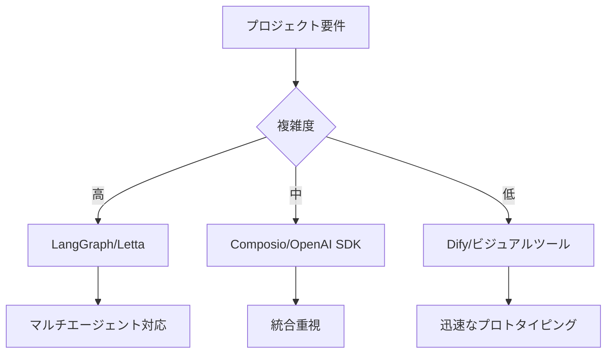

# 【AI週報】Google Gemini 2.5 Pro導入・AIエージェント開発最前線 - 2025年7月18日号

## 📰 今週のハイライト

今週のAI業界は、GoogleのGemini 2.5 Pro統合とAIエージェント開発ツールの急速な進化が注目を集めました。特に開発者向けツールの充実と、大手AI企業による透明性向上への共同取り組みが際立っています。

## 🚀 主要ニュース速報

-   :material-google: **Google Gemini 2.5 Pro AIモード統合**
    
    7/16発表：検索体験への統合と新ビジネス通話AI機能

-   :material-shield: **AI透明性共同提言**
    
    7/15発表：OpenAI・DeepMind・Anthropic共同論文

-   :material-school: **AI教育プログラム2350万ドル投資**
    
    7/8発表：MS・OpenAI・Anthropic共同出資

-   :material-robot: **AIエージェント開発ツール最新動向**
    
    Composio 25.6k stars達成、新フレームワーク続々登場

## 📊 AIエージェント開発ツール最新ランキング

### 🏆 GitHub Stars Top 5（2025年7月18日時点）

| 順位 | フレームワーク | Stars | 最終更新 | 特徴 |
|------|----------------|-------|----------|------|
| 1 | **Composio** | 25.6k | 7/17 | 100+統合、Function Calling対応 |
| 2 | **Daytona** | 21k | 7/17 | セキュアなAIコード実行環境 |
| 3 | **Letta (旧MemGPT)** | 17.3k | 7/15 | ステートフル・メモリ管理 |
| 4 | **Suna** | 16.8k | 7/17 | オープンソース汎用AIエージェント |
| 5 | **DeerFlow** | 14.1k | 7/17 | Deep Research対応、Web検索統合 |

### 🆕 2025年注目の新リリース

- **OpenAI Agents SDK** - 11k+ stars（3月リリース）
- **Google Agent Development Kit (ADK)** - エンドツーエンド開発対応
- **MCP (Model Context Protocol)** - エージェント間通信標準化

## 🔥 今週の重要アップデート詳細

### 1️⃣ Google Gemini 2.5 Pro統合（7/16）

!!! info "開発者への影響"
    - **AIモード強化**：検索体験にGemini 2.5 Proモデル統合
    - **新機能**：AIパワードビジネス通話（米国全ユーザー利用可能）
    - **Deep Research**：高度な調査・分析機能の追加

### 2️⃣ AI透明性に関する業界協調（7/15）

!!! warning "重要な警鐘"
    OpenAI、Google DeepMind、Anthropicの研究者が共同で「AIの理解能力を失いつつある」と警告。Geoffrey Hinton氏、Ilya Sutskever氏らも賛同。

### 3️⃣ Microsoft Build 2025の余波

- **GitHub Copilot進化**：非同期コーディングエージェント化
- **Windows AI Foundry**：エージェント開発基盤提供開始
- **Agent2Agent (A2A) Protocol**：50社以上が参加するオープン通信規格

## 💡 開発者向け実践ポイント

### エージェント開発フレームワーク選定指針

### 今すぐ試せるツール

1. **LangGraph**（LangChainエコシステム）
   - 月間420万ダウンロード
   - ステートフル・オーケストレーション

2. **Dify**（ローコードプラットフォーム）
   - 93k+ GitHub stars
   - ドラッグ&ドロップ開発

## 🔮 来週の注目ポイント

- **Microsoft AI Agents Hackathon 2025**：無料3週間バーチャルハッカソン
- **Cloudflare MCP統合**：リモートMCPサーバーのデプロイ対応
- **エージェント間通信プロトコル**：標準化への動き加速

## 📈 まとめと展望

今週はGoogleのGemini 2.5 Pro統合とAIエージェント開発ツールの成熟が顕著でした。特に：

- **開発ツールの急速な進化**：GitHub上でのスター数競争激化
- **大手企業の協調姿勢**：透明性向上への共同取り組み
- **実用段階への移行**：プロトタイプから本番環境へ

来週以降も、エージェント間通信の標準化とマルチモーダルAIの進化に注目が集まりそうです。

---

!!! tip "明日の深掘り予告"
    **「AIエージェント開発フレームワーク徹底比較2025」**を予定。各フレームワークの実装例とベンチマーク結果を詳しく解説します。

## 🔗 関連記事

- [Claude Code Hooks実践ガイド](../tools/claude-code-hooks-practical-guide.md)
- [ChatGPT Agentの全体像](../ai-development/chatgpt-agent-overview.md)
- [AIエージェント開発入門](../ai-development/ai-agent-development-intro.md)