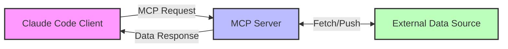

# Claude Code MCP実装完全ガイド：外部データ連携からリアルタイム処理まで


## はじめに

[今朝の記事](./ai-agent-evolution-2025.md)で紹介したClaude Code GA版の目玉機能の一つが、MCP（Model Context Protocol）対応です。MCPは外部データソースとAIモデルをシームレスに連携させる新しいプロトコルで、リアルタイムデータ処理やコンテキスト拡張を可能にします。本記事では、MCPの実装方法を具体的なコード例とともに徹底解説します。

## 実現できること

<div class="grid cards" markdown>

-   :material-database-sync: **リアルタイムデータ連携**
    
    外部API、データベース、ストリーミングサービスとの双方向通信

-   :material-memory: **動的コンテキスト管理**
    
    実行時にモデルのコンテキストを動的に拡張・更新

-   :material-shield-check: **セキュアな認証機構**
    
    OAuth2、API Key、mTLSなど多様な認証方式に対応

-   :material-chart-timeline: **イベント駆動処理**
    
    Webhookやストリーミングイベントに基づく自動処理

</div>

## MCP基本アーキテクチャ

### プロトコル概要

MCPは以下の3つのコンポーネントで構成されます：



### トランスポート方式の選択

```typescript
// MCP設定ファイル: mcp-config.ts
export interface MCPConfig {
  transport: 'sse' | 'http' | 'websocket';
  endpoint: string;
  authentication?: AuthConfig;
  retry?: RetryConfig;
  timeout?: number;
}

// SSE（Server-Sent Events）- リアルタイムデータ向け
const sseConfig: MCPConfig = {
  transport: 'sse',
  endpoint: 'https://api.example.com/mcp/stream',
  authentication: {
    type: 'bearer',
    token: process.env.MCP_API_KEY
  },
  retry: {
    maxAttempts: 3,
    backoffMultiplier: 2
  }
};

// HTTP - リクエスト/レスポンス型処理向け
const httpConfig: MCPConfig = {
  transport: 'http',
  endpoint: 'https://api.example.com/mcp/query',
  timeout: 30000 // 30秒
};
```

## 実装ステップ1：MCP Serverの構築

### Node.js/TypeScriptでのMCP Server実装

```typescript
// mcp-server.ts
import express from 'express';
import { MCPServer, MCPRequest, MCPResponse } from '@anthropic/mcp-sdk';

class CustomMCPServer extends MCPServer {
  private dataCache = new Map<string, any>();
  
  constructor() {
    super({
      capabilities: ['query', 'subscribe', 'update'],
      version: '1.0.0'
    });
  }
  
  // データクエリハンドラー
  async handleQuery(request: MCPRequest): Promise<MCPResponse> {
    const { query, parameters } = request.data;
    
    switch (query) {
      case 'user_data':
        return await this.fetchUserData(parameters.userId);
      
      case 'analytics':
        return await this.getAnalytics(parameters);
      
      case 'code_context':
        return await this.getCodeContext(parameters.repository);
      
      default:
        throw new Error(`Unknown query: ${query}`);
    }
  }
  
  // リアルタイムサブスクリプション
  async handleSubscribe(request: MCPRequest): Promise<AsyncGenerator<MCPResponse>> {
    const { topic, filters } = request.data;
    
    async function* streamData() {
      const eventSource = new EventSource(`/events/${topic}`);
      
      for await (const event of eventSource) {
        if (this.matchesFilters(event, filters)) {
          yield {
            type: 'event',
            data: event.data,
            timestamp: new Date().toISOString()
          };
        }
      }
    }
    
    return streamData();
  }
  
  // データ更新ハンドラー
  async handleUpdate(request: MCPRequest): Promise<MCPResponse> {
    const { target, data, validation } = request.data;
    
    // バリデーション
    if (validation) {
      await this.validateData(data, validation);
    }
    
    // 更新処理
    await this.updateDataSource(target, data);
    
    // Claude Codeに通知
    return {
      status: 'success',
      updated: true,
      timestamp: new Date().toISOString()
    };
  }
}

// Express統合
const app = express();
const mcpServer = new CustomMCPServer();

app.post('/mcp/query', async (req, res) => {
  try {
    const response = await mcpServer.handleQuery(req.body);
    res.json(response);
  } catch (error) {
    res.status(400).json({ error: error.message });
  }
});

app.get('/mcp/stream', async (req, res) => {
  res.setHeader('Content-Type', 'text/event-stream');
  res.setHeader('Cache-Control', 'no-cache');
  res.setHeader('Connection', 'keep-alive');
  
  const subscription = await mcpServer.handleSubscribe(req.query);
  
  for await (const event of subscription) {
    res.write(`data: ${JSON.stringify(event)}\n\n`);
  }
});

app.listen(3000, () => {
  console.log('MCP Server running on port 3000');
});
```

### Python実装例

```python
# mcp_server.py
from fastapi import FastAPI, HTTPException
from fastapi.responses import StreamingResponse
from typing import AsyncGenerator, Dict, Any
import asyncio
import json
from datetime import datetime

app = FastAPI()

class MCPServer:
    def __init__(self):
        self.data_sources = {}
        self.subscriptions = {}
    
    async def query_handler(self, request: Dict[str, Any]) -> Dict[str, Any]:
        """データクエリ処理"""
        query_type = request.get('query')
        params = request.get('parameters', {})
        
        handlers = {
            'database_query': self.handle_db_query,
            'api_fetch': self.handle_api_fetch,
            'cache_lookup': self.handle_cache_lookup
        }
        
        handler = handlers.get(query_type)
        if not handler:
            raise ValueError(f"Unknown query type: {query_type}")
        
        return await handler(params)
    
    async def handle_db_query(self, params: Dict) -> Dict:
        """データベースクエリ実行"""
        # 実際のDB接続とクエリ実行
        import asyncpg
        
        conn = await asyncpg.connect(
            host='localhost',
            database=params.get('database'),
            user=params.get('user'),
            password=params.get('password')
        )
        
        try:
            result = await conn.fetch(params.get('sql'))
            return {
                'data': [dict(row) for row in result],
                'count': len(result),
                'timestamp': datetime.utcnow().isoformat()
            }
        finally:
            await conn.close()
    
    async def stream_handler(self, topic: str) -> AsyncGenerator[str, None]:
        """リアルタイムストリーミング処理"""
        queue = asyncio.Queue()
        self.subscriptions[topic] = queue
        
        try:
            while True:
                data = await queue.get()
                yield f"data: {json.dumps(data)}\n\n"
        finally:
            del self.subscriptions[topic]

mcp_server = MCPServer()

@app.post("/mcp/query")
async def query_endpoint(request: Dict[str, Any]):
    try:
        result = await mcp_server.query_handler(request)
        return result
    except Exception as e:
        raise HTTPException(status_code=400, detail=str(e))

@app.get("/mcp/stream/{topic}")
async def stream_endpoint(topic: str):
    return StreamingResponse(
        mcp_server.stream_handler(topic),
        media_type="text/event-stream"
    )
```

## 実装ステップ2：Claude Code Clientの設定

### TypeScript SDKを使用した実装

```typescript
// claude-code-mcp-client.ts
import { ClaudeCodeClient, MCPClient } from '@anthropic/claude-code-sdk';

class EnhancedClaudeClient {
  private claudeClient: ClaudeCodeClient;
  private mcpClient: MCPClient;
  
  constructor(apiKey: string, mcpConfig: MCPConfig) {
    this.claudeClient = new ClaudeCodeClient({ apiKey });
    this.mcpClient = new MCPClient(mcpConfig);
    
    // MCPイベントハンドラー設定
    this.setupEventHandlers();
  }
  
  private setupEventHandlers() {
    // データ更新イベント
    this.mcpClient.on('data-update', async (event) => {
      console.log('Received data update:', event);
      await this.processDataUpdate(event);
    });
    
    // エラーハンドリング
    this.mcpClient.on('error', (error) => {
      console.error('MCP Error:', error);
      this.handleMCPError(error);
    });
    
    // 接続状態監視
    this.mcpClient.on('connection-status', (status) => {
      console.log('MCP Connection:', status);
    });
  }
  
  // 外部データを利用したコード生成
  async generateWithContext(prompt: string, dataQuery: any) {
    // MCPでデータ取得
    const contextData = await this.mcpClient.query(dataQuery);
    
    // コンテキストを含めてClaude Codeに送信
    const response = await this.claudeClient.complete({
      prompt: prompt,
      context: {
        external_data: contextData,
        timestamp: new Date().toISOString()
      },
      model: 'claude-opus-4'
    });
    
    return response;
  }
  
  // リアルタイムコラボレーション
  async startCollaboration(sessionId: string) {
    // MCPストリーム開始
    const stream = await this.mcpClient.subscribe({
      topic: `collaboration/${sessionId}`,
      filters: {
        event_types: ['code_change', 'cursor_move', 'selection']
      }
    });
    
    // ストリームイベント処理
    for await (const event of stream) {
      await this.handleCollaborationEvent(event);
    }
  }
  
  private async handleCollaborationEvent(event: any) {
    switch (event.type) {
      case 'code_change':
        await this.syncCodeChange(event.data);
        break;
      
      case 'cursor_move':
        await this.updateCursorPosition(event.data);
        break;
      
      case 'selection':
        await this.syncSelection(event.data);
        break;
    }
  }
}

// 使用例
const client = new EnhancedClaudeClient(
  process.env.CLAUDE_API_KEY!,
  {
    transport: 'sse',
    endpoint: 'https://mcp.example.com',
    authentication: {
      type: 'oauth2',
      clientId: process.env.OAUTH_CLIENT_ID!,
      clientSecret: process.env.OAUTH_CLIENT_SECRET!,
      tokenEndpoint: 'https://auth.example.com/token'
    }
  }
);

// データベーススキーマを基にしたコード生成
const generatedCode = await client.generateWithContext(
  'Create a TypeScript interface for the user table',
  {
    query: 'database_schema',
    parameters: {
      table: 'users',
      include_relations: true
    }
  }
);
```

## 実装ステップ3：認証とセキュリティ

### 多層認証の実装

```typescript
// mcp-auth.ts
import jwt from 'jsonwebtoken';
import { createHash } from 'crypto';

export class MCPAuthManager {
  private secretKey: string;
  private allowedOrigins: Set<string>;
  
  constructor(config: AuthConfig) {
    this.secretKey = config.secretKey;
    this.allowedOrigins = new Set(config.allowedOrigins);
  }
  
  // JWT認証
  async authenticateJWT(token: string): Promise<boolean> {
    try {
      const decoded = jwt.verify(token, this.secretKey) as any;
      
      // 追加の検証
      if (decoded.exp < Date.now() / 1000) {
        throw new Error('Token expired');
      }
      
      if (!decoded.permissions?.includes('mcp:access')) {
        throw new Error('Insufficient permissions');
      }
      
      return true;
    } catch (error) {
      console.error('JWT Auth failed:', error);
      return false;
    }
  }
  
  // API Key認証
  async authenticateAPIKey(apiKey: string): Promise<boolean> {
    const hashedKey = createHash('sha256').update(apiKey).digest('hex');
    
    // データベースでハッシュ化されたキーを検証
    const isValid = await this.validateAPIKey(hashedKey);
    
    if (isValid) {
      // レート制限チェック
      await this.checkRateLimit(apiKey);
    }
    
    return isValid;
  }
  
  // CORS検証
  validateOrigin(origin: string): boolean {
    return this.allowedOrigins.has(origin);
  }
  
  // リクエスト署名検証
  validateRequestSignature(
    payload: string, 
    signature: string, 
    timestamp: number
  ): boolean {
    // タイムスタンプ検証（5分以内）
    if (Math.abs(Date.now() - timestamp) > 300000) {
      return false;
    }
    
    // HMAC署名検証
    const expectedSignature = createHash('sha256')
      .update(`${timestamp}.${payload}`)
      .digest('hex');
    
    return signature === expectedSignature;
  }
}

// Express ミドルウェア
export const mcpAuthMiddleware = (authManager: MCPAuthManager) => {
  return async (req: any, res: any, next: any) => {
    try {
      // Bearer token認証
      const authHeader = req.headers.authorization;
      if (authHeader?.startsWith('Bearer ')) {
        const token = authHeader.slice(7);
        if (await authManager.authenticateJWT(token)) {
          return next();
        }
      }
      
      // API Key認証
      const apiKey = req.headers['x-api-key'];
      if (apiKey && await authManager.authenticateAPIKey(apiKey)) {
        return next();
      }
      
      // 署名認証
      const signature = req.headers['x-signature'];
      const timestamp = parseInt(req.headers['x-timestamp'] || '0');
      if (signature && authManager.validateRequestSignature(
        JSON.stringify(req.body),
        signature,
        timestamp
      )) {
        return next();
      }
      
      res.status(401).json({ error: 'Unauthorized' });
    } catch (error) {
      res.status(500).json({ error: 'Authentication error' });
    }
  };
};
```

## 実践的な使用例

### 1. データベース連携によるコード生成

```typescript
// database-code-generator.ts
class DatabaseCodeGenerator {
  private mcpClient: MCPClient;
  private claudeClient: ClaudeCodeClient;
  
  async generateORMModels(databaseUrl: string) {
    // データベーススキーマ取得
    const schema = await this.mcpClient.query({
      query: 'database_schema',
      parameters: {
        url: databaseUrl,
        include_indexes: true,
        include_constraints: true
      }
    });
    
    // 各テーブルのモデル生成
    const models = [];
    for (const table of schema.tables) {
      const model = await this.claudeClient.complete({
        prompt: `Generate a Prisma model for table: ${table.name}`,
        context: {
          schema: table,
          relationships: schema.relationships.filter(
            r => r.from_table === table.name || r.to_table === table.name
          )
        }
      });
      
      models.push(model);
    }
    
    // schema.prismaファイル生成
    return this.combineModels(models);
  }
}
```

### 2. リアルタイムログ分析

```typescript
// realtime-log-analyzer.ts
class RealtimeLogAnalyzer {
  private mcpClient: MCPClient;
  
  async startAnalysis(logSource: string) {
    const stream = await this.mcpClient.subscribe({
      topic: 'logs',
      filters: {
        source: logSource,
        severity: ['error', 'warning'],
        pattern: '.*exception.*|.*error.*'
      }
    });
    
    for await (const logEntry of stream) {
      // Claude Codeでログ分析
      const analysis = await this.analyzeLog(logEntry);
      
      if (analysis.requiresAction) {
        await this.handleCriticalIssue(analysis);
      }
    }
  }
  
  private async analyzeLog(logEntry: any) {
    return await this.claudeClient.complete({
      prompt: 'Analyze this log entry and suggest fixes',
      context: {
        log: logEntry,
        recent_logs: await this.getRecentLogs(logEntry.source),
        system_state: await this.getSystemState()
      }
    });
  }
}
```

### 3. CI/CDパイプライン統合

```yaml
# .github/workflows/mcp-enhanced-ci.yml
name: MCP Enhanced CI/CD

on:
  push:
    branches: [main]
  pull_request:

jobs:
  mcp-analysis:
    runs-on: ubuntu-latest
    steps:
      - uses: actions/checkout@v3
      
      - name: Setup MCP Connection
        run: |
          npm install @anthropic/claude-code-sdk
          export MCP_ENDPOINT=${{ secrets.MCP_ENDPOINT }}
          export MCP_API_KEY=${{ secrets.MCP_API_KEY }}
      
      - name: Code Analysis with External Context
        run: |
          node scripts/mcp-code-analysis.js \
            --context production-metrics \
            --include-dependencies \
            --suggest-optimizations
      
      - name: Generate Test Cases
        run: |
          node scripts/mcp-test-generator.js \
            --coverage-target 90 \
            --use-production-data \
            --mock-external-services
```

## トラブルシューティング

### よくある問題と解決方法

```typescript
// mcp-troubleshooter.ts
export class MCPTroubleshooter {
  // 接続タイムアウト対策
  static handleConnectionTimeout() {
    return {
      retry: {
        maxAttempts: 5,
        backoff: 'exponential',
        initialDelay: 1000
      },
      fallback: {
        useCache: true,
        degradedMode: true
      }
    };
  }
  
  // データ同期エラー対策
  static handleSyncError(error: any) {
    const strategies = {
      'version_mismatch': () => this.resolveVersionConflict(),
      'data_corruption': () => this.validateAndRepair(),
      'rate_limit': () => this.implementBackoff(),
      'auth_failure': () => this.refreshCredentials()
    };
    
    const strategy = strategies[error.type];
    return strategy ? strategy() : this.defaultErrorHandler(error);
  }
  
  // パフォーマンス最適化
  static optimizePerformance() {
    return {
      batching: {
        enabled: true,
        maxBatchSize: 100,
        maxWaitTime: 50 // ms
      },
      caching: {
        ttl: 300, // 5分
        maxSize: '100MB'
      },
      compression: {
        enabled: true,
        algorithm: 'gzip'
      }
    };
  }
}
```

### デバッグツール

```typescript
// mcp-debugger.ts
export class MCPDebugger {
  private logs: any[] = [];
  
  enableDebugMode() {
    // リクエスト/レスポンスロギング
    this.mcpClient.interceptors.request.use((config) => {
      console.log('MCP Request:', {
        url: config.url,
        method: config.method,
        headers: config.headers,
        data: config.data
      });
      return config;
    });
    
    // メトリクス収集
    this.mcpClient.on('metrics', (metrics) => {
      console.log('MCP Metrics:', {
        latency: metrics.latency,
        throughput: metrics.throughput,
        errorRate: metrics.errorRate
      });
    });
  }
  
  // トレース機能
  async trace(operation: string, fn: Function) {
    const traceId = generateTraceId();
    const startTime = Date.now();
    
    try {
      console.log(`[${traceId}] Starting ${operation}`);
      const result = await fn();
      console.log(`[${traceId}] Completed in ${Date.now() - startTime}ms`);
      return result;
    } catch (error) {
      console.error(`[${traceId}] Failed:`, error);
      throw error;
    }
  }
}
```

## パフォーマンス最適化

### バッチ処理とキャッシング

```typescript
// mcp-optimizer.ts
export class MCPOptimizer {
  private batchQueue: Map<string, any[]> = new Map();
  private cache: LRUCache<string, any>;
  
  constructor() {
    this.cache = new LRUCache({
      max: 1000,
      ttl: 1000 * 60 * 5 // 5分
    });
    
    // バッチ処理を定期実行
    setInterval(() => this.processBatches(), 100);
  }
  
  // バッチクエリ
  async batchQuery(query: any): Promise<any> {
    const cacheKey = this.generateCacheKey(query);
    
    // キャッシュチェック
    const cached = this.cache.get(cacheKey);
    if (cached) return cached;
    
    // バッチキューに追加
    return new Promise((resolve) => {
      const queueKey = query.type;
      if (!this.batchQueue.has(queueKey)) {
        this.batchQueue.set(queueKey, []);
      }
      
      this.batchQueue.get(queueKey)!.push({
        query,
        resolve,
        cacheKey
      });
    });
  }
  
  private async processBatches() {
    for (const [type, batch] of this.batchQueue) {
      if (batch.length === 0) continue;
      
      // バッチリクエスト実行
      const queries = batch.map(b => b.query);
      const results = await this.mcpClient.batchQuery({
        type,
        queries
      });
      
      // 結果を各リクエストに配布
      batch.forEach((item, index) => {
        const result = results[index];
        this.cache.set(item.cacheKey, result);
        item.resolve(result);
      });
      
      // キューをクリア
      this.batchQueue.set(type, []);
    }
  }
}
```

## まとめ

- **MCP実装の基本**: SSE/HTTPトランスポート、認証設定、エラーハンドリングの実装が重要
- **セキュリティ**: 多層認証、署名検証、レート制限を適切に実装
- **パフォーマンス**: バッチ処理、キャッシング、圧縮でレスポンスを最適化
- **実践的活用**: データベース連携、リアルタイム分析、CI/CD統合など多様な用途に対応
- **運用のコツ**: 適切なモニタリング、デバッグツール、トラブルシューティング手順の整備

MCPを活用することで、Claude Codeは単なるコード生成ツールから、外部システムと連携する強力な開発プラットフォームへと進化します。今回紹介した実装パターンを参考に、自社のユースケースに合わせたMCP活用を始めてみてください。

## 関連記事

- [AIエージェント開発の最新動向2025：Claude Code GA版からAgentic IDEまで完全ガイド](./ai-agent-evolution-2025.md)
- [Claude Code SDK活用ガイド：カスタムエージェント開発](../dev-efficiency/claude-code-sdk-guide.md)
- [エンタープライズ向けAI開発セキュリティベストプラクティス](../security/ai-development-security.md)